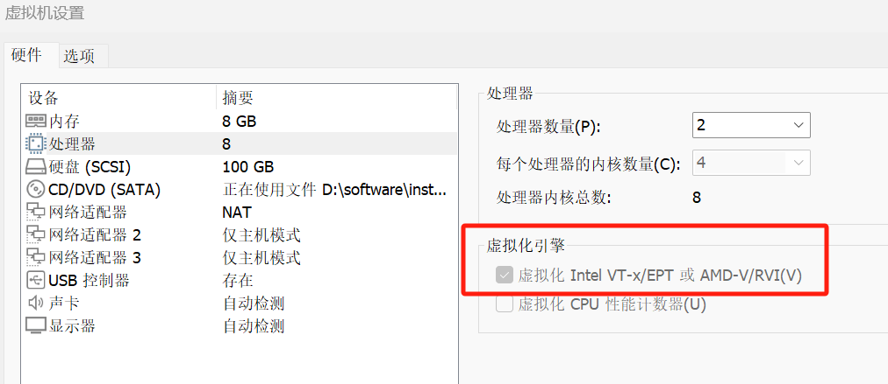

# kernel-src 环境说明

本目录用于放置 `linux-driver-lab` 的实验依赖环境。

GitHub 仓库中不会提交完整源码，只保留目录骨架、说明文档和占位文件。实际使用前，请按本文档准备：

- Linux 内核源码 `linux-5.15.10`
- BusyBox 源码 `busybox-1.36.1`

推荐目录：

```text
driver-lab/
├── kernel-src/
│   ├── linux-5.15.10/
│   └── busybox-1.36.1/
└── linux-driver-lab/
```

---

## 1. Windows 宿主机排查

如果你的开发环境是 **Windows -> VMware -> Ubuntu -> QEMU**，而且宿主机 CPU 支持虚拟化却仍然很慢，通常要优先检查 Hyper-V 相关功能是否占用了硬件虚拟化。

### 现象

常见现象包括：

- VMware 提示虚拟化加速不可用
- Ubuntu 能启动，但 QEMU 明显很慢
- 驱动实验启动和调试时间非常长

### Ubuntu 安装前的 VMware 设置

如果你的链路是 **Windows -> VMware -> Ubuntu -> QEMU/KVM**，那么 Ubuntu 这台虚拟机不仅是日常开发机，还是后面运行 QEMU 的“宿主机”。

因此在 VMware 里要进入：

- **虚拟机设置 -> 处理器**
- 勾选 **虚拟化 Intel VT-x/EPT 或 AMD-V/RVI(V)**

原因很简单：

- 这一步是在给 Ubuntu 打开 **嵌套虚拟化** 能力
- 没勾选时，Ubuntu 里即使安装了 QEMU/KVM，也很可能拿不到硬件虚拟化加速
- 结果就是 QEMU 退回软件模拟，启动内核、跑 rootfs、调试驱动都会明显变慢

对应界面如下：



如果这个勾选框是灰的，或者你明明开了 BIOS 虚拟化还是无法勾选，通常不是硬件不支持，而是 **Windows 把虚拟化权限占住了**。这时就回到下面的 Hyper-V 排查步骤。


### 建议排查顺序

#### 第一步：关闭“内核隔离 / 内存完整性”

1. 在 Windows 搜索框输入“内核隔离”并打开
2. 找到“内存完整性”
3. 设置为关闭
4. 重启物理机

#### 第二步：关闭 Hyper-V 相关功能

按 `Win + R` 输入 `optionalfeatures`，取消勾选：

- Hyper-V
- 虚拟机平台
- Windows 虚拟机监控程序平台

然后重启物理机。

#### 第三步：禁用 Hyper-V 启动项

以管理员身份打开终端或 PowerShell，执行：

```powershell
bcdedit /set hypervisorlaunchtype off
```

执行后重启物理机。

说明：

- 如果你关闭了这些功能，VMware 和后续的 Ubuntu/QEMU 通常会明显更顺畅
- 如果必须保留 Hyper-V 生态，就要接受 VMware 和嵌套虚拟化性能下降

---

## 2. Ubuntu 依赖安装

进入 Ubuntu 后，先安装构建和实验所需依赖：

```bash
sudo apt update
sudo apt install -y build-essential libncurses-dev bison flex libssl-dev libelf-dev cpio qemu-system-x86 wget xz-utils git
```

依赖说明：

- `build-essential`：gcc、make 等基础编译工具
- `libncurses-dev`：`make menuconfig` 需要
- `bison`、`flex`：编译内核配置/解析相关代码时需要
- `libssl-dev`、`libelf-dev`：内核构建常见依赖
- `cpio`：打包 initramfs
- `qemu-system-x86`：启动实验内核
- `wget`、`xz-utils`：下载和解压源码

---

## 3. Linux 内核源码准备

请继续阅读：

- `linux-5.15.10/README.md`

---

## 4. BusyBox 准备

请继续阅读：

- `busybox-1.36.1/README.md`

---

## 5. 环境准备完成后的最小检查

至少确认下面两个关键产物存在：

```text
kernel-src/linux-5.15.10/arch/x86/boot/bzImage
kernel-src/busybox-1.36.1/busybox
```

如果 BusyBox 执行过 `make install`，还可能有：

```text
kernel-src/busybox-1.36.1/_install/bin/busybox
```

这些路径准备好后，`linux-driver-lab/day01~day06/build.sh` 就可以直接使用。

---

## 6. 推荐的完整准备顺序

建议按下面顺序做，一次成功率更高：

1. 先在 Windows 宿主机关闭 Hyper-V 相关功能
2. 在 VMware 里确认 Ubuntu 的处理器页面已勾选虚拟化引擎
3. 进入 Ubuntu 安装编译依赖和 QEMU
4. 下载并编译 `linux-5.15.10`
5. 下载并编译 `busybox-1.36.1`
6. 回到 `linux-driver-lab/day01~day06` 执行 `./build.sh`

这样可以把“宿主机虚拟化问题”和“Linux 编译环境问题”分层排查，不容易混在一起。
