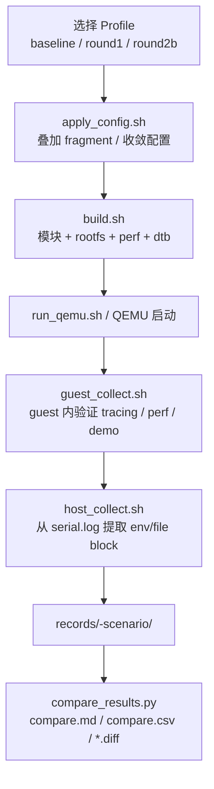
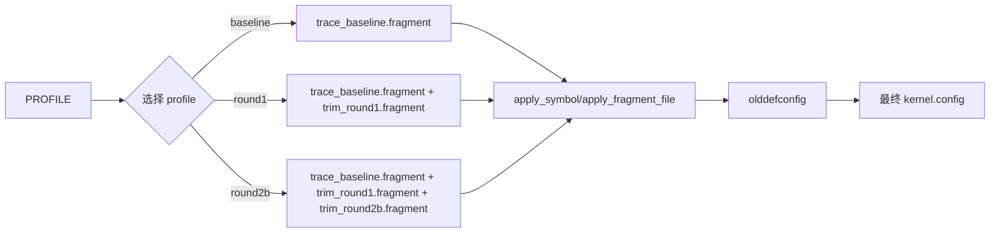
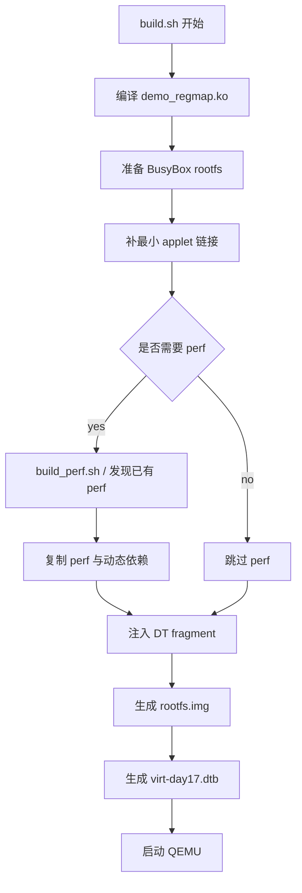
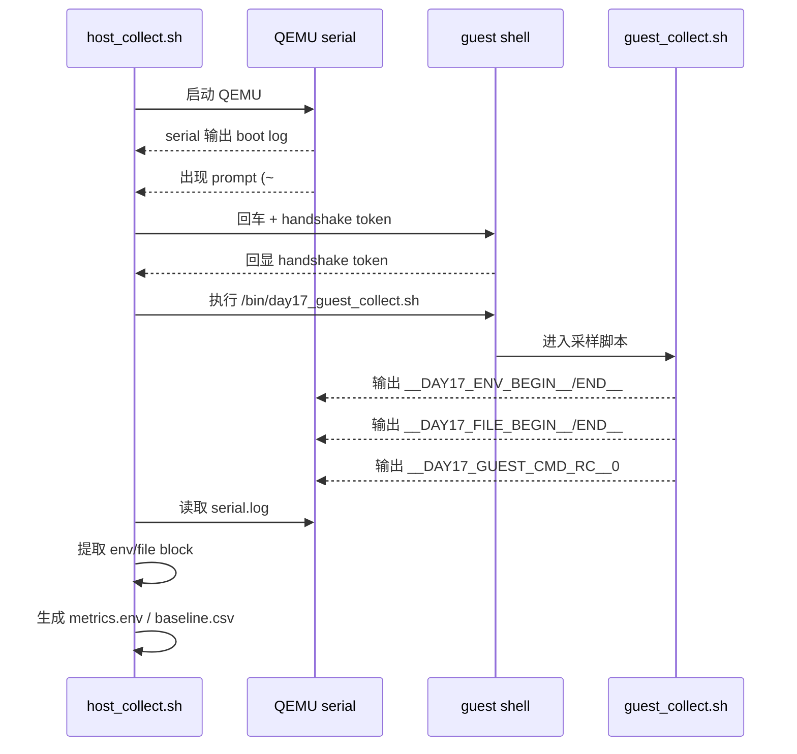
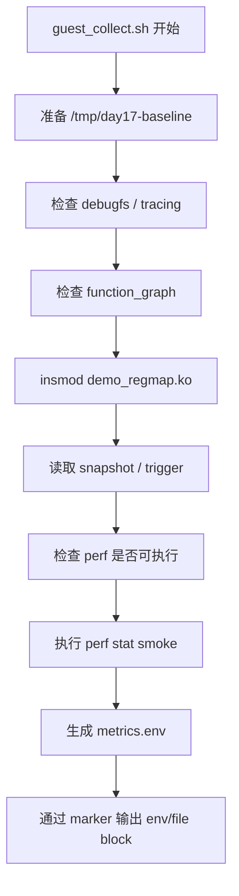
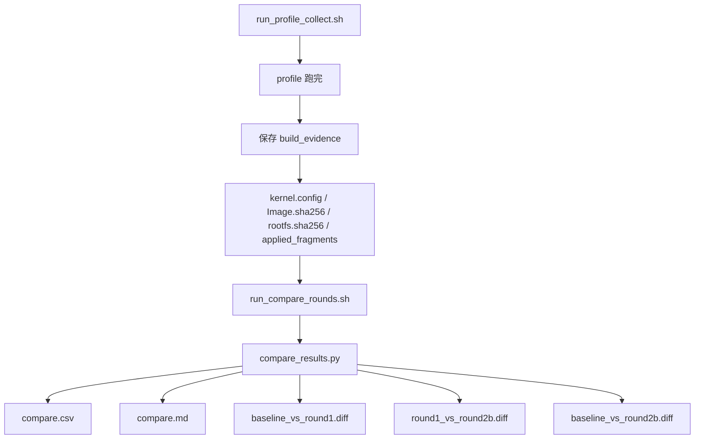
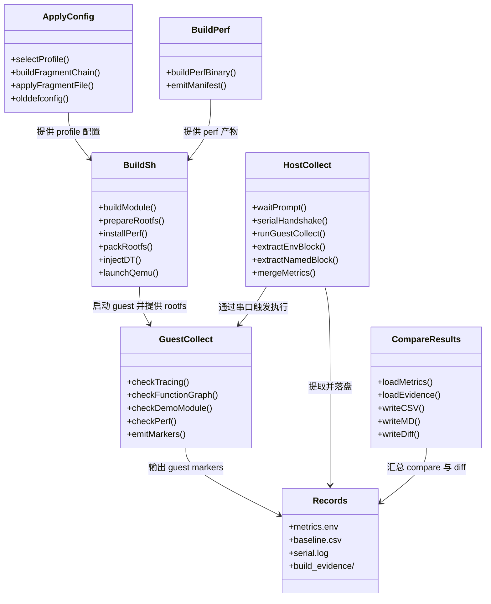
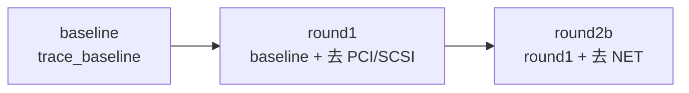
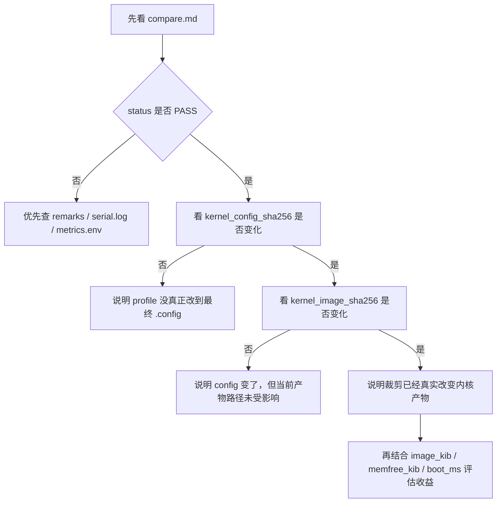

# Day17 流程图与 UML 速览

## 1. 文档目的

本文用流程图、时序图和结构图来帮助快速理解 Day17。

适合在你已经知道 Day17 能跑的前提下，用图去建立整体感：
- 哪些脚本负责什么
- 配置链和构建链怎么串起来
- host / guest 怎么交互
- records / evidence 为什么重要

---

## 2. Day17 全局执行流

---

## 3. profile 配置链流程图

### 理解重点
- profile 的本质不是“换一份完整 `.config`”
- 而是在 baseline 上叠加不同层的 trim

---

## 4. build.sh 构建链流程图

### 理解重点
- build.sh 是 Day17 的“产物总装器”
- 它把模块、rootfs、perf、dtb 和 QEMU 启动统一收口

---

## 5. host / guest 交互时序图

### 理解重点
- guest 并不直接写宿主机文件
- host 通过 marker 从串口流里“切块”拿结果

---

## 6. guest_collect 内部流程图

### 理解重点
- guest_collect 不是“复杂业务脚本”，而是 Day17 的最小实验验证器
- 它的价值在于把验收项格式化输出出来

---

## 7. compare 与 evidence 流程图

### 理解重点
- evidence 的目的是把“我觉得生效了”变成“我能证明生效了”

---

## 8. Day17 组件关系 UML（静态结构图）

---

## 9. round1 / round2b 关系图

### 理解重点
- round1 不是从零开始另起一套配置
- round2b 也不是独立 profile，而是在 round1 基础上继续向下裁

---

## 10. Day17 结果解读图

---

## 11. 一句话总结

> **Day17 最值得记住的不是某个单独脚本，而是“配置链 → 构建链 → 采样链 → evidence 链”这四条主线；一旦按这四条线理解，整个 day17 目录就会变得非常清晰。**
