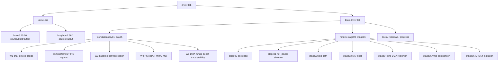
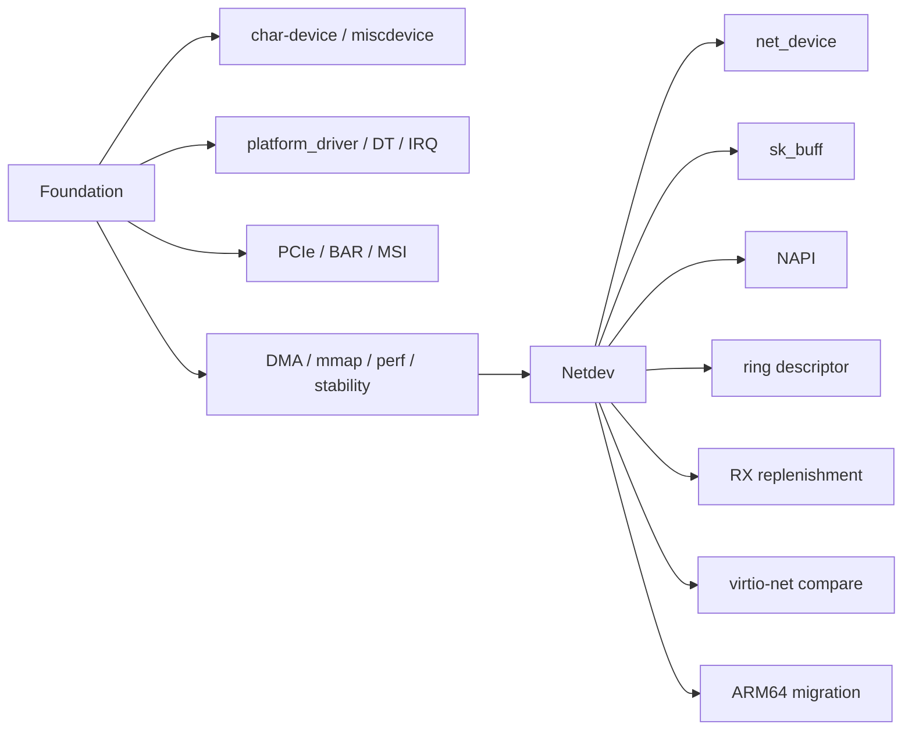
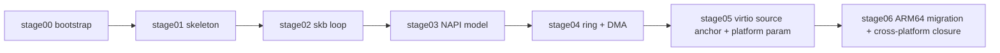
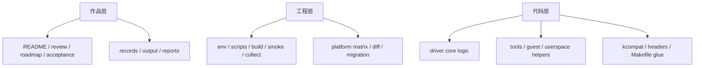

# 架构分层图（专家评审口径）

## 1. 项目总体分层

---

## 2. Foundation 与 Netdev 的关系

解释：

- Netdev 不是重新换题
- 它建立在前面 IRQ、DMA、QEMU、工程化脚本能力之上
- 因此当前项目是连续演进，而不是两套无关目录

---

## 3. 第二阶段内部演进关系

---

## 4. stage04 的数据路径抽象

```mermaid
flowchart LR
    U[userspace sender] --> T[xmit]
    T --> M1[dma_map_single TX]
    M1 --> R1[find RX posted slot]
    R1 --> C[memcpy simulate device DMA]
    C --> D[mark desc DONE + CPU owner]
    D --> I[raise irq]
    I --> N[napi_schedule]
    N --> P[poll budget loop]
    P --> M2[dma_unmap_single RX]
    M2 --> S[skb_put + eth_type_trans]
    S --> K[netif_receive_skb]
    K --> F[refill RX slot]
```

这张图对应的专家判断是：

- stage04 已经把“网卡驱动核心组织方式”具象化
- 虽然仍是教学型模型，但关键语义已经对了

---

## 5. 评审视角下的三层能力结构

结论：

- 这个仓库已经不是“只有代码层”
- 作品层、工程层、代码层三者都已经存在
- 专家评审时，这种三层都完整的仓库会明显更有说服力
