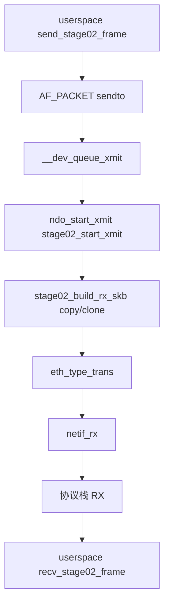

# 03. 软件环回路径

## 1. 主路径图



## 2. 为什么说这是“软件环回”而不是真实收包

因为真实网卡收包通常意味着：
- 设备 DMA 把数据写到 RX buffer
- 驱动在中断/NAPI poll 中收割 descriptor
- 驱动把 skb 交给协议栈

而 stage02 的路径是：
- 直接在 `ndo_start_xmit()` 里用软件方式构造 RX skb
- 再交给 `netif_rx()`

这不是硬件模型，但非常适合学习 `skb`。

## 3. copy 模式和 clone 模式有什么不同

### copy
```text
TX skb(data A)
    -> skb_copy()
    -> RX skb(data B)
```

### clone
```text
TX skb(head A, data X)
    -> skb_clone()
    -> RX skb(head B, data X)
```

## 4. 调试时最该看什么
- `ip -s link show nds2`
- `/sys/kernel/debug/netdev_stage02/stats`
- `recv_stage02_frame` 输出的 payload / protocol / pkttype

这三组信息结合起来，基本就能说明 stage02 的闭环成立。
