# ARCHITECTURE

## 1. 总体架构

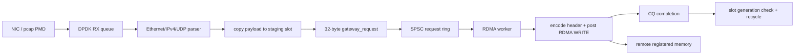

DPDK 和 RDMA 的共同边界不是 `rte_mbuf *`，而是 staging slot 加固定描述符。原因是 mbuf 可能分段、来自 DPDK mempool、未注册为 verbs MR，并且 TX/RX 生命周期由 PMD 约束。直接把 mbuf 虚拟地址交给 RDMA 会把两套所有权模型耦合在一起。

## 2. 模块 UML

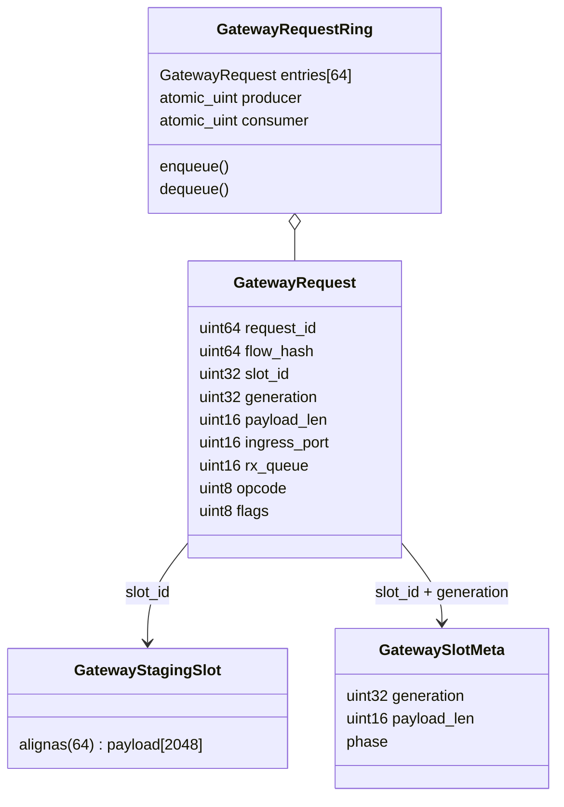

## 3. 本地 descriptor 布局

| offset | 大小 | 字段 | 含义 |
|---:|---:|---|---|
| 0 | 8 | `request_id` | 端到端唯一请求号 |
| 8 | 8 | `flow_hash` | DPDK 分类结果/未来分片依据 |
| 16 | 4 | `slot_id` | 本地 staging 索引，不发送到远端 |
| 20 | 4 | `generation` | 防止旧 CQE 回收新一代 slot |
| 24 | 2 | `payload_len` | 1-2048 字节 |
| 26 | 2 | `ingress_port` | DPDK 输入端口 |
| 28 | 2 | `rx_queue` | DPDK 输入队列 |
| 30 | 1 | `opcode` | 当前仅 `RDMA_WRITE` |
| 31 | 1 | `flags` | 后续扩展位 |

`_Static_assert(sizeof(struct gateway_request) == 32)` 把 ABI 变化变成编译错误。descriptor 只在本机线程之间传递，可以使用主机字节序；远端记录必须走显式 wire 编码。

## 4. Wire header

40 字节 wire header 使用大端序，并包含 magic、version、header length 和 reserved 校验。它不使用 `packed struct`，而是逐字段编码，避免编译器 padding、未对齐访问和不同架构字节序问题。


decoder 在访问数据面前拒绝错误 magic、version、header length、reserved、opcode、payload length 和短 buffer。Phase 1 用 6 个负向 case 验证这些边界。

## 5. Slot 生命周期

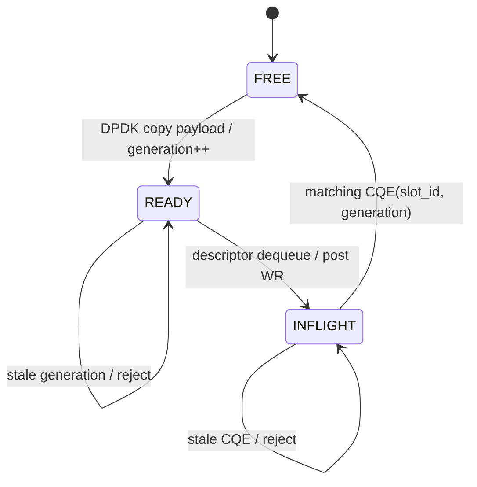

generation 是 slot 的逻辑时代号。假设 slot 5 的 generation 1 已完成并被复用为 generation 2，迟到的 generation 1 completion 必须返回 `-ESTALE`，否则会把仍在使用的 generation 2 错误标成 FREE。

## 6. 所有权时序

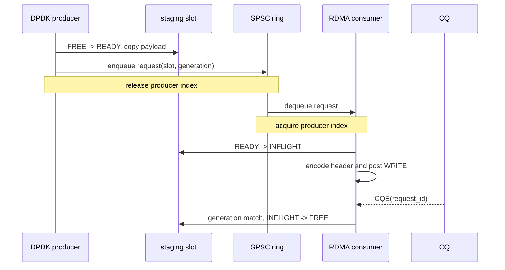

producer 在写完 descriptor 后以 release 发布索引；consumer 以 acquire 读取索引，因此看见新 producer 值时也必须看见完整 descriptor。反方向用 consumer release 和 producer acquire 保证槽位回收可见。

## 7. Backpressure

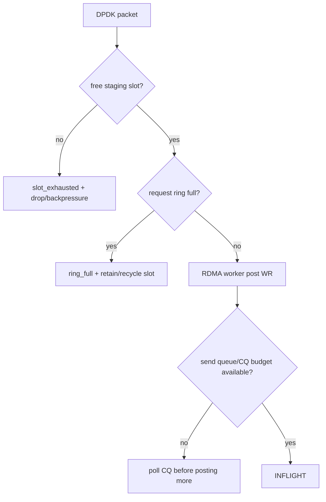

生产者不能无限排队。Phase 1 的 ring 满返回 `-ENOSPC`；后续 DPDK 集成需要把该返回值映射为显式 drop/backpressure 统计，并把尚未入队的 READY slot 安全回收。

## 8. 当前边界

Phase 1 只证明 contract、字节序、ring 和 slot 生命周期，不证明：

- DPDK pcap 或真实 NIC 已接入。
- staging region 已注册为 verbs MR。
- RDMA WRITE/CQE 已执行。
- Soft-RoCE 或 RNIC 端到端性能。

这些能力按 `ROADMAP.md` 分阶段加入，每阶段都保留独立 marker 和测试记录。

## 9. Phase 2：pcap ingress

Phase 2 使用 pcap PMD 提供 64 个确定性 Ethernet/IPv4 报文：每四包中三包 UDP、一包 ICMP。parser 使用 `rte_pktmbuf_read()`，因此即使协议头跨 mbuf segment 也能安全读取；只有完整 UDP payload 才能占用 staging slot。

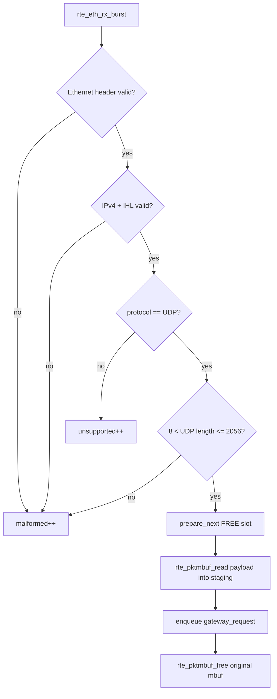

### 9.1 Copy 与 mbuf 所有权

当前选择 bounded copy，而不是注册整个 DPDK mempool。copy 完成后 staging 拥有独立 payload，原 mbuf 在当前 RX 循环立即释放，不需要等 RDMA completion。代价是一次内存复制，收益是 PMD、mempool 和 verbs MR 生命周期完全解耦。

如果 slot 用尽，`gateway_slot_prepare_next()` 返回 `-ENOSPC`；如果 request ring 满，producer 调用 `gateway_slot_cancel_ready()` 撤销尚未发布的 READY slot，防止 backpressure 路径泄漏资源。

### 9.2 Mock RDMA 的准确边界

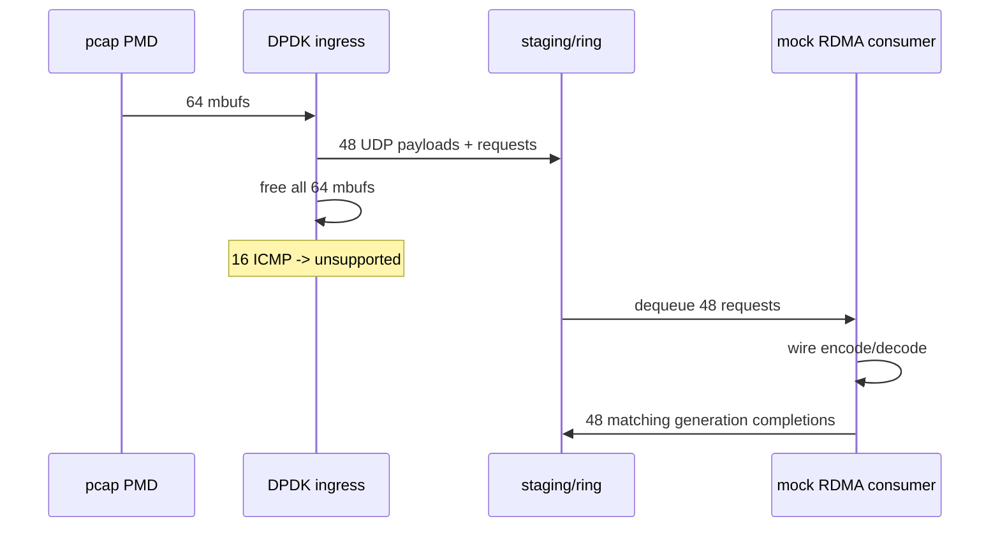

mock consumer 证明 descriptor 到 staging 的关联、wire codec 和 completion 回收可以组合，但没有调用 `ibv_post_send()`。因此 Phase 2 marker 只命名为 `INGRESS_PASS`，RDMA backend 留给 Phase 3。

## 10. Phase 3：RXE RDMA backend

Phase 3 复用 one-sided KV 已验证的 `rdma_cs` 基础库完成 device/PD/MR/CQ/QP 生命周期与 TCP metadata exchange，gateway adapter 只负责把 request 和 staging payload 编成 remote record。复用的是底层 verbs 工程能力，不复用 KV 协议。

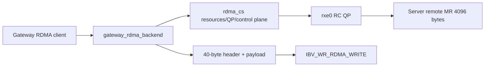

### 10.1 对象与建链顺序

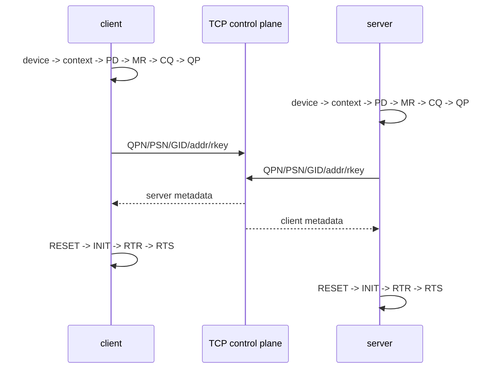

TCP 只承载 QP/MR metadata 和测试同步 token。`gateway_request` header 与 payload 不通过 TCP；它们由 client 的 registered send MR 发起 one-sided WRITE。

### 10.2 WRITE 与 completion

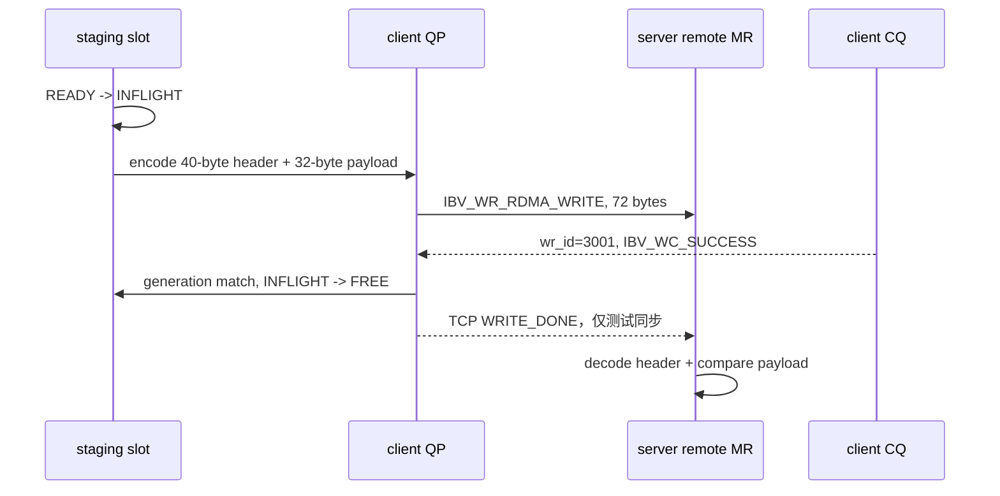

RC WRITE 的 client CQE 表示本次 signaled WR 成功完成；one-sided WRITE 不在 server CQ 生成接收 completion，所以测试使用 TCP token 通知 server 在 CQE 之后检查 remote MR。这个 token 不是业务数据面，也不能替代生产协议中的持久化或应用可见性确认。

### 10.3 Remote record 布局

```text
remote_addr + 0   : gateway wire header, 40 bytes
remote_addr + 40  : UDP/staging payload, payload_len bytes
```

本阶段写入 72 字节：40 字节 header 加 32 字节 payload。server 使用同一 wire decoder 验证 magic/version/request_id/generation/payload_len，再比较 payload 内容。

### 10.4 当前边界

- RXE/Soft-RoCE 证明 verbs 语义和工程流程，不代表 RNIC DMA/PCIe 性能。
- Phase 3 client 使用构造的 staging payload，尚未直接消费 Phase 2 pcap request ring。
- 每次只有一个 signaled WRITE；batch WR 与 selective signaling 留到 Phase 5。

## 11. Phase 4：DPDK 到 RDMA 端到端集成

Phase 4 将前两阶段的独立程序合并到同一个 client 进程。DPDK 主线程是 ring/slot 的唯一 producer；RDMA pthread 是唯一 consumer，并独占 QP、CQ 和 registered send MR。该边界让 DPDK 代码不依赖 verbs 对象，也避免两个线程并发 poll 同一个 CQ。

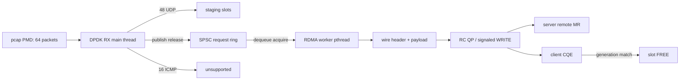

### 11.1 线程、内存序与停止协议

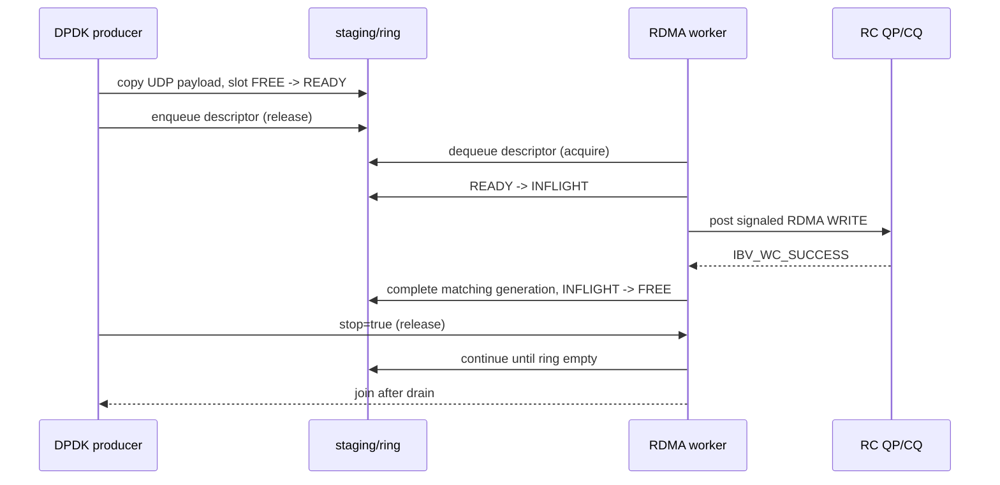

`stop=true` 只表示不会再发布新 request，不表示 worker 可以立即退出。worker 必须同时观察到 stop 和 ring empty 才结束；主线程 `pthread_join()` 返回后，才可以断开 QP 并销毁 staging/ring。这个 drain 协议避免进程收尾时遗失已发布 descriptor。

### 11.2 守恒关系

确定性 pcap 每 4 包包含 3 个 UDP 和 1 个 ICMP，因此 64 包应满足：

```text
rx = udp + unsupported + malformed = 64
udp = staged = dequeued = completed = 48
payload_bytes = 48 * 32 = 1536
write_bytes = 48 * (40 + 32) = 3456
active_slots(after drain) = 0
```

server remote MR 只有一个 record 区域。RC QP 保序，client 在每个 signaled WRITE 得到成功 CQE 后再发下一个，所以 batch 结束后 server 应看到最后一条 request 48，payload 为 `GATEWAY_UDP_0062`。这验证了最终远端内容，但不是多槽远端队列或持久化协议。

### 11.3 错误传播与回收

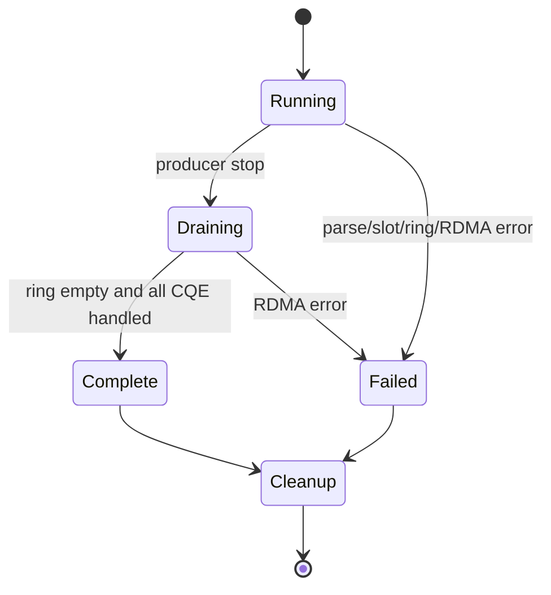

- ring 满时 producer 撤销 READY slot，不发布半成品 descriptor。
- WRITE 或 CQE 失败时 worker 增加 error 计数并停止正常验收，slot 不会被错误 generation 释放。
- 正常结束必须同时满足 `errors=0`、`completed=48`、`active_slots=0`。

### 11.4 当前环境边界

- DPDK pcap PMD 没有真实 NIC RX queue、RSS、DMA 和 PCIe 压力。
- RXE/Soft-RoCE 没有真实 RNIC doorbell、WQE cache 和 NUMA 路径。
- 当前每个 request 都是 signaled WR，便于证明 slot 回收正确；batch WR 和 selective signaling 属于后续性能扩展。
- Phase 1-4 已构成可解释、可回归的功能 capstone，状态为 `DPDK_RDMA_GATEWAY_CURRENT_ENV_COMPLETE`。
