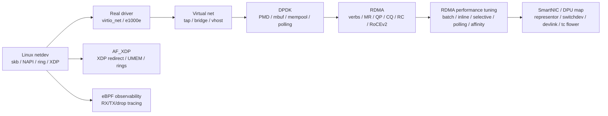

# 01_PORTFOLIO_MAP

## 1. 总体地图



这条线的核心不是堆名词，而是把“数据包/数据搬运路径”讲清楚：

- kernel netdev：理解 Linux 网络栈入口、驱动和队列模型。
- DPDK：理解为什么用户态轮询、hugepage、PMD、mbuf 可以绕开内核协议栈。
- AF_XDP：理解 Linux 原生 fastpath 如何保留 XDP hook，同时把数据面交给用户态。
- RDMA：理解从 packet fastpath 进一步转向 queue pair、registered memory 和 NIC DMA。
- eBPF：理解怎样观测上述路径，而不是只凭猜测定位问题。

## 2. 已完成证据

| 模块 | 代表产物 | 证据状态 |
| --- | --- | --- |
| Linux netdev | `netdev/stage00~stage14` | 已完成 |
| Real driver | `track-real-driver/` | 已完成 |
| Virtual net | `track-virtual-net/` | 已完成 |
| DPDK | `track-dpdk/` | 已完成 |
| DPDK Advanced | `track-dpdk-advanced/` | 已收敛 |
| AF_XDP | `track-af-xdp/` | 全部 PASS |
| eBPF observability | `track-ebpf-observability/` | 全部 COMPLETED |
| RDMA core | `track-rdma-core/` | Phase 1~10 当前环境边界收敛 |

## 3. 当前作品集输出

```text
docs/01_PORTFOLIO_MAP.md
docs/02_DPDK_RDMA_COMPARISON.md
docs/03_PERFORMANCE_TUNING_BOUNDARIES.md
docs/04_INTERVIEW_STORIES.md
docs/05_RESUME_MATERIAL.md
tests/EVIDENCE_INDEX.md
```

第一版目标是“可讲清楚”，不是“再开一条重实验线”。
