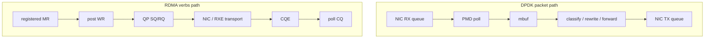

# 02_DPDK_RDMA_COMPARISON

## 1. 一句话区别

DPDK 主要解决 packet fastpath：让包绕过内核协议栈，在用户态 PMD 中轮询收发。

RDMA 主要解决 remote memory access：让已经注册的内存通过 QP/CQ/MR 与 NIC DMA 直接参与数据搬运。

## 2. 对比表

| 维度 | DPDK | RDMA |
| --- | --- | --- |
| 核心对象 | port、queue、mbuf、mempool、PMD | device、context、PD、MR、CQ、QP、WR、CQE |
| 数据单位 | packet / mbuf | WR / WQE / CQE，数据落在 MR |
| 内核参与 | 数据面绕过内核协议栈 | 数据面绕过 socket，依赖 RDMA core/provider 建立资源 |
| 内存模型 | hugepage-backed mbuf pool | registered memory，`lkey/rkey` 约束访问 |
| 同步模型 | polling RX/TX burst | post WR + poll CQ |
| 常见优化 | burst size、mempool cache、RSS、多队列、NUMA | batch WR、inline、selective signaling、CQ polling、NUMA/affinity |
| 典型边界 | 设备独占、hugepage、VFIO/IOMMU、PMD 驱动 | RNIC 能力、MR pinning、QP 状态机、PFC/ECN、RoCE 网络 |

## 3. 心智模型

DPDK 的问题通常是“包怎么更快进出用户态处理循环”。

RDMA 的问题通常是“哪个进程暴露了哪段已注册内存，哪个 QP 以什么权限访问它，完成事件怎么确认”。

## 4. 当前证据

- DPDK 证据：`track-dpdk/ROADMAP_NEXT.md`、`track-dpdk-advanced/project-dpdk-advanced-summary/reports/DPDK_ADVANCED_FINAL_REPORT.md`
- RDMA 证据：`track-rdma-core/project-rdma-core-summary/EVIDENCE_INDEX.md`、`track-rdma-core/project-rdma-performance-tuning/tests/TEST_RECORD_20260713_NUMACTL_NODE0.md`

## 5. 面试表达

可以这样讲：

> 我把 DPDK 和 RDMA 都放在“绕开传统内核协议栈的数据路径”里理解，但它们优化的对象不同。DPDK 优化 packet processing loop，核心是 PMD polling、mbuf/mempool、burst、多队列和 NUMA；RDMA 优化 remote memory access，核心是 MR 注册、QP 状态机、WR/CQE、rkey 权限和 RNIC/RoCE 网络。我的实验里 DPDK 用 pcap/虚拟环境验证 fastpath 行为，RDMA 用 Soft-RoCE 验证 verbs 模型和调参框架，所以我会明确区分模型验证和真实硬件性能结论。
