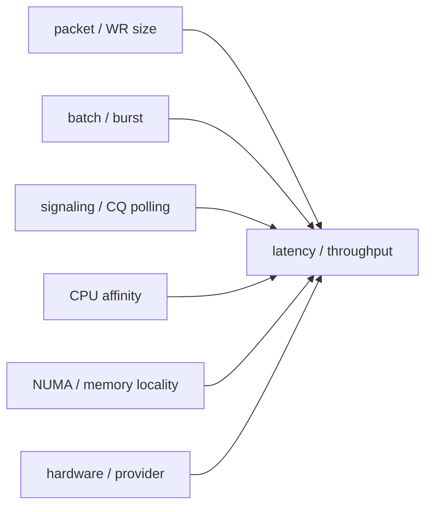

# 03_PERFORMANCE_TUNING_BOUNDARIES

## 1. 为什么要单独写边界

性能调优最容易把“模型验证”误说成“生产性能”。这个项目统一保留边界，让每个结论都有上下文。

## 2. 已验证的内容

| 方向 | 已验证 | 边界 |
| --- | --- | --- |
| DPDK basic | pcap PMD traffic / forwarding / rewrite marker | 不代表真实 NIC line-rate |
| DPDK advanced | mbuf/mempool/RSS/VFIO/NUMA 调优材料与边界报告 | 部分真实硬件能力为 boundary evidence |
| AF_XDP | XDP redirect、AF_XDP socket、UMEM/rings、copy/native 边界 | veth 环境不支持 zero-copy |
| eBPF | RX/TX/drop 路径观测与 cross-path 证据 | 不是生产级观测平台 |
| RDMA core | verbs/MR/QP/CQ/RC/UD/RoCEv2 模型 | Soft-RoCE 不代表 RNIC 性能 |
| RDMA perf | SEND latency、batch、inline、selective、polling、RTT、affinity、numactl node0 | 135 只有 node0，未完成跨 NUMA 对比 |

## 3. 关键变量

任何性能数字都必须至少说明：

- 跑在哪台机器
- 用什么设备或软件 provider
- 是否绑核
- 是否限制 NUMA node
- batch/burst size
- polling 策略
- 是否 inline / selective signaling
- 是否双机

## 4. 当前最重要的边界

RDMA：

- 135 上 `numactl node0` 绑定路径 PASS。
- 135 只有 `node0`，没有跨 NUMA 对照。
- 134 登录 blocked，双机 fresh perf 还没补。
- RXE 可以验证 verbs 行为，不能代表 RNIC DMA/offload 性能。

DPDK：

- pcap PMD 可以验证分类、转发、rewrite 逻辑。
- pcap PMD 不能代表真实 NIC 吞吐。
- RSS/VFIO/IOMMU/NUMA 需要真实硬件和部署上下文支撑最终结论。

## 5. 后续补强项

1. 真实 RNIC 上重跑 RDMA latency / batch / inline / selective / polling。
2. 多 NUMA node 机器上重跑同节点 / 跨节点对比。
3. 真实 NIC 上做 DPDK RSS 多队列和 AF_XDP zero-copy 对比。
4. SmartNIC/DPU 环境中验证 representor、switchdev、devlink、tc flower offload。
