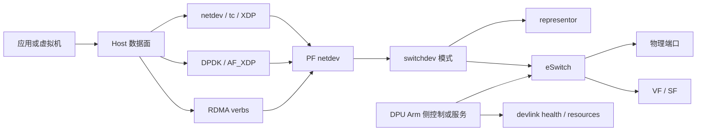
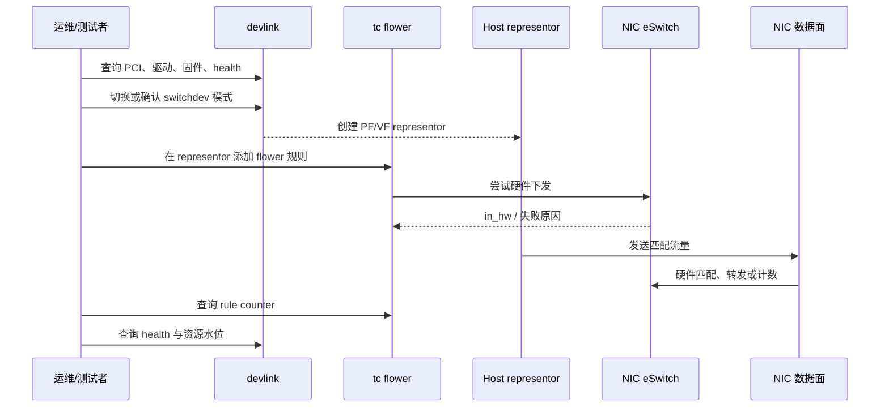
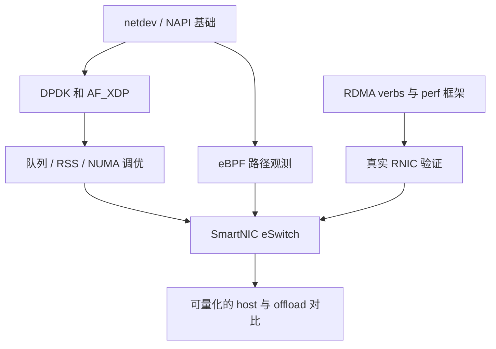

# SmartNIC / DPU Map

## 1. 定位与前置条件

SmartNIC / DPU 不是把 DPDK、XDP 或 RDMA 替换掉，而是把其中一部分数据面、控制面或安全隔离能力下沉到 NIC 或独立的 DPU 侧。本仓库当前已经完成 host 侧路径学习和部分软环境验证；本文件定义进入硬件 offload 阶段后应如何验证，不能作为已经完成 offload 的证明。

前置条件：真实支持 switchdev/representor 的 NIC 或 DPU、可恢复的测试主机、至少两端连通的网络、管理员权限，以及可取得的驱动和固件版本。

## 2. Host 到硬件的能力映射



| Host 已有能力 | 硬件阶段对应能力 | 首个验收目标 |
| --- | --- | --- |
| netdev、NAPI、XDP | PF/SF/VF 生命周期与队列可见性 | 网卡、队列和驱动版本可复现 |
| tc 规则模型 | tc flower 硬件 offload | `in_hw` 计数存在且命中递增 |
| DPDK poll-mode | VFIO + queue/NUMA/RSS | lcore、队列和 NIC NUMA 对齐 |
| AF_XDP UMEM/ring | XDP native/zero-copy 能力 | 驱动明确报告零拷贝可用性 |
| RDMA QP/CQ/MR | RNIC DMA、RoCE、拥塞与 QoS | verbs 测试通过且性能不再引用 RXE |

## 3. 控制面、数据面与观测面



三类信息必须同时记录：

- 控制面：`devlink dev info`、eswitch mode、驱动/固件版本、资源和 health 状态。
- 数据面：规则命中前后计数、收发包统计、吞吐/时延测试参数、CPU/NUMA 绑定。
- 观测面：`tc -s`、`ethtool -S`、`devlink health`、必要时 eBPF trace；只看“命令返回成功”不足以说明 offload 生效。

## 4. 分阶段实施与验收

| 阶段 | 操作 | 最小验收 | 不可越过的边界 |
| --- | --- | --- | --- |
| H0 环境盘点 | 记录 PCI、驱动、固件、NUMA、端口状态 | 形成可重放环境快照 | 不改生产网卡模式 |
| H1 representor | 创建 VF/SF，确认 representor 与端口关系 | `ip link` 与 `devlink port show` 对应 | 不把 VF 创建当作 offload 成功 |
| H2 tc offload | 下发单条 flower drop/redirect 规则 | `tc -s` 出现 `in_hw` 且计数增长 | 不只依据 `skip_sw` 命令成功 |
| H3 datapath | 比较 host 转发和 eSwitch 转发 | 同一流量模型下有明确统计 | 不跨不同包长/CPU/队列直接比较 |
| H4 RDMA | 在 RNIC 上跑 verbs 和 perf 参数矩阵 | 有端到端日志和 NIC 计数 | 不沿用 RXE 数字作为 RNIC 结论 |
| H5 故障处理 | 制造可恢复的规则失败或端口异常 | health reporter 与恢复记录完整 | 不在无回滚方案的机器上试验 |

## 5. 首轮命令模板

以下命令只用于盘点和验证，接口名、PCI 地址、规则字段必须按实际硬件替换：

```bash
devlink dev info
devlink port show
devlink dev eswitch show pci/0000:01:00.0
ethtool -i <pf>
ethtool -S <pf>
cat /sys/class/net/<pf>/device/numa_node
tc -s filter show dev <representor> ingress
devlink health show pci/0000:01:00.0 reporter fw
```

首条规则建议只选一条可识别的测试流量，并在下发前后分别保存 `tc -s` 和端口统计。需要强制硬件规则时使用 `skip_sw`，若下发失败，应记录内核、驱动或资源约束的原始错误，而不是改为软件回退后继续宣称 offload。

## 6. 与现有作品集的连接



这样进入硬件阶段时，先前的学习成果仍然有效：netdev 解释内核路径，DPDK/AF_XDP 解释 host bypass，eBPF 提供观测，RDMA 解释远端 DMA 语义。新增的任务只是证明哪些动作真正由硬件执行，以及为该结论保留足够证据。
