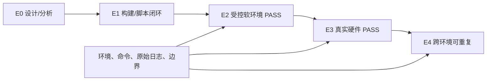
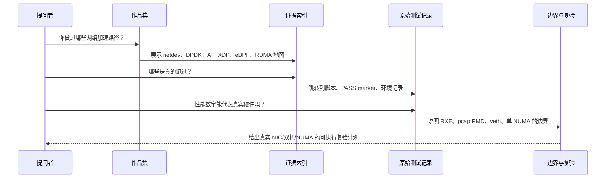

# Portfolio Demo Runbook

## 1. 目标

本 runbook 用于 10 到 15 分钟的作品集演示、技术复盘或面试沟通。目标不是逐个打开全部目录，而是在每个结论旁边给出可追溯证据和明确边界。

建议先准备一个只读终端，仓库根目录为 `linux-driver-lab/`。演示过程中不运行需要 root、改网卡模式或长时间压测的命令；这些动作应留给 `tests/REVALIDATION_CHECKLIST.md` 的受控复验。

## 2. 证据等级

| 等级 | 含义 | 可使用的表述 | 例子 |
| --- | --- | --- | --- |
| E0 | 设计或阅读材料，没有本地运行结论 | 已完成设计/源码分析 | SmartNIC/DPU 实施地图 |
| E1 | 本地构建、静态检查或脚本闭环 | 已验证构建或流程 | 文档、Makefile、测试脚本闭环 |
| E2 | 受控软环境的功能 PASS | 在 RXE/pcap PMD/veth 环境验证 | RDMA verbs 模型、DPDK pcap forwarding |
| E3 | 真实硬件、可重放测试 PASS | 在指定 NIC/主机/拓扑验证 | 真实 NIC RSS、RNIC latency 对比 |
| E4 | 跨环境重复且变量受控的性能结论 | 在多台或多拓扑复现趋势 | NUMA、队列、包长矩阵的稳定结论 |

当前作品集的主要证据集中在 E1 和 E2。`PASS_NUMACTL_NODE0_BINDING` 说明 node0 绑定流程在 135 上成功，不等于 E4 的跨 NUMA 性能结论。真实硬件复验完成后才可把具体条目升级到 E3 或 E4。



## 3. 十分钟演示路径

| 时间 | 展示内容 | 结论 | 证据等级 |
| --- | --- | --- | --- |
| 0-1 分钟 | `README.md` 与 `docs/01_PORTFOLIO_MAP.md` | 主题是从内核网络路径到用户态、RDMA 和后续 offload 的完整模型 | E0/E1 |
| 1-3 分钟 | `docs/02_DPDK_RDMA_COMPARISON.md` | DPDK 解决 packet fastpath，RDMA 解决注册内存上的远端数据搬运，二者不能混为同类优化 | E1 |
| 3-5 分钟 | `tests/EVIDENCE_INDEX.md` 的 DPDK、AF_XDP、eBPF 条目 | 每个方向都有实际产物和状态入口 | E2 为主 |
| 5-7 分钟 | RDMA 的 affinity 与 numactl 测试记录 | SEND/batch/inline/selective/polling 调参框架已经在 RXE 环境闭环 | E2 |
| 7-8 分钟 | `docs/03_PERFORMANCE_TUNING_BOUNDARIES.md` | 明确 RXE、pcap PMD、veth 与真实硬件之间的差异 | 边界声明 |
| 8-10 分钟 | `docs/06_SMARTNIC_DPU_MAP.md` 与复验清单 | 给出进真实 NIC、双机、多 NUMA、SmartNIC/DPU 的具体升级路径 | E0 到 E3 计划 |

## 4. 终端展示命令

以下命令只读取仓库内容，不改变环境：

```bash
cd linux-driver-lab
rg -n "Phase [1-8].*PASS|PASS_NUMACTL_NODE0_BINDING" \
  track-rdma-core/README.md \
  track-rdma-core/ROADMAP.md \
  track-rdma-core/project-rdma-performance-tuning/tests/TEST_RECORD_20260713_NUMACTL_NODE0.md \

rg -n "Phase 1 流量|Phase 3 模式" \
  track-af-xdp/project-af-xdp-track-summary/reports/final/AF_XDP_INTERVIEW_NOTES.md

rg -n "PASS_TRAFFIC|PASS_FORWARDING|PASS_REWRITE" \
  track-dpdk/ROADMAP_NEXT.md \
  track-dpdk/docs/07_DPDK_TRACK_FINAL_STATUS.md

rg -n "134 SSH login blocked|135 only has node0|no real RNIC benchmark" \
  projects/project-network-acceleration-portfolio/tests/EVIDENCE_INDEX.md
```

当某个路径在当前分支不存在或已重命名时，先用 `rg --files <directory>` 定位，不要临时改写结论。演示时优先展示测试记录中的 marker 和环境字段，而不是截取长日志。

## 5. 一条完整讲述链



推荐表述：

> 我把每条路径分为对象模型、可运行闭环、观测证据和硬件边界四层。当前已经在受控环境完成 DPDK、AF_XDP、eBPF 和 RDMA 的关键流程验证；对于性能结论，我保留了环境、命令和缺失条件，并把真实 NIC、双机和多 NUMA 的验证写成可重放清单。

## 6. 常见追问与回答边界

| 追问 | 回答重点 | 不应回答 |
| --- | --- | --- |
| 为什么还要内核网络知识？ | DPDK/AF_XDP/RDMA 的收益取决于队列、IRQ、NUMA、驱动和 NIC 行为 | 用户态绕过后内核完全不重要 |
| RXE 的 batch 数据有什么价值？ | 验证 WR 构造、CQ 回收、参数矩阵和脚本可重复性 | 等价于 RNIC 吞吐或时延 |
| pcap PMD 能证明什么？ | classify/rewrite/forwarding 程序逻辑闭环 | NIC line-rate 或硬件 offload |
| SmartNIC/DPU 做完了吗？ | 已有 representor/switchdev/devlink/tc 的实施和验收地图 | 已完成任意硬件 offload |

## 7. 演示后的交付

演示结束后给出三个入口即可：

1. `README.md`：总览和阅读顺序。
2. `tests/EVIDENCE_INDEX.md`：每个结论的证据位置和当前等级。
3. `tests/REVALIDATION_CHECKLIST.md`：在真实硬件上升级证据的步骤。

这三个文件足以让阅读者独立复查现有结论，也足以让后续实验新增证据时保持同一标准。
