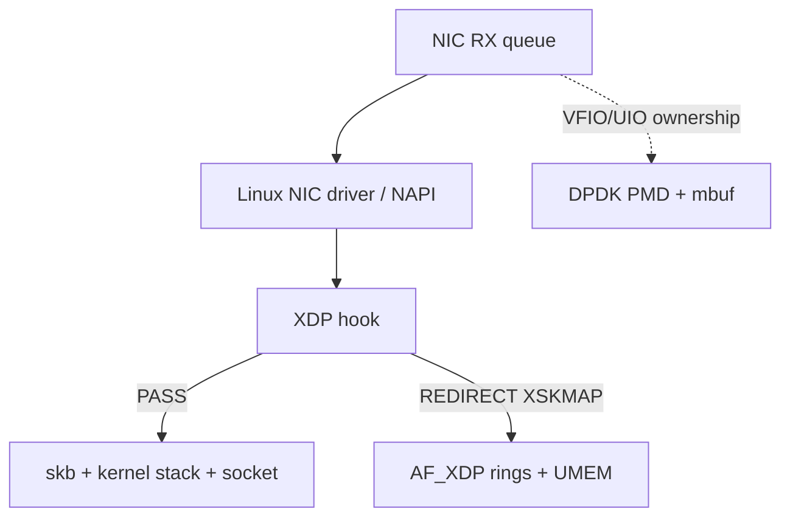
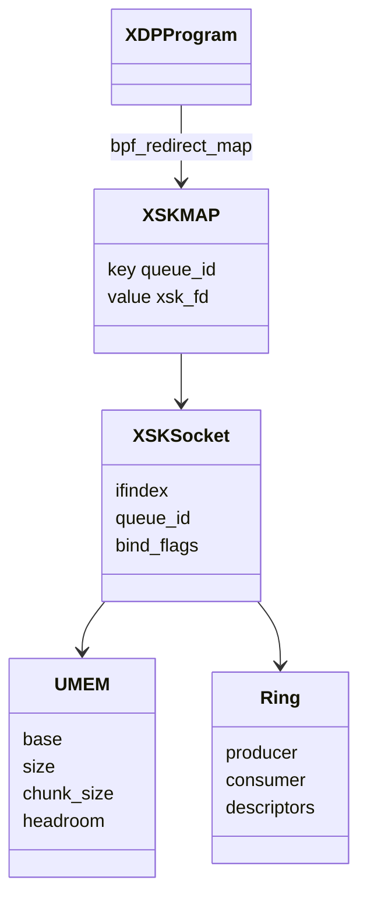
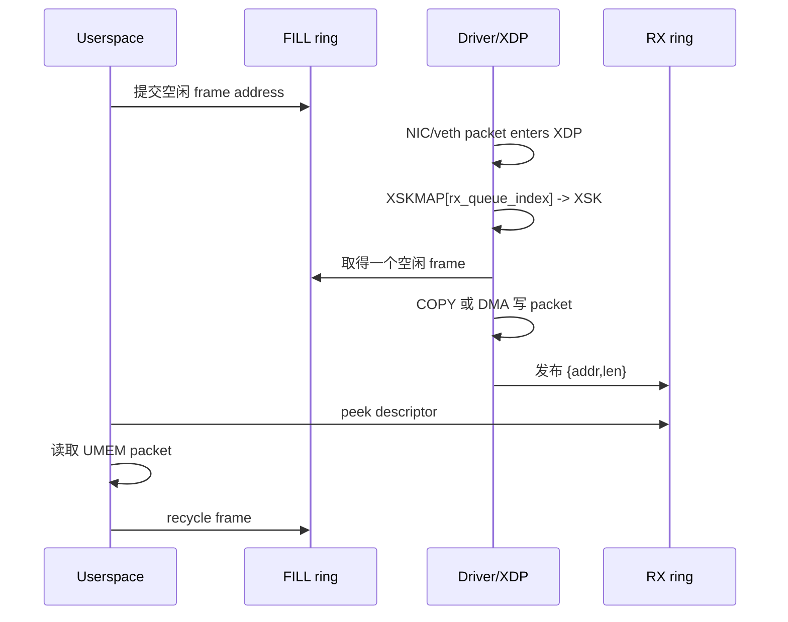
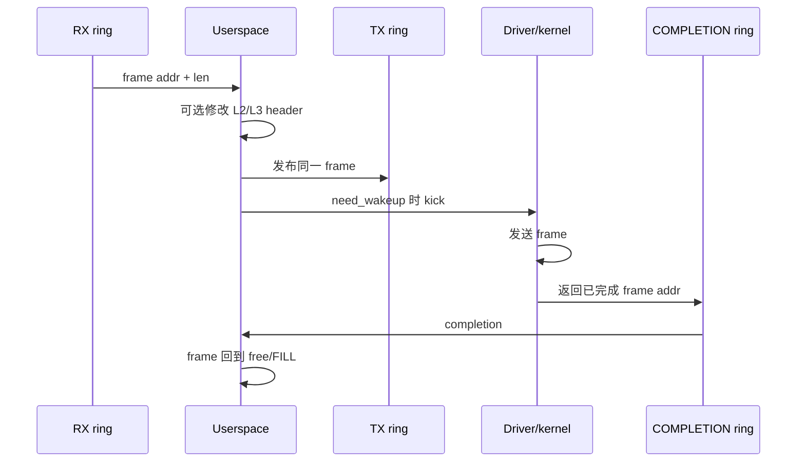
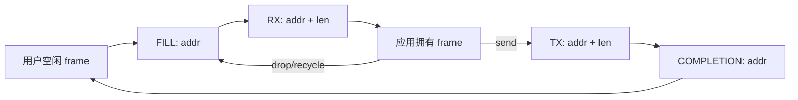
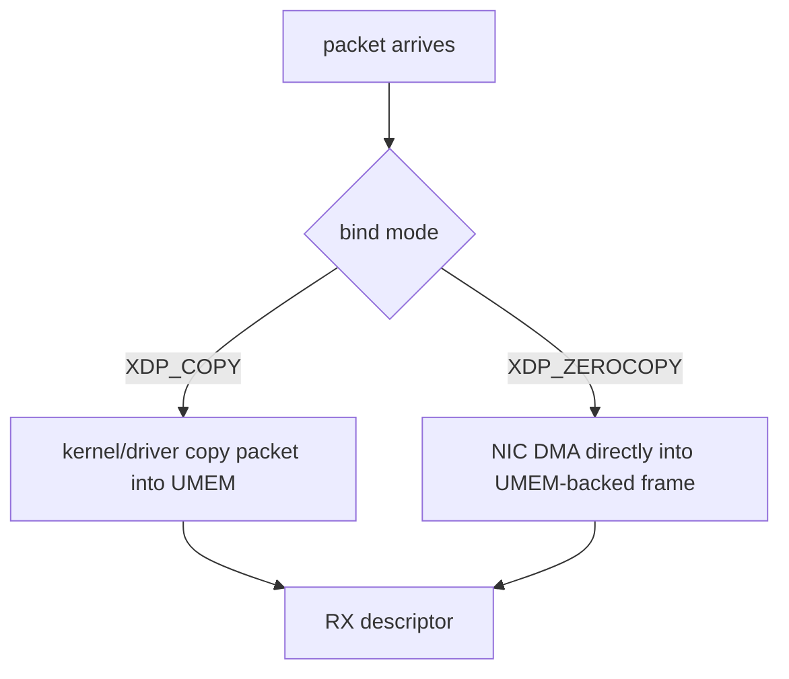

# 00：15 分钟建立 AF_XDP 心智模型

## 一句话定义

AF_XDP 是 Linux 提供的一种高性能 packet socket：XDP 程序在驱动接收早期把指定 RX queue 的包 redirect 到 XSK，内核或驱动把包放进用户注册的 UMEM frame，用户态通过共享 ring 批量收发并回收 frame。

## 它与普通 socket、DPDK 的位置

- 普通 socket 继续经过 skb 和 TCP/IP。
- AF_XDP 保留 Linux 驱动和 XDP hook，把选中的包送给用户态。
- DPDK 常把设备交给用户态 PMD，绕开内核 netdev 数据面。

## 最小闭环的五个对象

| 对象 | 作用 |
| --- | --- |
| XDP program | 对包做 PASS/DROP/REDIRECT 决策 |
| XSKMAP | 将 queue key 映射到 AF_XDP socket |
| UMEM | 用户态预分配、注册给 AF_XDP 的 packet memory |
| XSK socket | 绑定 netdev + queue，关联 UMEM 和 rings |
| rings | 在 kernel/driver 与 userspace 之间交换 frame descriptor |

## RX 的完整故事

没有 FILL frame 时，即使 XDP/XSKMAP 正确，内核也没有目的缓冲区可放包。`rx_packets=0` 不能只怪流量。

## reflect TX 的完整故事

frame 放入 TX 后，应用不能立即覆盖它；只有 COMPLETION 返回才重新拥有该 frame。

## 四环不是四份 packet buffer

ring 里主要传 descriptor；payload 始终在 UMEM。性能与正确性都围绕 frame ownership，而不是复制 C struct。

## COPY 与 ZEROCOPY

ZEROCOPY 需要驱动实现 XSK buffer pool/DMA 支持、合法 queue 和内存条件。veth 没有物理 DMA，因此 COPY 可完整验证功能，ZC unsupported 是合理结论。

## 五个必须分开的成功

1. BPF object load 成功。
2. XDP attach 到正确 netdev/mode 成功。
3. XSK bind 和 XSKMAP 注册成功。
4. XDP redirect 命中并成功。
5. 用户态 RX/TX/completion 计数实际增长。

只有第五层非零，才证明端到端数据闭环。

## 阅读代码先找八个位置

1. UMEM 分配、chunk size、headroom 和注册参数。
2. FILL/RX/TX/COMPLETION ring size。
3. XSK bind 的 ifname、queue 和 COPY/ZC flags。
4. XDP attach mode 与程序 section。
5. XSKMAP key/value 更新。
6. RX peek/release 与 FILL reserve/submit。
7. TX reserve/submit、kick 与 completion 回收。
8. 退出时 XDP detach、map/socket/UMEM 销毁顺序。

