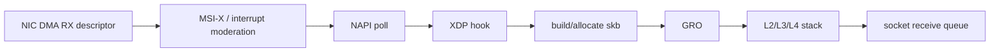
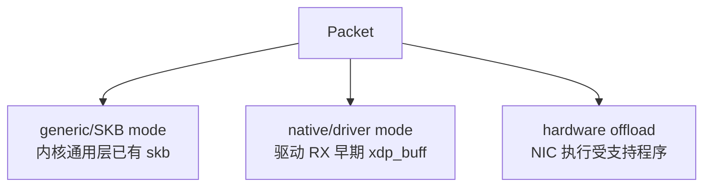
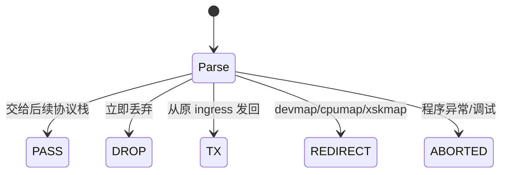
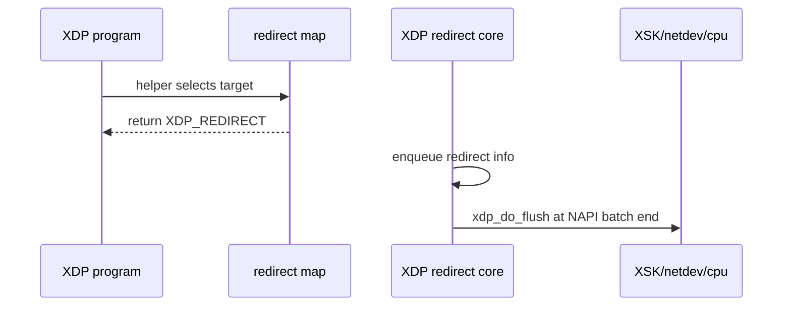
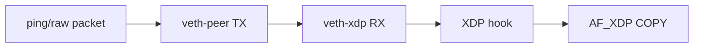

# 01：内核 RX 路径与 XDP 的位置

## 普通 RX 路径



native XDP 通常在驱动已拿到 RX buffer、尚未构造完整 skb 时运行。因此 DROP/REDIRECT 可以省掉 skb 分配、协议栈和后续调度成本。

## generic、native、offload



| 模式 | attach 常见标志 | 优点 | 边界 |
| --- | --- | --- | --- |
| generic | `XDP_FLAGS_SKB_MODE` | 几乎所有 netdev 可用，适合功能验证 | 已产生 skb，性能最低 |
| native | `XDP_FLAGS_DRV_MODE` | 驱动早期执行，支持高性能 AF_XDP | 依赖驱动实现 |
| offload | `XDP_FLAGS_HW_MODE` | 在 NIC 上执行 | 程序/map/helper 能力受硬件限制 |

native XDP 支持不等于 AF_XDP zero-copy 支持；这是两个独立 driver capability。

## `xdp_buff` 与 packet bounds

XDP 程序常见上下文是 `struct xdp_md`，包含 `data`、`data_end` 等偏移。每次解析都必须先做边界检查：

```c
void *data_end = (void *)(long)ctx->data_end;
void *data = (void *)(long)ctx->data;
struct ethhdr *eth = data;

/* verifier 需要看到显式边界检查，证明 eth 指针不会越界。 */
if ((void *)(eth + 1) > data_end)
    return XDP_ABORTED;
```

verifier 证明的是所有可能路径的内存安全，不会因为实际测试包“总是够长”就省略检查。

## XDP action



- `XDP_PASS`：继续构造 skb/进入网络栈。
- `XDP_DROP`：回收当前 RX buffer。
- `XDP_TX`：由驱动从同一设备发回，适合简单 L2 reflect。
- `XDP_REDIRECT`：redirect 到另一 netdev、CPU 或 AF_XDP socket。
- `XDP_ABORTED`：通常应计为程序错误，不是正常策略 DROP。

## redirect 是两阶段动作



helper 返回 REDIRECT 不保证最终 target 接收成功。需要结合 `xdp_redirect` exception/drop tracepoint、map 命中和目标 ring 统计判断。

## NAPI batch 为什么重要

驱动在一次 NAPI poll 中批量处理 RX descriptor，并在 batch 尾部 flush redirect。batch 可以摊薄锁、map 与 flush 成本，但也影响单包尾延迟。AF_XDP 应用自己的 batch size 应与 NIC/NAPI/ring 行为一起测量。

## veth 为什么适合功能测试



向本机某地址发包可能被 local route 短路，不经过目标 netdev RX。veth pair 从 peer 注入，能稳定触发另一端 RX/XDP。它验证软件路径，不提供物理 NIC DMA、PCIe 或硬件 RSS 证据。

## attach 生命周期

程序应记录：ifindex、mode、program id、旧 program、attach flags。退出时只 detach 自己负责的 program，避免误卸载别的进程更新后的 XDP 程序。生产环境更适合通过 pinned link/bpf_link 管理所有权，而不是无条件 `set_link_xdp_fd(-1)`。

## 与 tc/eBPF hook 的区别

XDP 位于 ingress 最早期，packet 仍是线性/驱动 buffer 表示；tc ingress 更晚，通常已有 skb，但能访问更多 skb metadata 和协议栈语义。选择 hook 应基于所需信息和 action，不是只按“哪个更快”。

对应实验：[../../lab-xdp-redirect-basics/README.md](../../lab-xdp-redirect-basics/README.md)。

