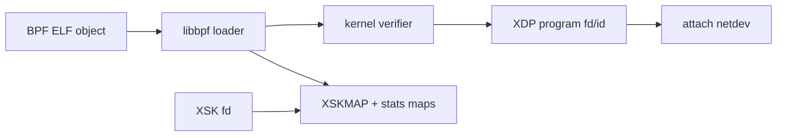
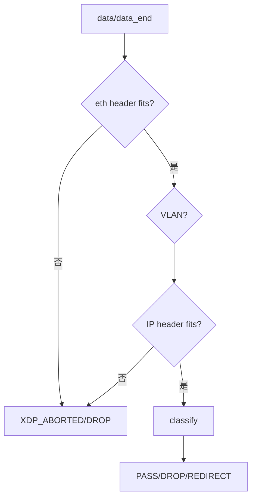
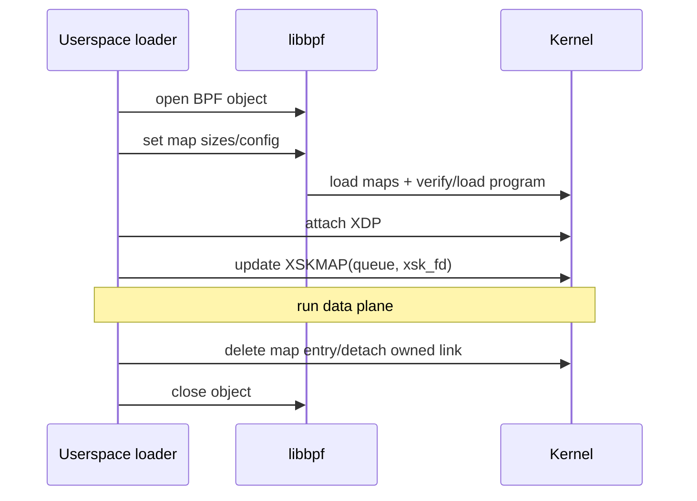
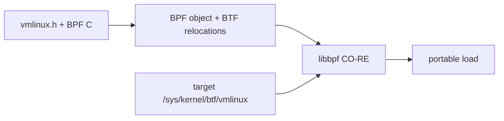

# 02：eBPF Verifier、Maps 与 Loader

## AF_XDP 为什么仍需要 eBPF

AF_XDP socket 不会自动接收网卡所有包。XDP 程序负责在 RX hook 上选择包，并通过 XSKMAP 把它重定向到与 queue 绑定的 XSK。



## verifier 在证明什么

- 所有 packet pointer 访问不超过 `data_end`。
- map value pointer 在合法生命周期内使用。
- 栈和寄存器已初始化。
- 循环有可证明边界，程序复杂度在限制内。
- helper 参数类型、context 和 program type 合法。

verifier 接受不代表业务逻辑正确；它保证受检查的安全属性，不会验证 XSKMAP key 是否选对 queue。

## 安全解析模式



解析 VLAN、IPv4 options、IPv6 extension header 时，每移动一次 cursor 都要重新证明边界。不要用未校验的 `ihl` 或长度字段直接做指针算术。

## XSKMAP 的语义

XSKMAP 的 key 通常是 RX queue id，value 是 XSK fd。用户态写 map 后，内核保存 socket 引用；XDP 程序常用：

```c
/* queue id 必须与 XSK bind 的 queue 一致，否则 redirect 会失败。 */
return bpf_redirect_map(&xsks_map, ctx->rx_queue_index, XDP_PASS);
```

最后一个 flags 参数的低位可提供 lookup miss 时的 fallback action。学习代码必须明确 miss 是 PASS 还是 DROP，不能把未注册 queue 静默黑洞化。

## map 类型分工

| map | 在 AF_XDP 中的用途 | 并发特点 |
| --- | --- | --- |
| XSKMAP | queue -> XSK | redirect target 专用 |
| PERCPU_ARRAY | 每 CPU action/bytes 统计 | 避免共享计数器竞争 |
| ARRAY/HASH | 配置、ACL、flow state | 更新与读取并发需设计 |
| DEVMAP | XDP redirect 到 netdev | 支持批量 flush |
| CPUMAP | 把 XDP frame 转交其他 CPU | 软件分流/后续程序 |

per-CPU counter 汇总时必须遍历所有 possible CPU，不能只读一个 value。

## loader 生命周期



推荐顺序是先准备 XSK/UMEM，再更新 XSKMAP，最后开始流量；退出时先阻止新 redirect，删除 map entry，再 drain/reclaim rings 和关闭 socket。

## BTF 与 CO-RE

BTF 描述内核/程序类型，CO-RE 允许 libbpf 根据目标内核 BTF 重定位结构字段。简单 `xdp_md` 程序不一定依赖复杂 CO-RE，但工程化观测、kfunc 或内核结构访问会受益。



CO-RE 解决结构布局兼容，不解决 helper、map type、driver XDP 和 AF_XDP zero-copy 能力差异。

## pinning 与多进程

pin 到 bpffs 可以让 map/program 生命周期独立于 loader fd，并支持控制面和数据面进程共享。代价是需要明确 owner、版本、升级和清理策略；遗留 pinned map 的 key/value size 与新程序不兼容时会导致加载或更新失败。

## 调试 verifier

保留完整 verifier log，先看最后一个 rejected instruction 和寄存器状态，再回到对应源代码。常见修复是显式 bounds check、限制循环、缩小栈对象、避免不确定 pointer arithmetic，而不是盲目提高 log level 后阅读全部输出。

对应 BPF 代码：[../../lab-af-xdp-socket-rings/app/af_xdp_kern.bpf.c](../../lab-af-xdp-socket-rings/app/af_xdp_kern.bpf.c)。

