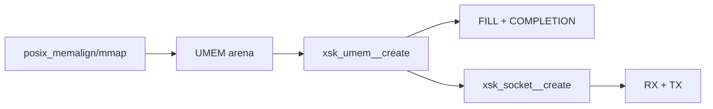
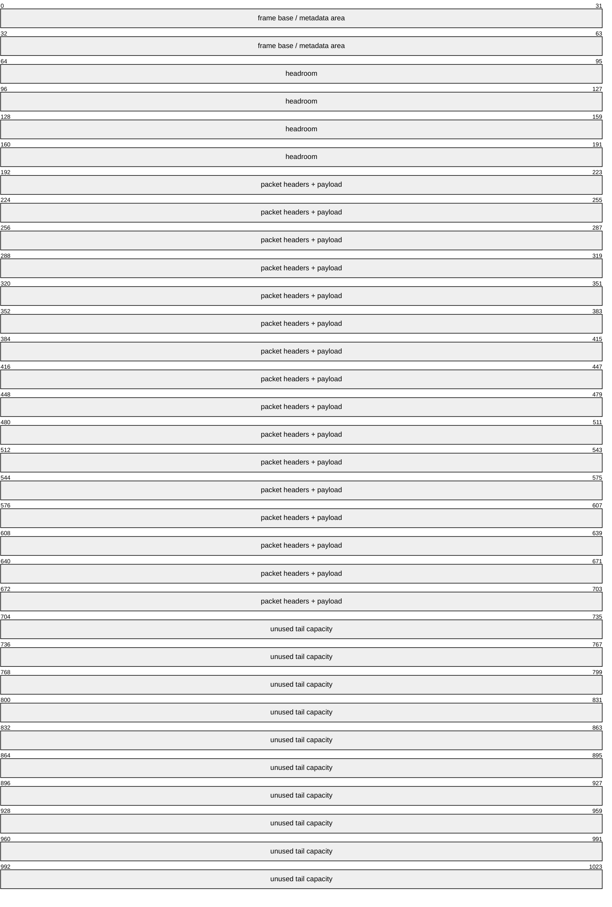
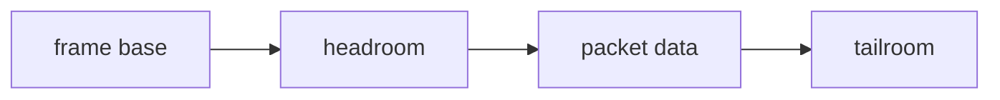
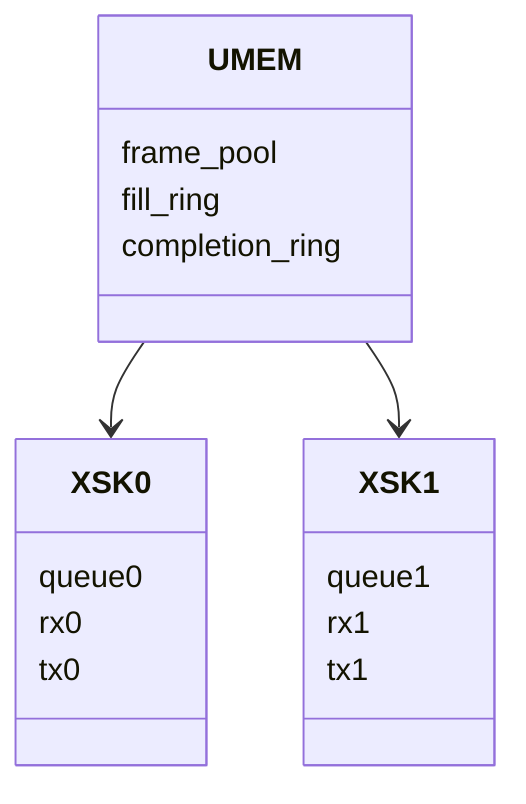
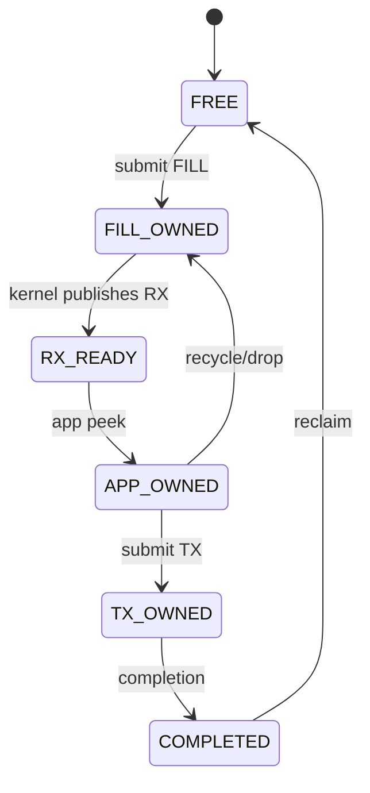

# 03：AF_XDP Socket、UMEM 与 Frame Layout

## UMEM 是什么

UMEM 是用户态提供的一段 packet buffer arena。注册时告诉内核 base、length、chunk size、headroom 和 flags；ring descriptor 用 offset/address 引用其中的 frame。



UMEM 不是普通 malloc 后就自动 zero-copy。ZC 还要求驱动把页面映射进 NIC DMA domain，并用 XSK buffer pool 管理。

## frame/chunk 布局



这是概念图，不表示固定大小。descriptor addr 指向 chunk/frame，实际 packet data 位置要使用 libxdp helper 或按配置解码，尤其在 unaligned chunk mode 下不能简单做 `base + addr` 假设。

## chunk size 的选择

chunk 必须容纳 headroom + packet + 必要 metadata。过小会丢弃大包，过大则降低同一 UMEM 可容纳 frame 数并增加 cache/TLB 工作集。

```text
usable_packet_bytes = chunk_size - headroom - metadata_reserve
frame_count = umem_size / chunk_size
```

测试应记录 MTU、VLAN、可能的 encapsulation 和 multi-buffer 支持。只按 1500 byte MTU 选择 2048 frame，在额外 tunnel header 或 jumbo frame 下可能不足。

## aligned 与 unaligned chunk

- aligned mode：frame address 通常按固定 chunk 边界解释，管理简单。
- unaligned mode：descriptor 可携带非固定边界 offset，适合更灵活内存布局，但地址编码/提取必须使用正确 mask/helper。

不要把 ring 中的 address 永久当作直接 C pointer；它是 UMEM 内地址标识，还可能编码 offset。

## headroom 的用途

headroom 为 prepend header、metadata 或对齐预留空间。例如转发器封装 VLAN/VXLAN 时可在 payload 前添加 header，避免整体 memmove。headroom 过大则浪费每 frame 容量。



XDP metadata (`data_meta`) 与 AF_XDP userspace metadata 需要双方约定布局、版本和边界，不能直接把内核 struct 指针暴露给用户态。

## UMEM 数量与共享

一个 UMEM 可以服务一个 XSK，也可以通过 shared UMEM 被多个 XSK 使用。共享减少内存注册和跨 socket copy，但 frame allocator 必须全局保证唯一所有权，FILL/COMPLETION ring 的组合关系也更复杂。



## 内存分配与 NUMA

高性能时应让 UMEM 页面靠近 NIC PCIe NUMA node 和处理该 queue 的 CPU。首次触页决定匿名内存放置时，必须在线程绑定后初始化/触页，或使用 `numactl --membind`。功能 PASS 不代表 NUMA 正确。

## hugepage 是否必须

AF_XDP UMEM 不要求一律使用 hugepage。大页可能减少 TLB 和 DMA mapping 条目，但会增加预留、锁页和部署复杂度。COPY 模式下内核 copy 成本可能更主要；ZC 和大工作集才更值得测试 page size。

## frame allocator

最简单可维护一个 free stack：初始化放入所有 frame addr；提交 FILL/TX 时移出；收到 RX/COMPLETION 后按状态转移。工程化实现应为每个 frame 记录 state/generation，debug build 检测 double-free。



## 容量计算

UMEM frame 至少覆盖：FILL outstanding + RX batch + app processing + TX outstanding + completion lag + safety margin。只按 FILL ring size 分配会在 reflect/forward 高峰时耗尽。

对应实验：[../../lab-af-xdp-socket-rings/README.md](../../lab-af-xdp-socket-rings/README.md)。

