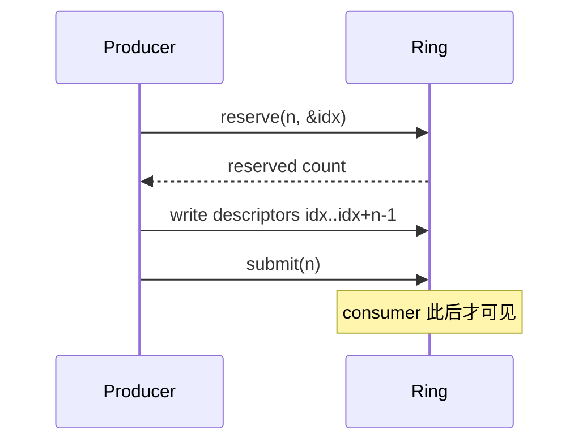
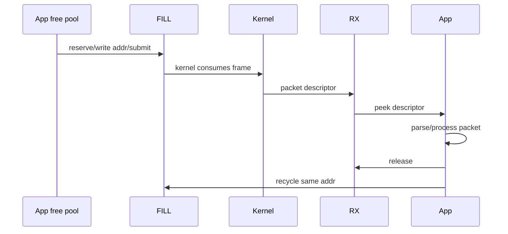
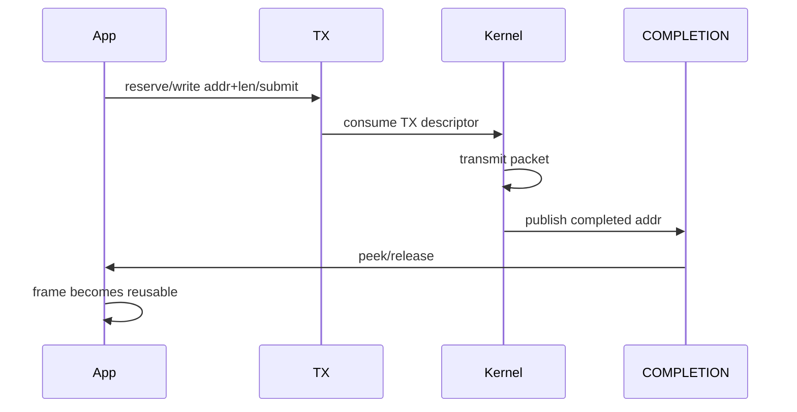
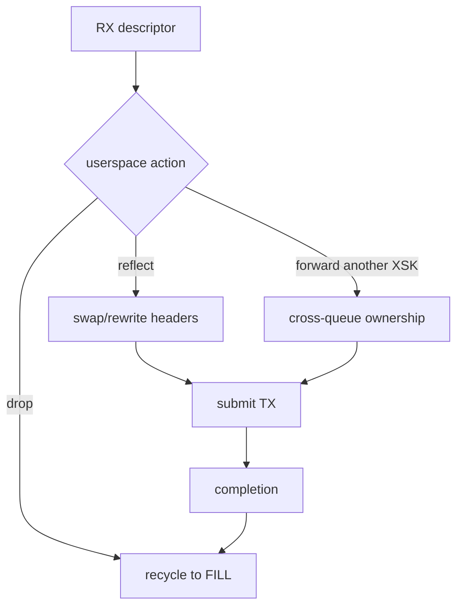
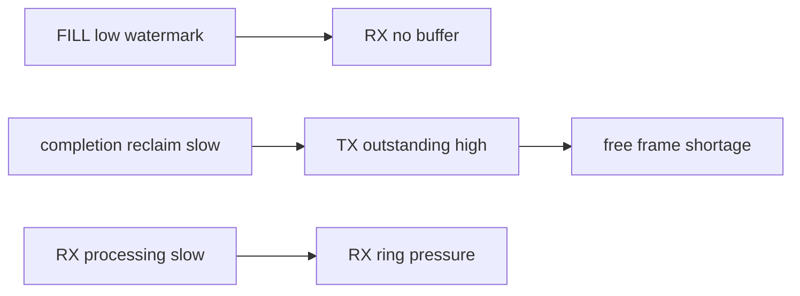
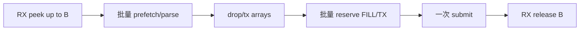

# 04：四类 Ring 与 Frame Ownership

## 两组 ring 的方向

| ring | producer | consumer | descriptor 内容 |
| --- | --- | --- | --- |
| FILL | userspace | kernel/driver | 可接收数据的 frame address |
| RX | kernel/driver | userspace | 收到包的 address + length |
| TX | userspace | kernel/driver | 待发送包的 address + length |
| COMPLETION | kernel/driver | userspace | 已完成发送的 frame address |

FILL/COMPLETION 通常属于 UMEM，RX/TX 属于 XSK。共享 UMEM 时这一归属关系决定哪些 ring 能共享。

## ring API 的事务模型



consumer 对应：`peek()` 获得连续可用 descriptor，处理后 `release()`。reserve 不足时不能假设返回值一定等于请求 batch；要么缩小批次，要么稍后重试。

## RX 所有权转移



`release RX` 只推进 RX consumer index，不会自动把 frame 放回 FILL。忘记 recycle 会让 FILL 水位逐渐下降，最终 RX 停止。

## TX 所有权转移



TX submit 后到 completion 前，frame 属于内核/驱动 TX 路径。提前 recycle 到 FILL 会让 RX DMA/copy 覆盖尚未发送的数据。

## Drop、Reflect、Forward 的状态差异



drop 不是释放 malloc，而是尽快把 frame address 重新交给 FILL。跨 XSK forward 若不是共享 UMEM，通常需要 copy 到目标 UMEM frame。

## 水位与背压



应用应统计：free frames、fill submitted、RX outstanding、TX outstanding、completion pending。仅统计 packets 无法定位 frame 卡在哪里。

## 推荐不变量

```text
total_frames = free
             + fill_owned
             + rx_ready_or_app
             + tx_owned
             + completion_ready
```

debug 模式每轮检查总和和 frame state，能快速发现 double submit、lost frame 和 premature reuse。

## 地址与长度校验

收到 RX descriptor 后应验证：

- address 解码后位于 UMEM 范围。
- `len <= chunk usable capacity`。
- parser 每层都不越过 `addr + len`。
- multi-buffer packet 若未支持，明确拒绝而非把 fragment 当完整包。

用户态不受 BPF verifier 保护，越界解析会变成普通 C 内存错误。

## 批量处理



实际顺序要确保 reserve 失败时 frame 不丢失。可先统计 action 数，分别 reserve 足够槽位，再写 descriptor 和提交。

## Ring size 不是越大越好

大 ring 提高突发容忍度，但增加 frame 占用、cache footprint 和排队时延。ring size 还受内核/驱动能力和 power-of-two 约束。建议同时测 packet rate、drop、ring occupancy 和 p99。

对应代码：[../../project-af-xdp-mini-forwarder/app/af_xdp_forwarder.c](../../project-af-xdp-mini-forwarder/app/af_xdp_forwarder.c)。

