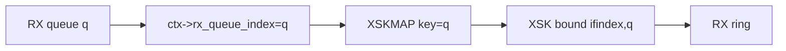
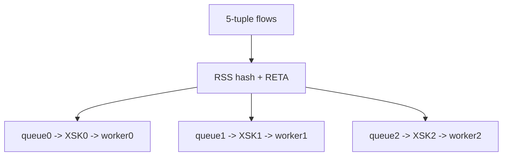
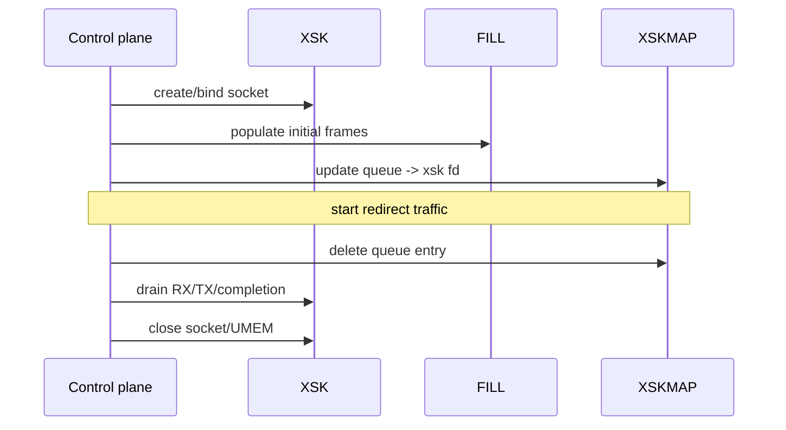
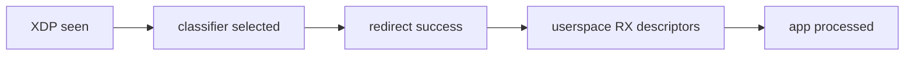

# 05：XSKMAP Redirect 与 Queue Binding

## 最重要的契约

XSK 绑定 `(ifindex, queue_id)`；XDP 程序运行在某个 RX queue 上；XSKMAP key 必须把该 queue 指向兼容的 XSK。



map 中存在 fd 不代表任意 queue 都可 redirect 到它。queue mismatch、netdev mismatch 或 socket 未就绪都可能导致 redirect error/drop。

## 为什么 queue id 是天然分片键

RSS 已把流分散到 RX queue。每 queue 一个 XSK/worker 可保持 flow affinity，避免跨核移动 packet buffer。



veth 单队列功能测试证明不了硬件 RSS、RETA 和多队列 NUMA 扩展。

## map miss 的策略

```mermaid
flowchart TD
    Packet --> Lookup{XSKMAP[q] valid?}
    Lookup -- 是 --> Redirect[XDP_REDIRECT]
    Lookup -- 否 --> Policy{fallback}
    Policy --> Pass[XDP_PASS]
    Policy --> Drop[XDP_DROP]
```

- PASS 适合渐进部署：未注册 queue 继续内核栈。
- DROP 适合严格 fast path，但配置错误会造成黑洞。
- 控制面切换时可先建 XSK、填 FILL、更新 map，撤销时反向操作。

## 安全发布顺序



先更新 map 再准备 FILL 会造成启动窗口丢包；先关闭 socket 再删除 map 会产生 redirect failure。

## 多 socket 同 queue

一个 XSKMAP key 同时只能指向一个 socket。需要同 queue 软件分流时可：

- 一个 XSK worker 收包后通过用户态 ring 分发。
- 通过 RSS/flow steering 增加硬件 queue。
- 用 cpumap/devmap 在 XDP 层重定向到其他处理上下文。

每种方式都有 copy、cache locality、排序和背压代价。

## 统计必须两侧对应



理想情况下计数单调不增。差值说明问题层次：seen 高而 selected 低是分类；selected 高而 redirect 低是 map/queue；redirect 高而 RX 低是 FILL/ring/socket；RX 高而 app 低是用户处理。

## 更新并发

BPF map update/delete 与 XDP lookup 可并发，内核负责 map 对象安全；业务切换仍需 generation/readiness。控制面可在 value 外维护 socket generation，日志记录每次 queue owner 变化。

## 常见错误

| 现象 | 检查 |
| --- | --- |
| XDP action 是 REDIRECT，RX=0 | XSKMAP key、socket queue、FILL 水位 |
| queue0 正常，queue1 丢包 | 是否为每 queue 创建 XSK/map entry |
| 程序重启后黑洞 | pinned map 是否残留旧 socket entry |
| attach 后内核网络断 | fallback 是否错误设为 DROP |

对应 Phase 2：[../../lab-af-xdp-socket-rings/README.md](../../lab-af-xdp-socket-rings/README.md)。
