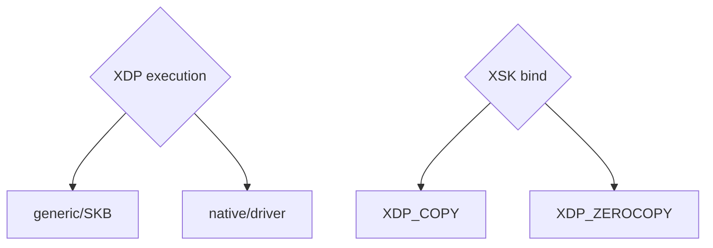
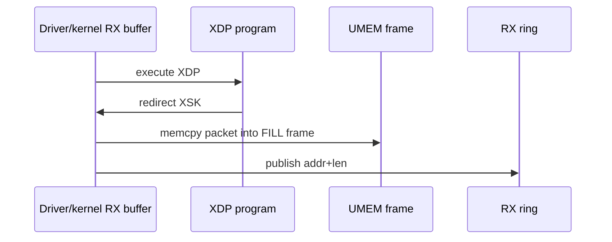
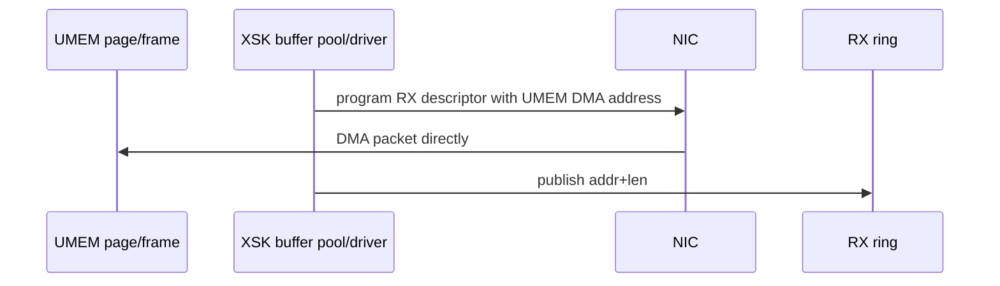
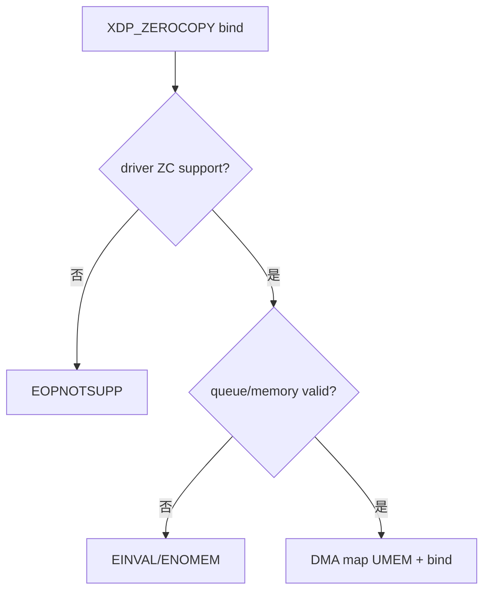
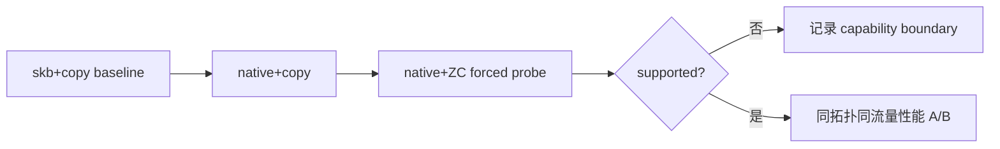

# 06：COPY、ZEROCOPY、驱动与 DMA

## 三个独立选择

不要把 XDP mode 与 XSK bind mode 混为一个开关：

可出现 generic+copy、native+copy、native+ZC。generic+ZC 通常不成立，因为 ZC 依赖驱动早期 RX buffer path。

## COPY RX 路径

COPY 仍省去普通 socket 的大部分协议栈和用户 recv copy 语义，但在 XDP buffer 到 UMEM 之间有一次 copy。它是可靠的功能基线。

## ZEROCOPY RX 路径

这里“zero-copy”指 NIC 到用户可见 packet memory 不再经过中间 packet copy；descriptor、cache coherence、DMA mapping 和 metadata 操作仍存在。

## ZC 需要哪些能力

- 驱动实现 AF_XDP zero-copy/XSK buffer pool hooks。
- 指定 netdev 和 queue 支持该模式。
- UMEM 页面可被 DMA map，IOMMU/内存锁定条件满足。
- frame size/headroom/alignment 满足驱动要求。
- XDP native path 可用。

## veth 与 vmxnet3 边界

veth 是软件设备，没有真实 NIC DMA，因此可支持 generic/native XDP 和 COPY，却不应期待 ZC。某个驱动支持 native XDP 也不代表实现 AF_XDP ZC；应查 `ethtool -i`、驱动源码/文档并实际强制 bind 验证。

## 强制与 fallback

测试模式必须区分：

- 强制 `XDP_ZEROCOPY`：失败即记录 unsupported，最能证明能力。
- 自动 bind：内核/libbpf 可能选择 COPY，适合可用性，不适合能力声明。
- 强制 `XDP_COPY`：建立稳定功能基线。

结果中要打印 requested mode 和 actual/observed outcome，不能只写 `socket ready`。

## TX 的 ZC 含义

TX 时应用把 UMEM frame 交给 TX ring，驱动/NIC 从该 frame DMA 读取。completion 返回前 frame 仍被设备拥有。即使 RX 是 COPY，TX 也可能走不同能力路径；测试应分别验证。

## cache coherence 与 DMA

在 coherent 平台，驱动 DMA API 负责必要同步；应用通过 ring ownership 和 API 保证时序。不要在用户态手写“flush cache”替代驱动 DMA contract。跨 NUMA 时 NIC DMA 到远端内存仍会产生额外互连成本。

## 如何做模式对比

必须保持 payload、queue、CPU、ring、UMEM、测试时长和流量发生器一致。只比较不同机器上的两个数字没有意义。

对应实验：[../../lab-af-xdp-zero-copy-vs-copy/README.md](../../lab-af-xdp-zero-copy-vs-copy/README.md)。

