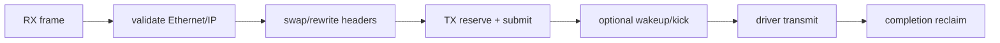
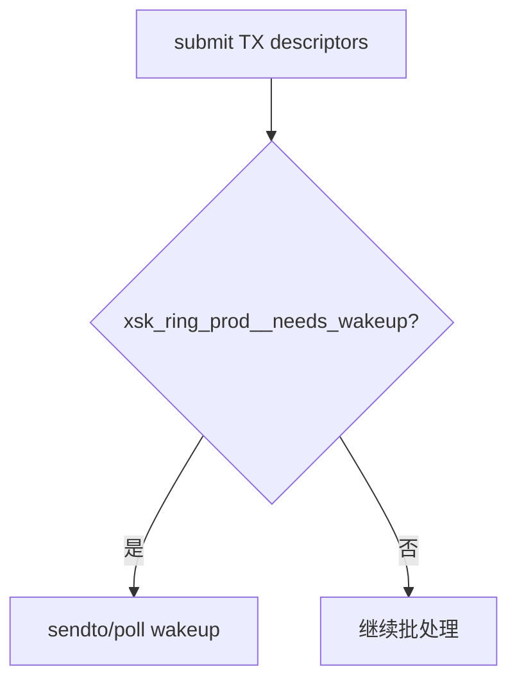
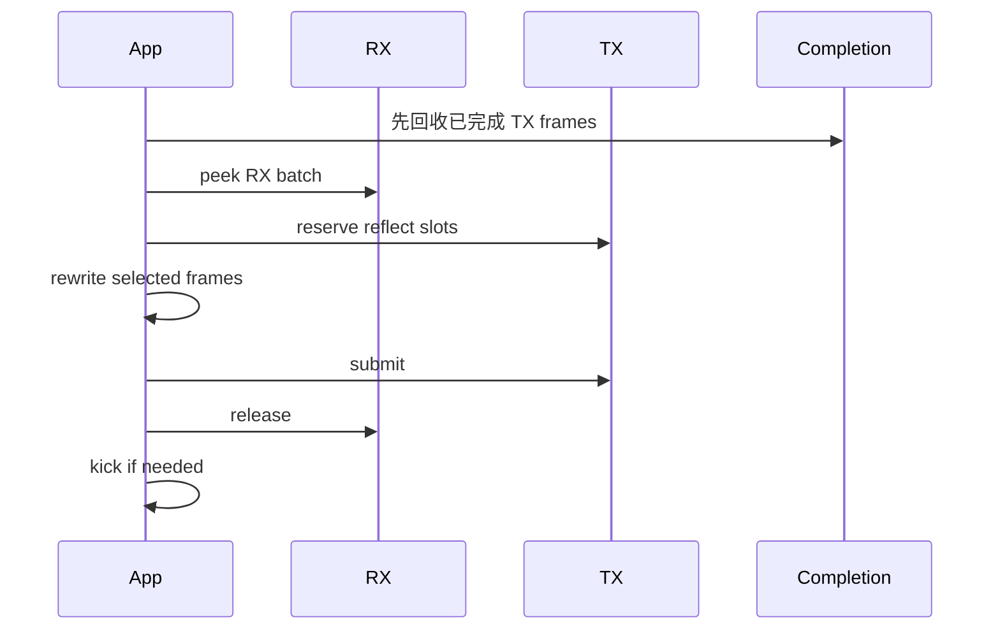
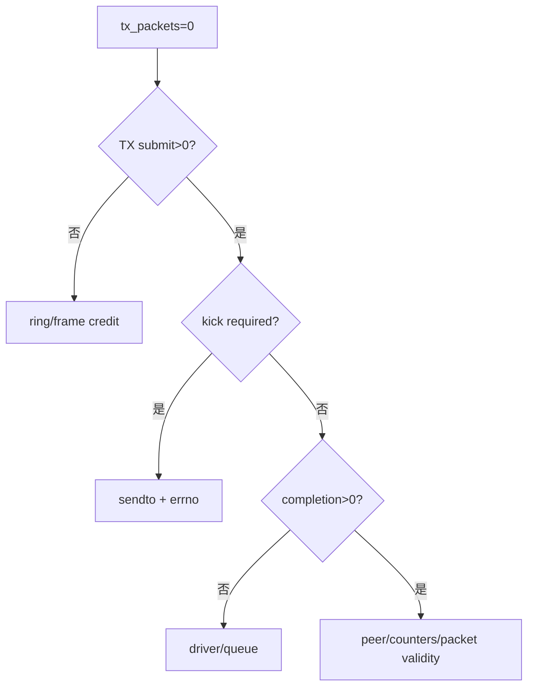

# 07：TX、Reflect 与 NEED_WAKEUP

## Reflect 不只是把 RX descriptor 填进 TX

最小 L2 reflect 通常要交换源/目的 MAC，并重新检查 packet 长度；L3/L4 修改还需要更新 checksum。然后把同一 frame 提交 TX，等待 completion 后回收。



## 为什么有时要 `sendto()` kick

AF_XDP TX ring 是共享内存，提交 descriptor 后内核/驱动未必正在主动检查。传统方式用零长度 `sendto()` 触发发送。`XDP_USE_NEED_WAKEUP` 允许应用只在 ring 标志表示需要唤醒时 kick，减少 syscall。



是否需要 wakeup 与驱动、busy polling 和 bind flags 有关。永远 kick 功能简单但 syscall 多；从不 kick 可能导致 TX descriptor 长期不被消费。

## TX credit

可提交数量受 TX ring free slots 和可用 frame 双重限制。completion 回收慢时，即使 TX ring 暂时有槽，也可能没有安全 frame。

```text
tx_outstanding = tx_submitted - completion_reclaimed
available_frames = total_frames - all_nonfree_states
```

设置 max outstanding 和 completion drain budget，避免 RX 高峰把所有 frame 转入 TX 后 FILL 枯竭。

## completion 的语义

COMPLETION 表明该 frame 不再被 AF_XDP TX path 使用，可以复用。它通常不等价于对端收到、协议 ACK 或业务处理完成。对可靠发送有要求时仍需上层协议。

## RX/TX 同批处理



先 reclaim completion 可扩大当轮可用 frame。TX reserve 不足时必须决定 partial send、drop/recycle 或 backlog，不能丢失 frame ownership。

## XDP_TX 与 AF_XDP userspace reflect

| 路径 | 优点 | 适用 |
| --- | --- | --- |
| `XDP_TX` | 全在内核/驱动，最少用户态往返 | 简单无状态 L2 反射 |
| AF_XDP RX->TX | 用户态可做复杂解析/状态/业务 | 自定义转发、网关、应用协议 |

如果业务逻辑可在 verifier 限制内完成，XDP_TX 可能更高效；不要为了使用 AF_XDP 而把简单动作强行搬到用户态。

## checksum 与 packet mutation

交换 MAC 不影响 IP/L4 checksum；修改 IP、端口、长度或 payload 通常需要增量/完整更新 checksum。还要处理 IPv4 fragments、IPv6、VLAN 和 offload metadata。veth 小包 smoke 不能覆盖真实 NIC checksum offload 组合。

## TX 不动的排查顺序

1. TX reserve 是否成功，submitted 是否增长。
2. descriptor addr/len 是否合法。
3. need-wakeup 是否检查并执行 kick。
4. `sendto()` errno。
5. completion 是否增长。
6. netdev TX counters 和 peer RX counters。
7. driver ZC/COPY mode 和 queue 状态。



对应项目：[../../project-af-xdp-mini-forwarder/README.md](../../project-af-xdp-mini-forwarder/README.md)。

