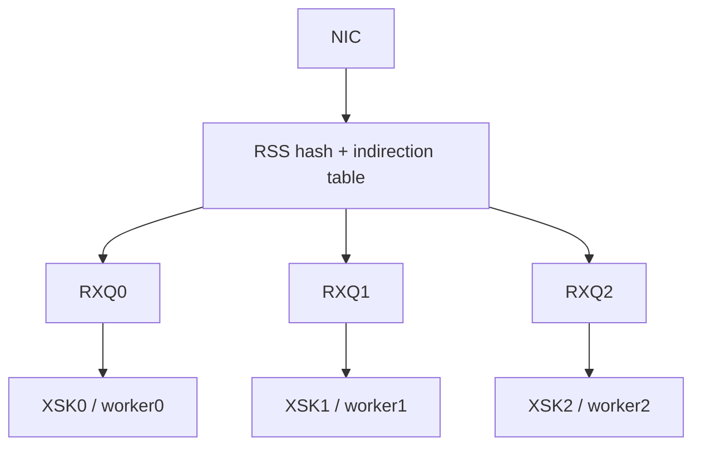
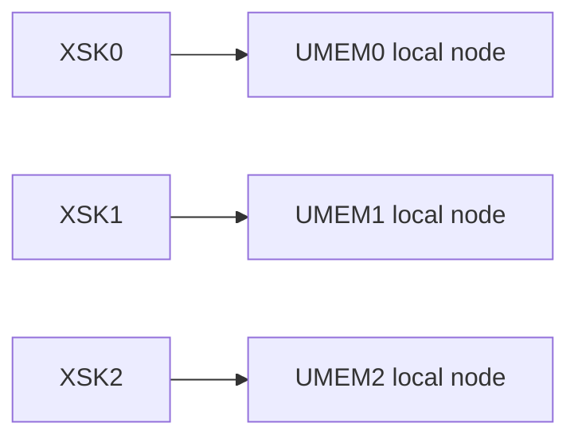
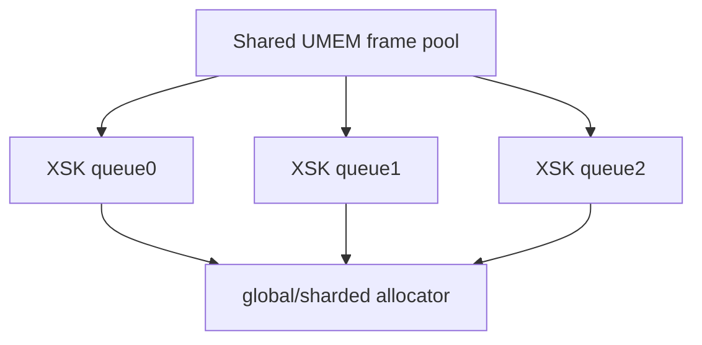
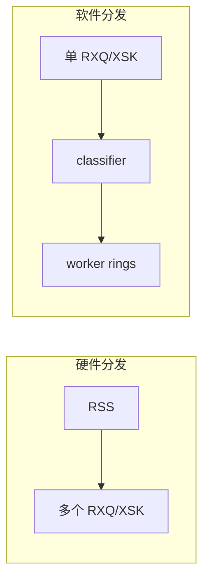
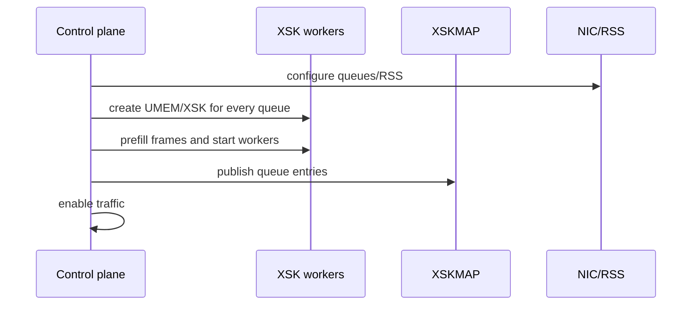

# 08：多队列、RSS 与共享 UMEM

## 从单队列到多核

单个 XSK 绑定一个 netdev queue。扩展常用模式是每个 RX queue 一个 XSK、一个固定 worker，依靠 RSS 维持 flow affinity。

必须同时配置硬件 queue 数、RSS key/RETA、XSKMAP entries、XSK bind queue 和 worker affinity。漏一个 queue 时，该 queue 应明确 PASS 到内核或计数 DROP。

## Flow affinity 的价值

同一 flow 保持在一个 worker 可减少：

- flow table 跨核锁。
- packet reorder。
- cache line 迁移。
- 跨 worker frame handoff。

但 NIC RSS hash 与应用 flow key 可能不一致，fragment、tunnel、非 TCP/UDP 流也需要定义策略。

## 每 XSK 独立 UMEM

优点是所有权、ring 和 NUMA 清晰；缺点是跨 queue forwarding 需要 copy 或复杂 handoff，内存注册/预留更多。

## 共享 UMEM

共享可让 frame 在 XSK 间转发而不 copy，但需要：

- 明确 FILL/COMPLETION ring 与 socket 的关联方式。
- allocator 不重复分配 frame。
- cross-worker handoff 有界并带背压。
- NUMA 跨节点访问可观测。

## 软件分发与硬件 RSS

硬件 RSS 少一次软件 handoff，受 NIC hash/queue 能力约束；软件分发策略灵活，但增加 cache、ring 和一个 worker 瓶颈。应测量而不是绝对化选择。

## 多队列启动顺序

撤销顺序反过来：先停止/重定向新流量，删除 map entries，drain workers，再销毁 XSK/UMEM。

## Queue resize 与在线升级

改变 `ethtool -L` channel 数可能重排 queue、RSS 和 XSK bind，有活动 AF_XDP socket 时应视为控制面变更。在线升级可使用新 generation 的 worker/XSK，逐 queue 切 map entry，并监控 redirect/RX 差值。

## 跨队列转发的所有权

源 worker 从 RX 获得 frame 后，若目标 XSK 共享 UMEM，可通过有界 SPSC ring 交给目标 worker；目标提交 TX 并最终回收。源 worker在 handoff 后不得再访问。handoff ring 满时要有 drop/backpressure 策略。

## 验证矩阵

| 维度 | 建议 |
| --- | --- |
| queue | 1/2/4/8 |
| worker | 等于 queue，另测不足/超配 |
| UMEM | per-XSK/shared |
| flow | 单流、多流、倾斜流量 |
| affinity | unbound/same NUMA/cross NUMA |
| metric | per-queue pps/drop/ring watermarks |

当前 veth 单队列实验只验证模型；真实 RSS/RETA 和多队列性能属于硬件复验边界。

