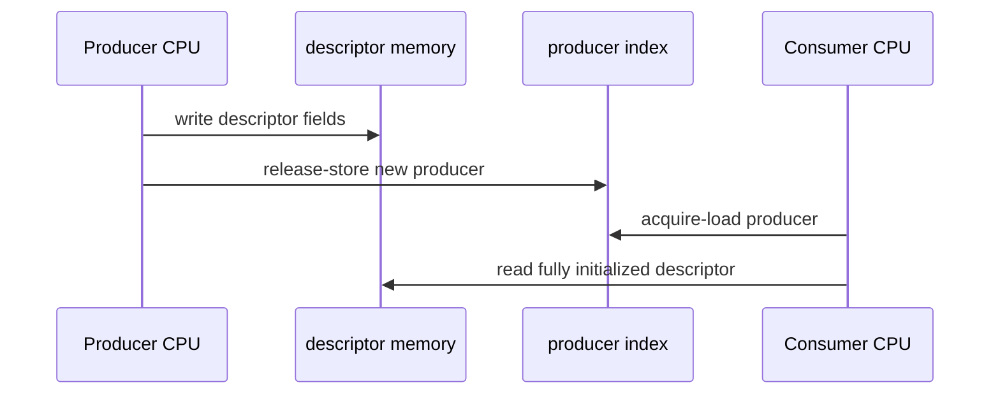
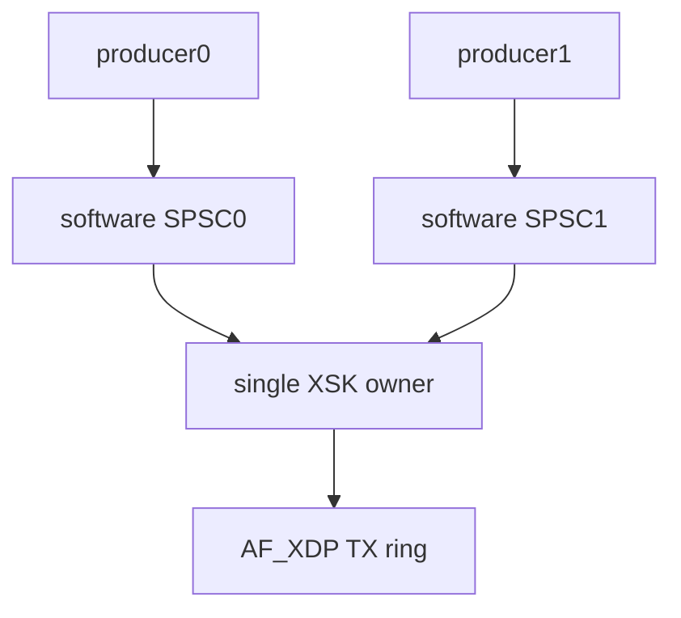
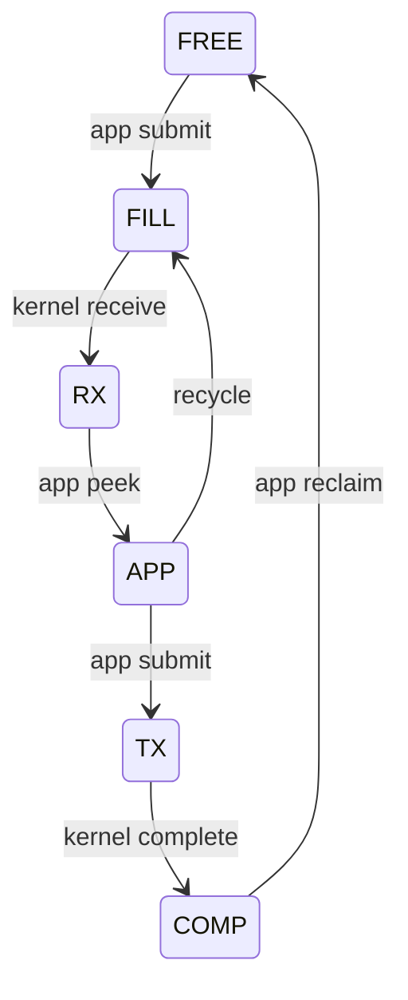
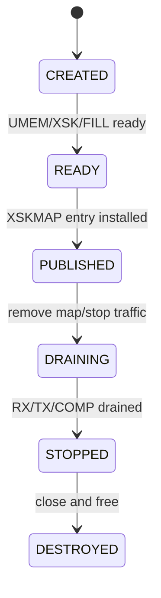

# 09：并发、内存序与生命周期

## ring 为什么高效

AF_XDP rings 按单生产者/单消费者模型设计，双方主要更新各自 index，通过 acquire/release 内存序发布 descriptor，避免每包锁。

必须使用 libbpf/libxdp ring helper；普通 volatile 不能替代跨 CPU/DMA 所需的内存序。

## SPSC 所有权限制

同一个 producer ring 不应被多个线程无锁并发 reserve/submit。同一个 consumer ring 也不应多线程并发 peek/release。多线程方案应：

- 每 queue/XSK 单 owner worker。
- 或在外层加锁。
- 或通过每 worker 软件 ring 汇聚到唯一 XSK owner。

## cached indices

ring helper 会缓存 producer/consumer index，减少共享 cache line 读取。reserve 空间不足时才刷新对端 index。错误地绕开 helper 修改 index 会破坏 wrap-around 和内存屏障。

## wrap-around

ring size 常为 power-of-two，实际 descriptor index 用 mask 计算；producer/consumer 使用递增无符号计数。不要把 masked slot index 当作队列总进度，也不要用有符号差值处理 wrap。

## Batch 发布的原子边界

producer 写完一批 descriptor 后一次 submit，consumer 要么看不到新 producer，要么看到完整 batch。业务上仍需处理 partial reserve；不能写了 8 个 descriptor 却只 submit 4，再复用其余 frame。

## Frame 状态机的并发保护

frame ownership 在 ring 边界转移。debug allocator 可为每个 frame 保存 owner enum 和 generation，使用单 owner 线程更新或原子 CAS 检测非法迁移。

## 控制面与数据面并发

XSKMAP update、XDP replace、worker stop 和 UMEM teardown 不能无序执行。建议控制面状态机：

worker 应在 DRAINING 阶段停止接受新业务、继续回收 completion，直到 outstanding 归零或超时进入明确失败状态。

## 多进程共享风险

共享 pinned map 或 UMEM fd 时，进程崩溃会留下 ownership 不明的 frame/socket。需要单一 supervisor、generation、pidfd/heartbeat 和清理策略。仅靠 bpffs pinning 不提供事务恢复。

## false sharing

每 worker stats、free-list index、producer/consumer mirror 若位于同 cache line，会产生 ping-pong。使用 cache-line 对齐和 per-worker counters，控制面周期汇总。不要让 debug counter 反过来成为性能瓶颈。

## 退出检查

- XSKMAP entry 已删除。
- 新 redirect 已停止。
- RX descriptors 已处理/recycle。
- TX outstanding 与 completion 差值为零，或明确记录丢弃。
- 所有 frame 状态总和等于 total。
- XDP link 只卸载当前进程拥有的实例。

