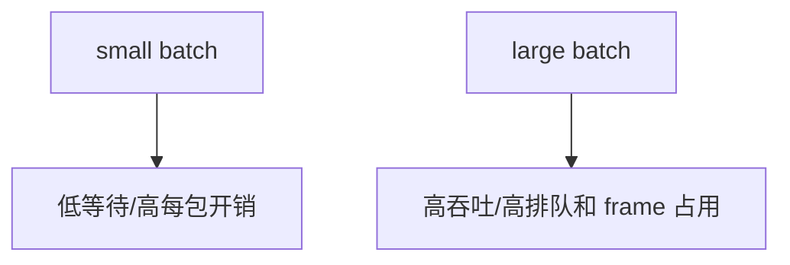
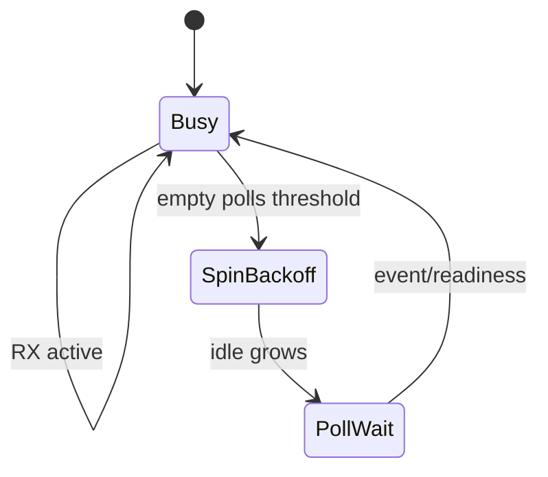
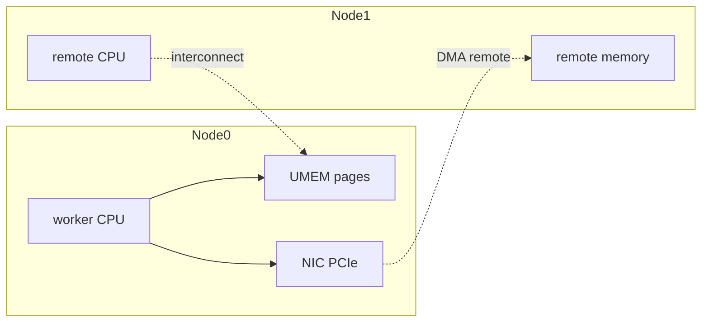
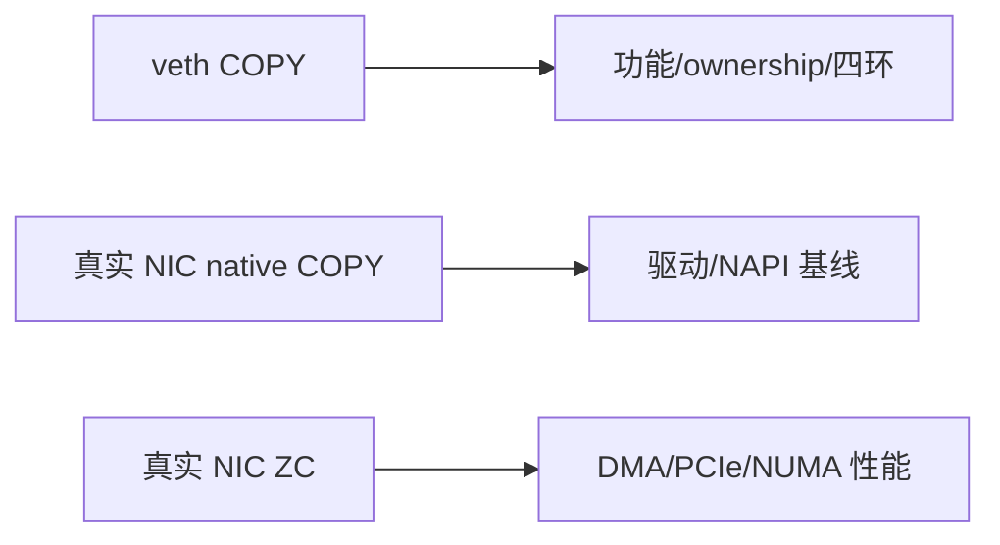

# 10：性能、NUMA 与测量方法

## 性能不是只有 pps

| 指标 | 含义 |
| --- | --- |
| RX/TX pps/Gbps | 数据面吞吐 |
| drop by layer | XDP redirect、RX no-buffer、app、TX 等位置 |
| cycles/packet | CPU 效率 |
| batch latency | 从到达/peek 到发送/completion |
| p50/p99 | 平均之外的尾延迟 |
| wakeups/syscalls | need-wakeup 策略成本 |
| ring occupancy | 背压与容量证据 |

## 成本分解


每个优化都应对应成本：ZC 减 packet copy，batch 摊薄 ring/index，busy poll 减唤醒，need-wakeup 减无用 syscall，NUMA 减跨 socket memory/PCIe。

## Batch size



建议 sweep 1/8/16/32/64，记录 pps、p99、RX/TX occupancy 和 CPU。流量不足时“凑不满 batch”也应允许处理，而不是永久等待。

## Busy poll、poll 与 sleep

| 模式 | 特点 |
| --- | --- |
| tight busy loop | 最低软件等待，独占 core |
| `poll()`/epoll | 空闲友好，有唤醒成本 |
| adaptive | 活跃时 busy、空闲后 poll，参数复杂 |
| busy-poll socket options/NAPI | 依赖内核/驱动配置，需单独验证 |



## NUMA 拓扑



测试要固定：worker CPU、IRQ/NAPI CPU、UMEM memory node、NIC NUMA node。veth 没有 PCIe NIC locality，但仍可观察 CPU/memory placement；不能外推硬件 DMA 结果。

## Ring/frame 参数矩阵

| 参数 | 小值代价 | 大值代价 |
| --- | --- | --- |
| FILL/RX size | 突发易耗尽 | memory/frame 占用、排队 |
| TX/COMP size | TX backpressure | completion lag/工作集 |
| frame size | 大包放不下 | UMEM frame 数减少 |
| headroom | prepend 不够 | 每 frame 浪费 |
| UMEM size | 容量不足 | TLB/锁页/NUMA 工作集 |

## 测试拓扑的真实性



不同层次回答不同问题。veth 的 3 packets smoke 不应写成吞吐 benchmark；真实 NIC ZC 测试还需独立 traffic generator 和线速计数器。

## 推荐性能矩阵

```text
packet size: 64, 128, 256, 512, 1500
batch:       1, 8, 16, 32, 64
mode:        generic+copy, native+copy, native+zc
queues:      1, 2, 4, 8
workers:     same as queues
NUMA:        local, remote
duration:    warmup + >=30s steady state
```

## 证据要求

记录 kernel、driver/firmware、NIC、queue/RSS、XDP mode、bind mode、UMEM/ring、CPU/NUMA、traffic generator、packet size、duration，以及 XDP/ethtool/app 三层计数。任何 fallback 都要显式打印。

