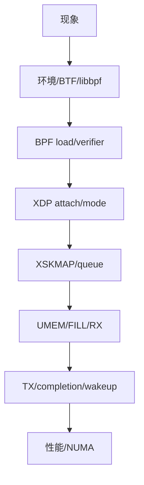
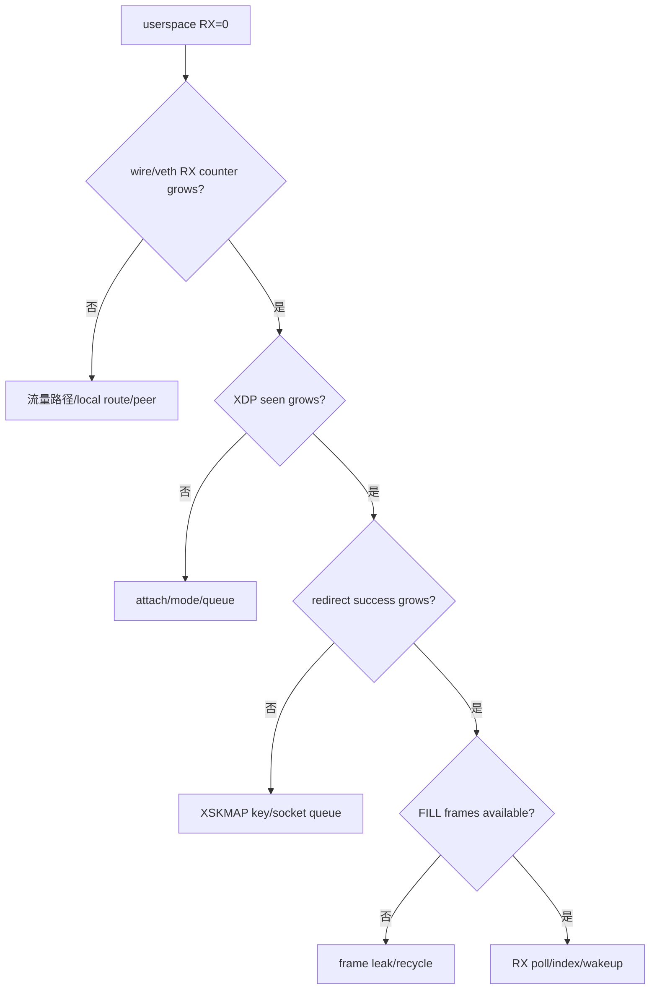
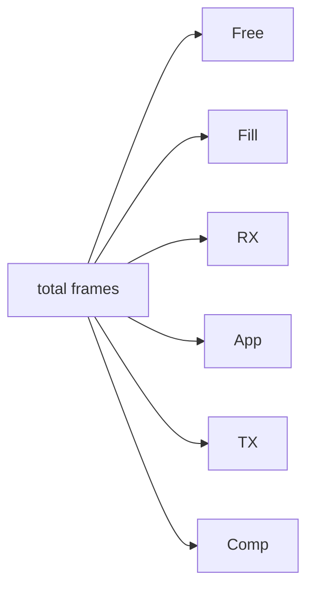

# 11：AF_XDP 分层排障手册

## 七层定位



先保留第一条失败和 errno，再按层检查。不要看到 RX=0 就立即改 ring size。

## 环境层

```bash
uname -a
bpftool feature probe kernel
bpftool net
ip -details link show
ethtool -i <ifname>
ethtool -l <ifname>
```

记录 kernel config、libbpf/libxdp、clang、BTF、driver、queue 和管理网口。任何 attach/rebind 前先确认不会中断 SSH 管理口。

## BPF load/verifier

```bash
bpftool prog show
bpftool map show
bpftool prog tracelog
```

保留 verifier log 尾部和 rejected instruction。常见问题：packet bounds、栈过大、helper/program type 不匹配、旧 pinned map schema 不兼容。

## XDP attach

```bash
ip -details link show dev <ifname>
bpftool net show dev <ifname>
```

确认 actual mode 是 generic 还是 driver，不要只看 requested flags。若 native 不支持，强制模式应失败并记录，而不是无提示 fallback。

## RX=0 决策树



本机向本机 IP 发包可能 local-delivery 短路；用 veth peer 或外部发生器确保包真正进入目标 RX。

## XDP redirect 观测

可用 tracepoint/bpftrace/perf 观察 `xdp_redirect`、`xdp_redirect_err`、`xdp_exception`，再对照 BPF per-CPU stats。redirect error 常见于 map miss、queue mismatch、socket state 或无 RX buffer。

## Frame 泄漏

症状是开始能收包，随后 RX 停止，FILL 水位持续下降。打印每种 frame state 和不变量总和；检查 drop path 是否 recycle、TX path 是否消费 completion、错误分支是否遗漏 release。



## TX/completion=0

- TX reserve/submit 是否增长。
- `xsk_ring_prod__needs_wakeup()` 与 kick 是否执行。
- `sendto()` errno 是否 EAGAIN/EINVAL。
- frame addr/len 是否合法。
- peer interface counters 是否增长。
- completion drain 是否真的 peek/release。

## ZC unsupported

记录 requested flags、errno、driver、queue、XDP mode。随后跑强制 COPY 验证功能基线。不要把 unsupported 作为测试失败，也不要把 fallback COPY 作为 ZC PASS。

## Marker 优先日志法

```bash
grep -E 'FAIL|ERROR|errno|READY|ATTACHED|XSKMAP|FINAL_STATS|PASS_|ZERO_COPY|wakeup|drop' records/*/*.log
```

先看 marker，再读取异常前后局部日志；完整 verifier log 只在 load 阶段失败时展开。

## 清理检查

```bash
bpftool net
ip -details link show dev <ifname>
ip link show veth-xdp
```

确认 XDP link、veth test topology、pinned map 和后台进程按本轮 ownership 清理。不要在管理网口运行无条件 detach/rebind。

完整回归流程见 [../../tests/TEST_FLOW.md](../../tests/TEST_FLOW.md)。

