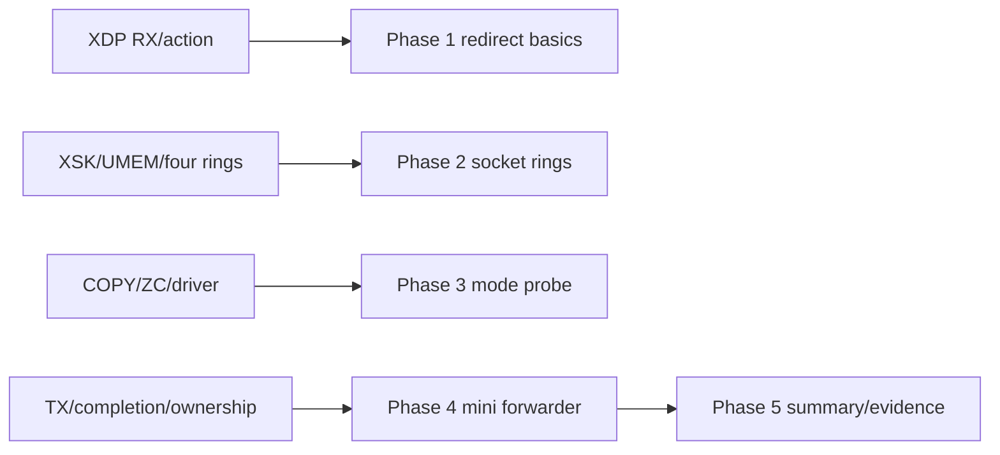
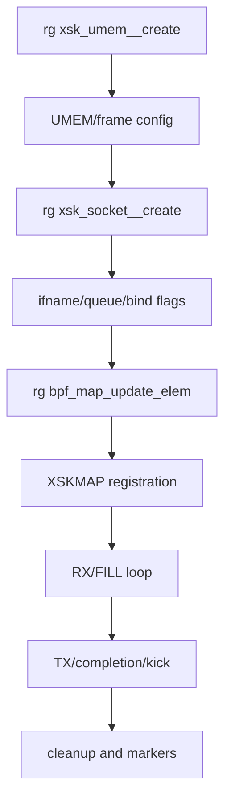
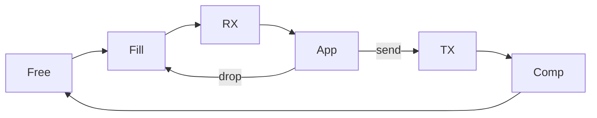

# 12：项目知识映射与速记卡

## 知识到 Phase



| Phase | 前置章节 | 关键代码 | 必须能解释 |
| --- | --- | --- | --- |
| 1 | 01、02、05 | `xdp_redirect_basics.bpf.c`、`xdp_loader.c` | hook、action、attach、veth 流量 |
| 2 | 03、04、05 | `af_xdp_rings.c`、`af_xdp_kern.bpf.c` | UMEM、FILL/RX、XSKMAP |
| 3 | 01、06、10 | `af_xdp_mode_probe.c` | generic/native、COPY/ZC capability |
| 4 | 04、07、09 | `af_xdp_forwarder.c` | RX->TX->completion frame 生命周期 |
| 5 | 10、11 | reports/records | 证据、边界和复验命令 |

## 代码阅读顺序



## 一页四环卡

```text
FILL:       userspace -> kernel，空闲 frame addr
RX:         kernel -> userspace，packet addr + len
TX:         userspace -> kernel，packet addr + len
COMPLETION: kernel -> userspace，发送完成 frame addr
```

## 一页模式卡

| 概念 | 20 秒答案 |
| --- | --- |
| generic XDP | skb 通用路径执行，兼容性高、性能较低 |
| native XDP | 驱动 RX 早期对 xdp buffer 执行 |
| XDP_COPY | packet 被 copy 到 UMEM frame |
| XDP_ZEROCOPY | 驱动让 NIC DMA 直接使用 UMEM-backed frame |
| need-wakeup | ring 标志提示应用是否需要 syscall kick/wakeup |

## 五个高频误区

1. native XDP 支持不等于 AF_XDP ZC 支持。
2. XDP_REDIRECT 返回不等于用户态 RX 已增长。
3. RX release 不会自动把 frame 放回 FILL。
4. TX submit 后不能在 completion 前复用 frame。
5. veth COPY PASS 不能证明真实 NIC DMA 性能。

## Ownership 自测



尝试回答：每条箭头由谁推进哪个 index？frame payload 在哪？哪一步可以安全修改？

## 排障速记

| 现象 | 第一联想 |
| --- | --- |
| BPF load fail | verifier bounds/helper/map schema |
| attach fail | driver mode/capability/已有 program |
| redirect error | XSKMAP key、queue、socket state |
| RX 开始后停止 | FILL frame 泄漏 |
| TX=0 | reserve/submit/need-wakeup/kick |
| completion=0 | TX 未消费或回收 loop 错 |
| ZC EOPNOTSUPP | driver/queue 不支持，跑 COPY 基线 |

## 口述练习

每题控制在两分钟：

1. 从 NIC RX descriptor 到 AF_XDP 用户态 packet pointer 的完整路径。
2. 四环 producer/consumer 和 frame ownership。
3. XSKMAP queue mismatch 为什么会丢包。
4. native+copy 与 native+ZC 的数据搬运差异。
5. reflect 模式为什么必须等 completion。
6. 如何从单 XSK 扩展到 RSS 多队列。
7. 如何证明 RX=0 是流量、attach、redirect、FILL 还是用户 ring 问题。
8. 为什么 veth 是好功能环境，却不是 ZC benchmark 环境。

能稳定回答这些问题后，再进入各 Phase 的 C/BPF 代码会快得多。

