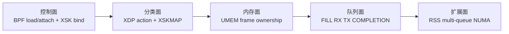

# AF_XDP Fundamentals 学习入口

这套文档放在四个 AF_XDP Phase 之前。目标不是背 `xsk_*` API，而是建立一条可追踪的数据路径：包从驱动 RX queue 进入 XDP，经过 XSKMAP 选择 socket，落入 UMEM frame，再在 FILL/RX/TX/COMPLETION 四环之间转移所有权。

## 学完后应能回答

1. XDP hook 位于 NIC、驱动、NAPI、skb 和协议栈之间的什么位置？
2. generic、native、hardware offload 模式分别在哪里执行？
3. eBPF verifier、BTF/CO-RE、map、loader 与 AF_XDP socket 如何协作？
4. UMEM、frame、chunk、headroom、unaligned chunk 各解决什么问题？
5. FILL、RX、TX、COMPLETION 四环谁生产、谁消费、传递的是地址还是包？
6. `XSKMAP[queue_id]` 为什么必须与 socket 绑定的 netdev queue 匹配？
7. COPY 与 ZEROCOPY 真正差在哪一次内存搬运和 DMA 映射？
8. `XDP_USE_NEED_WAKEUP`、`poll()`、`sendto()` 分别在什么条件下需要？
9. frame 在 RX、应用、TX、completion 之间如何避免重复使用和泄漏？
10. 多队列、RSS、每队列 XSK、共享 UMEM 如何扩展到多核？
11. batch、busy poll、NUMA、ring size 和 frame size 在优化什么成本？
12. 遇到 RX=0、FILL 耗尽、TX 不走、ZC 不支持时如何分层排查？

## 推荐阅读顺序

| 顺序 | 文档 | 核心模型 |
| --- | --- | --- |
| 1 | [00_15_MINUTE_MENTAL_MODEL.md](00_15_MINUTE_MENTAL_MODEL.md) | 15 分钟建立端到端轮廓 |
| 2 | [01_KERNEL_RX_AND_XDP_POSITION.md](01_KERNEL_RX_AND_XDP_POSITION.md) | 驱动 RX、NAPI、XDP 模式与 action |
| 3 | [02_EBPF_VERIFIER_MAPS_AND_LOADER.md](02_EBPF_VERIFIER_MAPS_AND_LOADER.md) | verifier、map、loader、BTF/CO-RE |
| 4 | [03_SOCKET_UMEM_AND_FRAME_LAYOUT.md](03_SOCKET_UMEM_AND_FRAME_LAYOUT.md) | XSK socket、UMEM、frame/headroom |
| 5 | [04_FOUR_RINGS_AND_OWNERSHIP.md](04_FOUR_RINGS_AND_OWNERSHIP.md) | 四环生产者/消费者与所有权 |
| 6 | [05_XSKMAP_REDIRECT_AND_QUEUE_BINDING.md](05_XSKMAP_REDIRECT_AND_QUEUE_BINDING.md) | redirect、queue 匹配、fallback |
| 7 | [06_COPY_ZEROCOPY_AND_DRIVER_DMA.md](06_COPY_ZEROCOPY_AND_DRIVER_DMA.md) | COPY/ZC、驱动能力、DMA |
| 8 | [07_TX_REFLECT_AND_NEED_WAKEUP.md](07_TX_REFLECT_AND_NEED_WAKEUP.md) | TX/completion、kick、反射路径 |
| 9 | [08_MULTIQUEUE_RSS_AND_SHARED_UMEM.md](08_MULTIQUEUE_RSS_AND_SHARED_UMEM.md) | RSS、多 XSK、共享 UMEM、分片 |
| 10 | [09_CONCURRENCY_AND_MEMORY_ORDER.md](09_CONCURRENCY_AND_MEMORY_ORDER.md) | SPSC、barrier、批量索引、生命周期 |
| 11 | [10_PERFORMANCE_NUMA_AND_MEASUREMENT.md](10_PERFORMANCE_NUMA_AND_MEASUREMENT.md) | 性能成本、NUMA、测试矩阵 |
| 12 | [11_DEBUGGING_PLAYBOOK.md](11_DEBUGGING_PLAYBOOK.md) | 分层排障与证据采集 |
| 13 | [12_PROJECT_MAP_AND_RECALL_CARDS.md](12_PROJECT_MAP_AND_RECALL_CARDS.md) | 项目映射、速记与自测 |

## 四条主线

## 学习边界

- veth + COPY 能验证 XDP、XSKMAP、UMEM 和四环语义，但不能证明真实 NIC DMA zero-copy 性能。
- `XDP_ZEROCOPY` bind 失败是能力边界，不应通过静默退回 COPY 后仍宣称 ZC 成功。
- XDP redirect 成功计数不等于用户态已经消费 RX descriptor；两侧统计必须对应。
- AF_XDP 避免的是通用 skb/协议栈路径，不等于“绝对零拷贝”或“完全无内核”。

原有 [../03_AF_XDP_MODEL.md](../03_AF_XDP_MODEL.md) 和各 Phase `docs/` 继续作为实验说明；本目录是新的统一前置入口。执行入口见 [../../START_HERE.md](../../START_HERE.md)。

