# 04_ARCHITECTURE_PRINCIPLES - DPDK Advanced 鍘熺悊鎬诲浘

> 杩欑瘒鏄?`track-dpdk-advanced` 鐨勬€诲師鐞嗗浘銆傚畠鐢?Mermaid 鎶婂綋鍓嶉」鐩殑鍒嗗眰銆佹暟鎹矾寰勩€佸疄楠屽叧绯汇€乵buf 鐢熷懡鍛ㄦ湡銆丷SS 杈圭晫銆乂FIO/IOMMU 杈圭晫鍜?L3 forwarder lite 涓茶捣鏉ャ€?
## 1. Track 鎬讳綋鑳藉姏鍦板浘

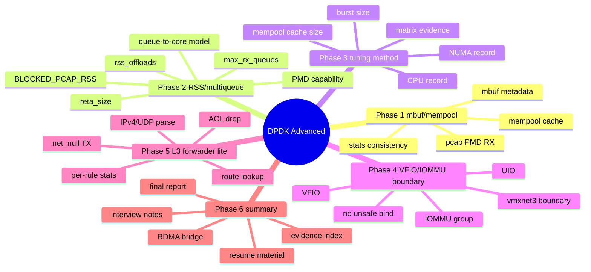

## 2. 椤圭洰鍒嗗眰鏋舵瀯

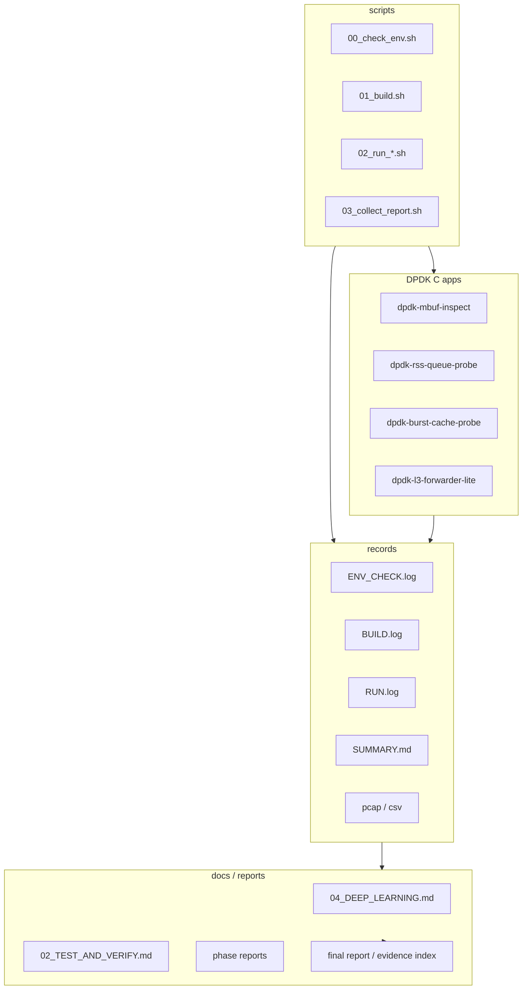

杩欏紶鍥惧搴旈」鐩爣鍑嗕氦浠樻柟寮忥細

```text
浠ｇ爜鎴栬剼鏈?-> 鐞嗚В鏂囨。 -> 娴嬭瘯鍛戒护 -> records 璇佹嵁 -> reports 鎶ュ憡
```

## 3. DPDK 鍩虹鏁版嵁璺緞

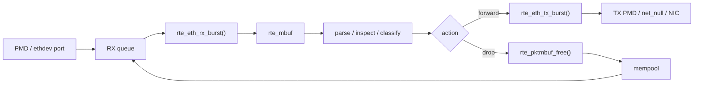

鏍稿績鐐癸細

- PMD 鎵归噺鏀跺寘锛屽簲鐢ㄦ嬁鍒扮殑鏄?`struct rte_mbuf *`銆?- 搴旂敤澶勭悊鍚庤涔?TX锛岃涔?free銆?- `tx_burst()` 鎴愬姛鍚庯紝mbuf 鎵€鏈夋潈浜ょ粰 PMD锛屽簲鐢ㄤ笉鑳界户缁闂€?
## 4. Phase 1: mbuf / mempool 鐢熷懡鍛ㄦ湡

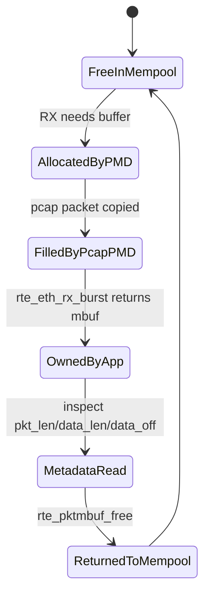

Phase 1 鐨勫師鐞嗘槸瑙傚療锛屼笉鏄浆鍙戯細

```text
pcap PMD -> mbuf metadata -> free mbuf
```

鍏抽敭璇佹嵁锛?
```text
data_off=128
pkt_len=67
data_len=67
nb_segs=1
software_rx_packets=32
```

## 5. Phase 2: RSS / multi-queue 鑳藉姏鍒ゆ柇

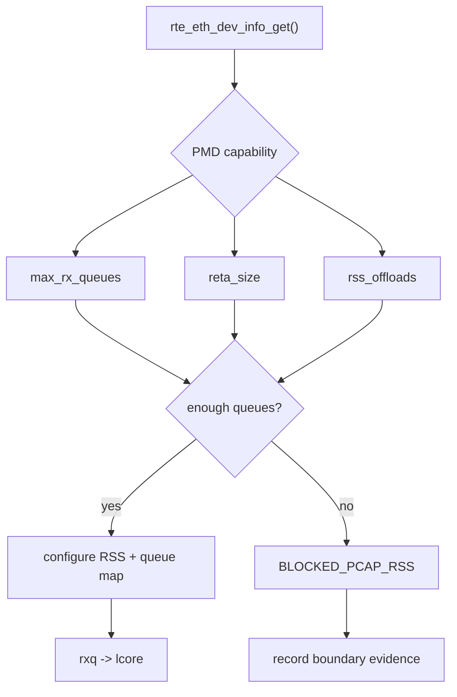

鏈」鐩綋鍓嶇粨鏋滐細

```text
driver_name=net_pcap
max_rx_queues=1
reta_size=0
rss_offloads=0x0
```

鎵€浠?Phase 2 姝ｇ‘缁撹鏄?boundary锛屼笉鏄け璐ャ€?
## 6. Phase 3: burst/cache 璋冧紭鐭╅樀

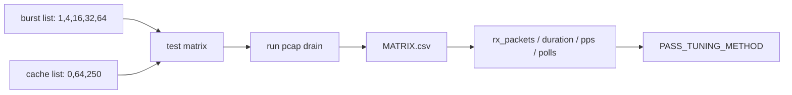

璋冧紭鏂规硶鐨勫叧閿槸鎺у埗鍙橀噺锛?
```text
鍚屼竴 pcap
鍚屼竴 lcore 鍙傛暟
鍚屼竴 DPDK app
鍙敼鍙?burst_size 鍜?mempool_cache
```

## 7. Phase 4: UIO / VFIO / IOMMU 杈圭晫

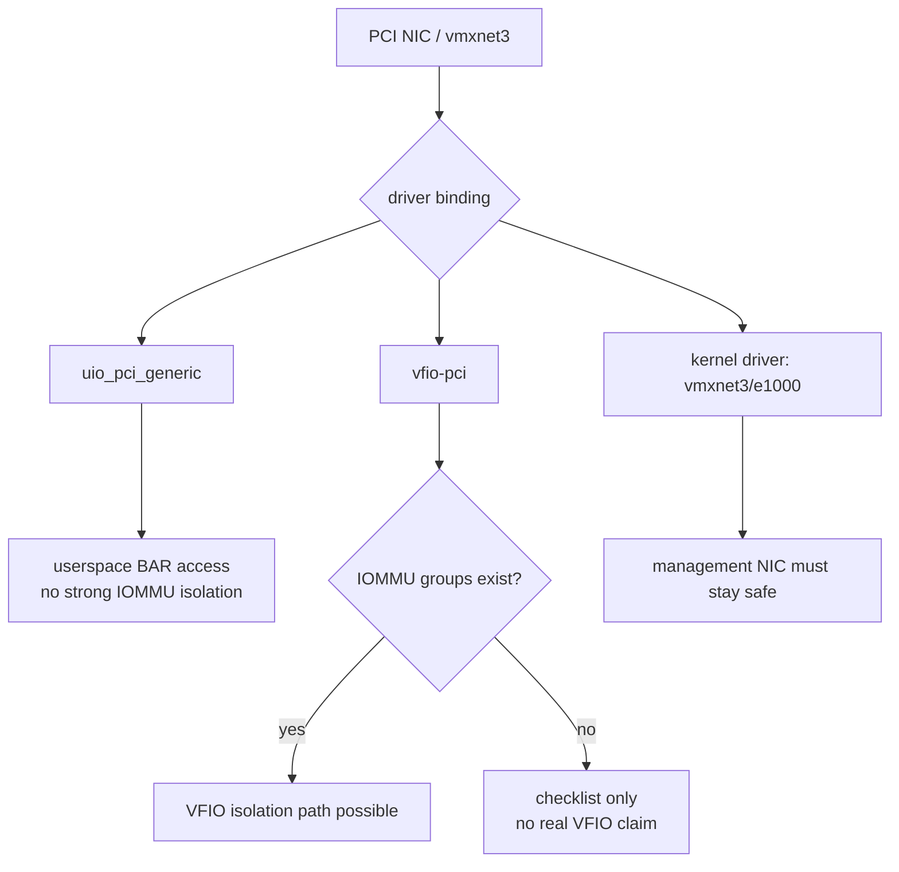

褰撳墠娴嬭瘯鏈轰簨瀹烇細

```text
iommu_group_entries=0
vfio_module_loaded=no
uio_module_loaded=no
ens192 uses vmxnet3 kernel driver
```

鎵€浠?Phase 4 鐨勫師鐞嗘槸鈥滈儴缃茶竟鐣屽彇璇佲€濓紝涓嶆槸鈥滃己琛屽垏 VFIO鈥濄€?
## 8. Phase 5: L3 forwarder lite 娴佺▼鍥?
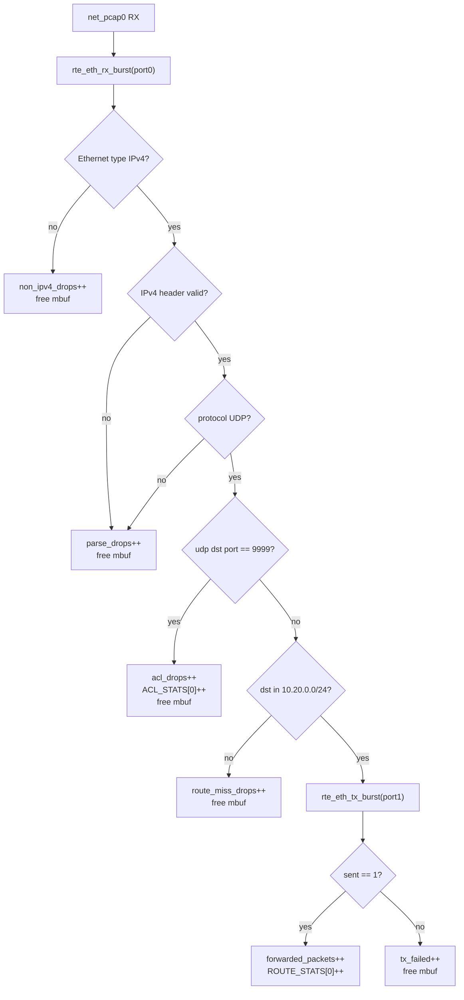

鏈娴嬭瘯娴侀噺锛?
```text
48 packets total
24 forward
12 ACL drop
12 route miss
0 tx_failed
```

## 9. Phase 5 sequence diagram

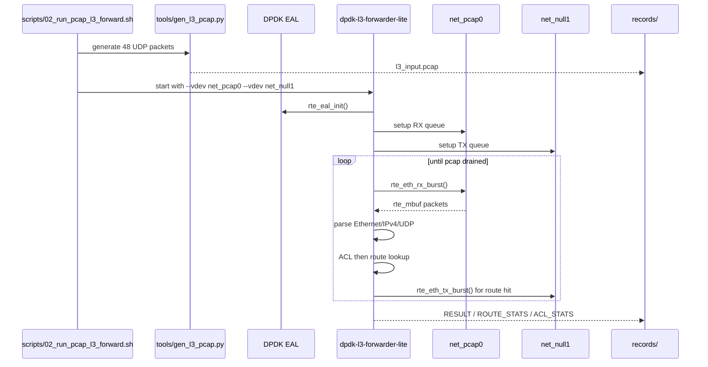

## 10. Phase 5 class diagram

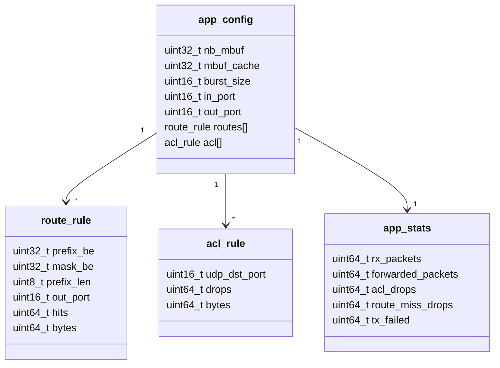

杩欏紶 UML 鍥惧搴?`project-dpdk-l3-forwarder-lite/app/main.c` 鐨勬牳蹇冪粨鏋勩€?
## 11. 娴嬭瘯璁板綍閾捐矾

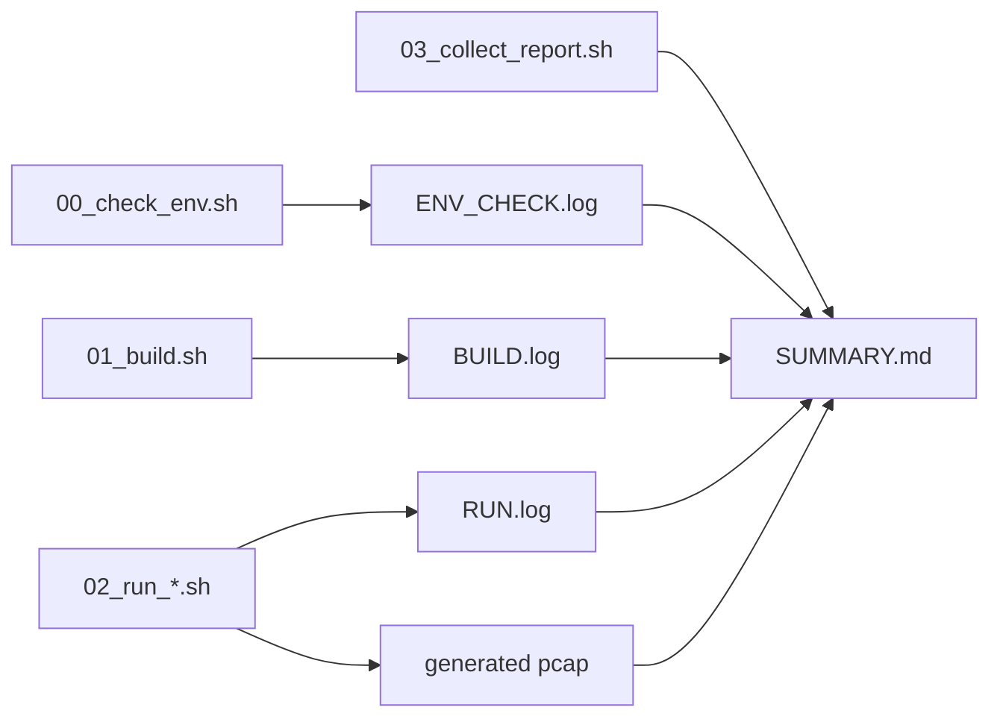

姣忎釜闃舵閮戒繚鎸佺浉鍚岃瘉鎹摼锛?
```text
env -> build -> run -> summary -> report
```

## 12. 鏈€缁堣竟鐣屾ā鍨?
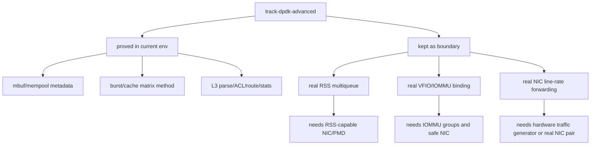

杩欎釜鍥炬槸鏈€缁堥潰璇曞彛寰勶細

```text
鑳借瘉鏄庣殑灏辩粰 records锛?鐜涓嶈兘璇佹槑鐨勫氨鍐?boundary锛?涓嶆妸妯℃嫙鐜鍖呰鎴愮敓浜х‖浠剁粨鏋溿€?```
