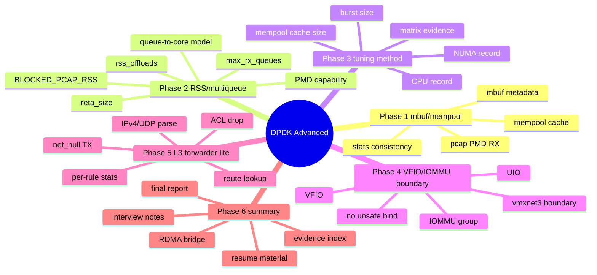
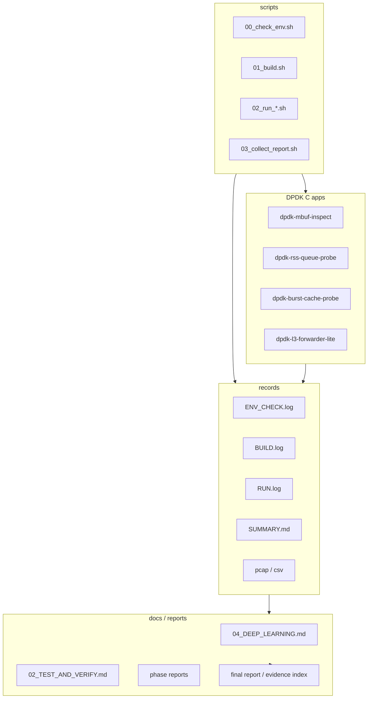
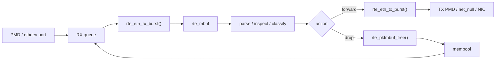
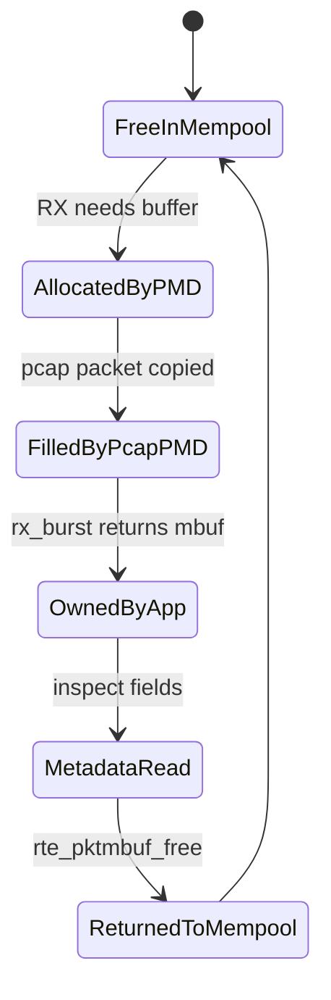
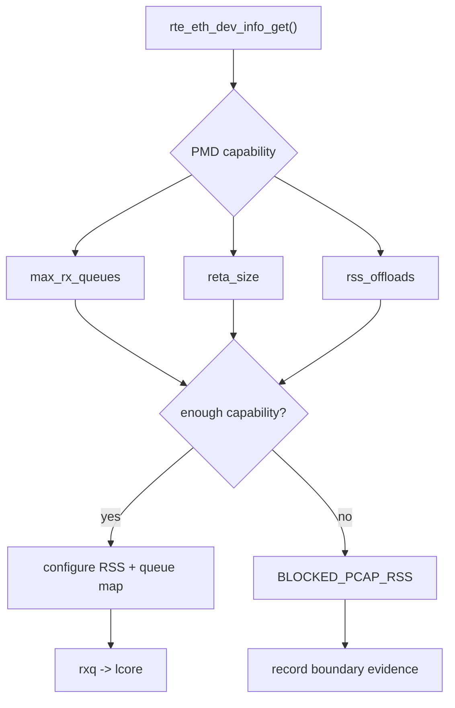
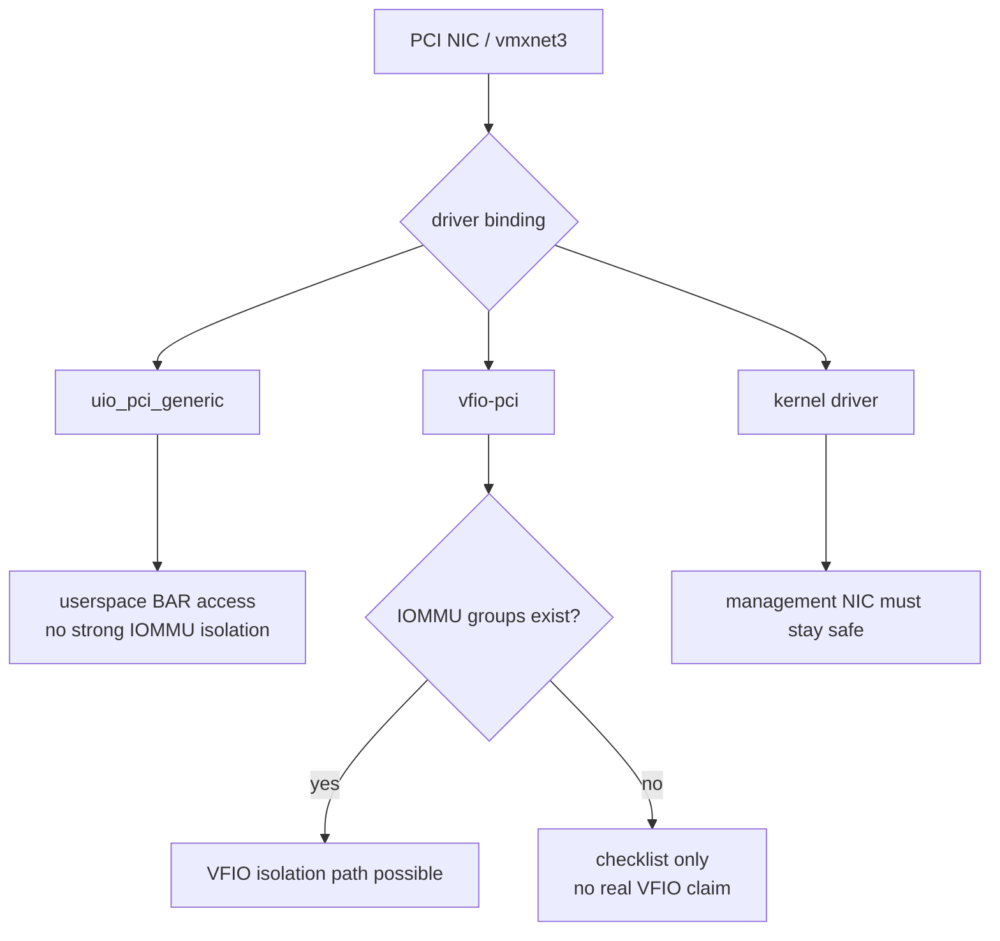
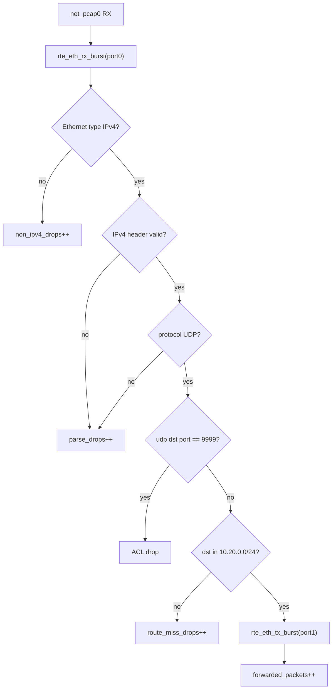
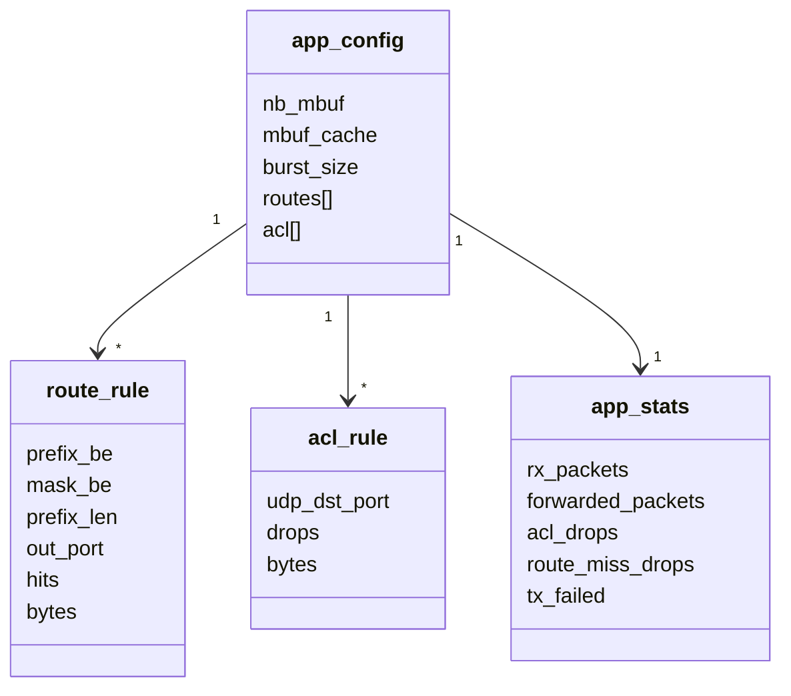
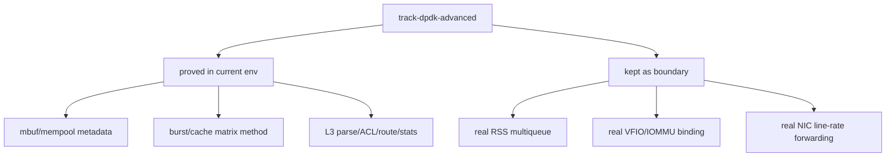

# 04_ARCHITECTURE_PRINCIPLES - DPDK Advanced 原理总图

> 这篇是 `track-dpdk-advanced` 的总原理图。它用 Mermaid 串起项目分层、数据路径、mbuf 生命周期、RSS 边界、VFIO/IOMMU 边界和 L3 forwarder lite。

## 1. 能力地图



## 2. 项目分层



## 3. DPDK 基础数据路径



关键规则：

- 应用从 `rx_burst()` 拿到 mbuf 后拥有它。
- 如果不转发，应用必须调用 `rte_pktmbuf_free()`。
- 如果 `tx_burst()` 成功，mbuf 所有权交给 PMD，应用不能继续访问该 mbuf。

## 4. mbuf 生命周期



## 5. RSS capability 判断



本项目当前结果：

```text
driver_name=net_pcap
max_rx_queues=1
reta_size=0
rss_offloads=0x0
```

## 6. VFIO / IOMMU 边界



当前测试机没有 IOMMU group，所以 Phase 4 只声明 boundary 和 checklist。

## 7. L3 forwarder lite 数据面



## 8. L3 forwarder UML



## 9. 最终边界模型



最终口径：

```text
能证明的给 records。
环境不能证明的写 boundary。
不把模拟环境包装成生产硬件结果。
```

