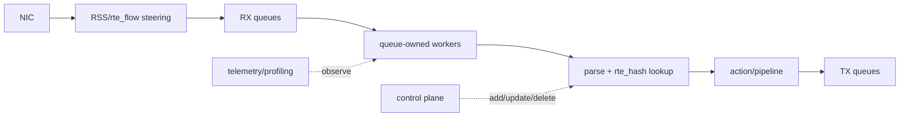
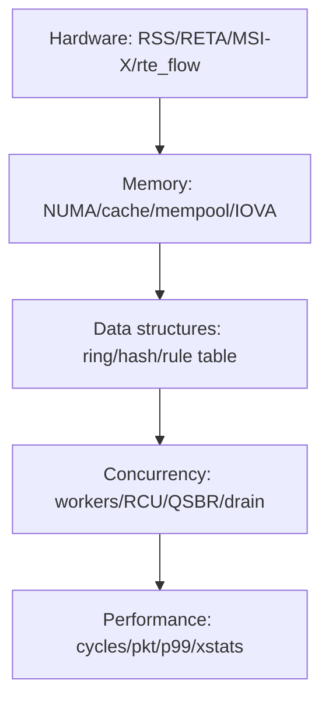

# DPDK Advanced 十分钟心智模型

## 1. Advanced 到底进阶在哪里

基础 DPDK 回答“一个包怎样进入用户态并被安全发出”；Advanced 回答“很多包、很多 flow、很多 queue 和很多 worker 怎样在正确性不退化的前提下扩展”。



性能只是结果之一。Advanced 更重要的是建立以下工程约束：

- flow affinity：同一 flow 是否稳定到同一 worker。
- memory locality：queue、CPU、mempool 和 PCI device 是否同 NUMA。
- ownership：mbuf 跨 ring/worker 后由谁释放。
- concurrency：lookup 与规则更新能否并发。
- backpressure：下游变慢时在哪一层丢、排队或限速。
- evidence scope：软件 dispatch、pcap PMD 与真实硬件 steering 分开描述。

## 2. 进入前置门槛

先完成 `../../track-dpdk/docs/fundamentals/`，至少能解释：

```text
descriptor vs mbuf vs packet buffer
rx_burst/tx_burst ownership
hugepage/mempool/NUMA 基础
ethdev capability negotiation
pcap functional vs real NIC performance
```

如果这些概念模糊，先回基础 track，不在 Advanced 项目里反向猜基础对象。

## 3. 五层能力地图



任何调优结论都应能落回这五层。例如“burst 32 更快”没有说明 PMD、packet size、queue、计时范围和 drop，就不是可复核结论。

## 4. 当前环境能证明什么

| 能力 | 当前证据 | 边界 |
|---|---|---|
| mbuf metadata | pcap PMD | 非真实 NIC RX offload |
| RSS capability probe | `max_rx_queues/reta/rss_offloads` | pcap PMD 不支持真实 RSS |
| burst/cache 矩阵 | 固定 pcap 软件路径 | 非硬件吞吐 |
| L3/ACL/rule stats | pcap + null PMD | 非外部 wire |
| dual worker/ring/hash | software dispatch | 非 NIC queue steering |
| `rte_flow` validate | capability boundary | PMD 返回未实现 |

记录 blocked capability 不是失败；把 software model 写成 hardware evidence 才是失败。

## 5. 从基础项目到 flow pipeline


## 6. 八篇阅读顺序

1. 本文：建立边界。
2. `01_HARDWARE_QUEUE_STEERING.md`：RSS/RETA/rte_flow。
3. `02_ADVANCED_MEMORY_AND_DATA_STRUCTURES.md`：mbuf/ring/hash internals。
4. `03_MULTICORE_PIPELINE_DATA_PATH.md`：多 worker 路径。
5. `04_CONCURRENCY_RCU_QSBR.md`：动态规则与回收。
6. `05_PROJECT_KNOWLEDGE_MAP.md`：选择实验。
7. `06_PROFILING_AND_DEBUGGING.md`：测量和排障。
8. `07_RECALL_CARDS.md`：复习和自测。

## 7. 自测

1. software dispatch 与 NIC RSS 有何证据差别？
2. flow affinity 为什么影响 stateful pipeline？
3. shared hash 允许并发 lookup 是否意味着可随时 delete？
4. p99 只测 parse+lookup 能否代表端到端延迟？
5. Advanced 调优结论为什么必须同时报告 drop 和环境？
