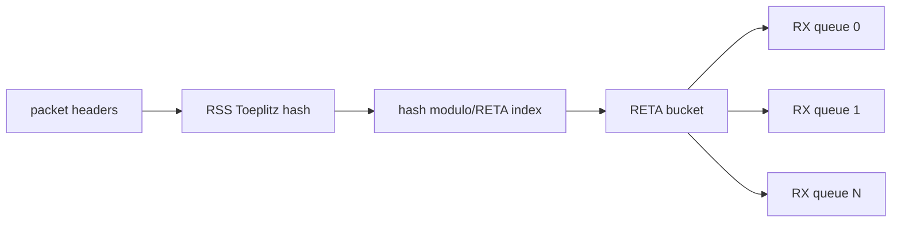
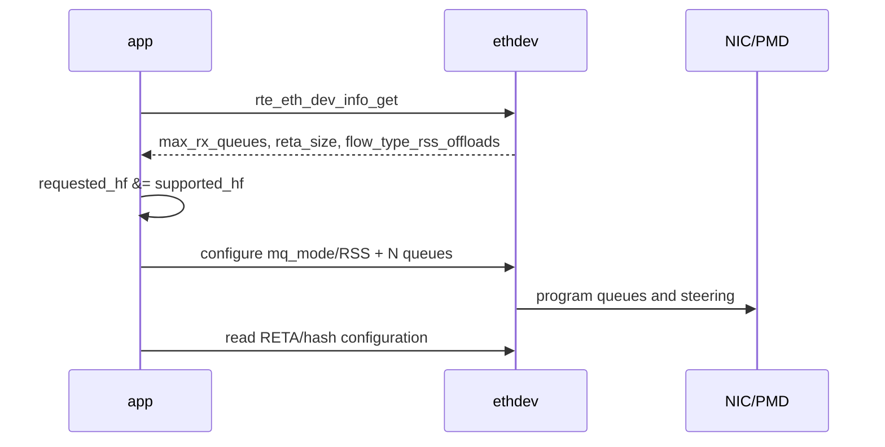
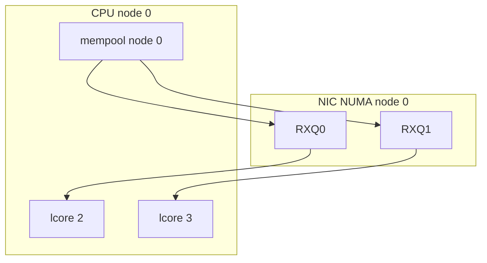

# RSS、RETA 与硬件 Queue Steering

## 1. 从一个 RX queue 扩展到多个



RSS 的目标不是理解业务规则，而是依据配置的 header fields 计算 hash，把大量 flow 分散到 RX queue。应用再把每个 queue 固定给 worker。

## 2. Toeplitz Hash 心智模型

RSS 通常对选定 tuple（如 IPv4 src/dst、TCP/UDP src/dst port）与 RSS key 做 Toeplitz 运算，输出 hash。重要的不是手算公式，而是知道：

- hash 输入字段由设备 capability 和配置决定。
- RSS key 改变会改变分布。
- 同一 tuple 在配置不变时应稳定产生同一 hash。
- hash 均匀不保证业务负载均匀，elephant flow 仍可能压垮单 queue。

## 3. RETA 做什么

RETA 是 redirection table。hash 选中 bucket，bucket 保存 queue id。改变 RETA 可以在不改变 hash 算法的情况下调整 queue 分布。

```text
hash -> bucket 0 -> queue 0
hash -> bucket 1 -> queue 1
hash -> bucket 2 -> queue 0
hash -> bucket 3 -> queue 2
```

`reta_size=0` 通常意味着当前 PMD 没有可配置 RETA 能力；不能用软件 `% worker_count` 冒充硬件 RETA 已验证。

## 4. Flow Affinity 与对称 RSS

stateful NAT、ACL connection state、flow statistics 常希望正反方向落到同一 worker。普通 RSS 对方向敏感；交换 src/dst 后 hash 可能变化。

对称 RSS 可以通过支持的 symmetric hash、规范化 tuple 或上层 software steering 实现，但必须考虑碰撞、协议类型和设备能力。不能仅因为两个包属于同一会话就假设硬件会送到同一 queue。

## 5. RSS Capability 协商



至少记录：requested queue count、effective queue count、RSS hash fields、key、RETA size 和 queue-to-lcore mapping。

## 6. Queue、MSI-X 与 Worker

真实 NIC 常为 queue 提供独立 interrupt vector/MSI-X 能力，但 DPDK steady-state PMD 主要 polling。MSI-X 仍可能用于 link、error、sleep/wakeup 或混合模式。



queue 能分开只是第一步；worker 没有轮询、映射跨 NUMA 或多个 worker 共享同一 queue，都会削弱扩展性。

## 7. `rte_flow` 精确 Steering

RSS 是通用 hash 分流；`rte_flow` 可按 pattern/action 编程更精确的硬件规则：

```text
pattern: ETH / VLAN / IPV4 / UDP dst=9000 / END
actions: COUNT / MARK / QUEUE 3 / END
```

典型生命周期：

```text
rte_flow_validate
-> rte_flow_create
-> rte_flow_query(COUNT)
-> rte_flow_destroy
```

还要理解 group、priority、ingress/egress、isolate 和 PMD-specific limitations。validate 成功只说明规则可接受，仍需 traffic/counter 证明实际 steering。

## 8. RSS Action 与 Queue Action

- `QUEUE`：匹配规则直接送到一个 queue。
- `RSS`：匹配规则后在一组 queue 中 hash 分流。
- `MARK`：写 metadata，供 software pipeline 读取。
- `COUNT`：硬件/PMD rule counter。

SmartNIC/representor 场景还可能涉及 port representor、transfer domain 和 switchdev；基础实验不应无硬件宣称已 offload。

## 9. 当前项目映射

| 内容 | 当前位置 |
|---|---|
| RSS capability probe | `lab-dpdk-rss-multiqueue` |
| pcap PMD boundary | `BLOCKED_PCAP_RSS` record |
| software worker dispatch | `project-dpdk-flow-pipeline` Phase 3 |
| `rte_flow_validate` boundary | flow pipeline capability module |
| 真实 RETA/rule counter | 后续真实 PMD 分支 |

## 10. 自测

1. RSS hash 和 RETA 分别决定什么？
2. 多 queue 配置成功为什么不等于多核扩展成功？
3. software `% N` 分流为什么不能作为 RSS 证据？
4. `rte_flow_validate()` 成功后还缺什么证据？
5. 为什么同一会话正反方向不一定命中同一 RSS queue？
