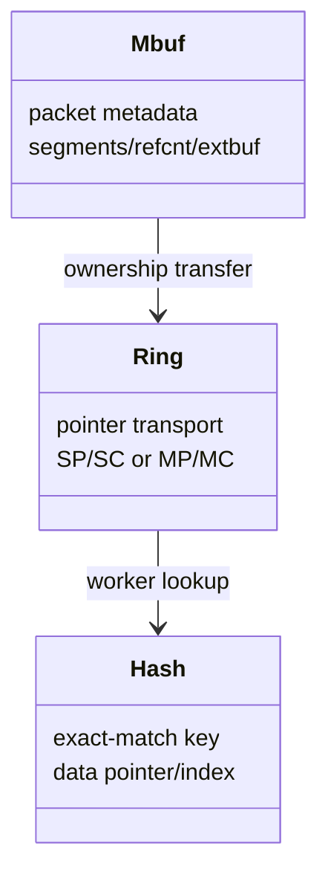
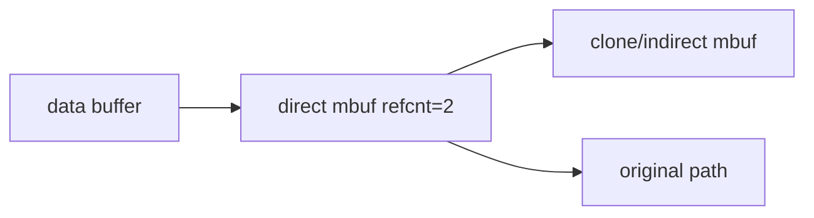
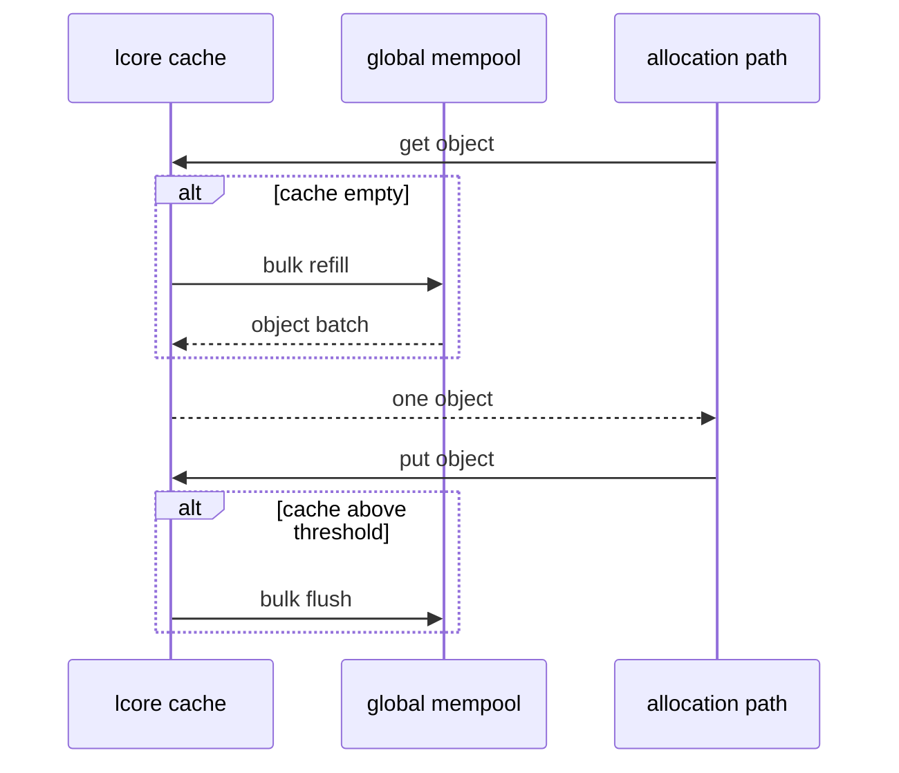
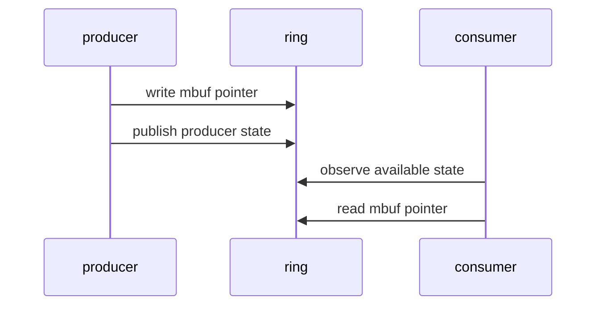
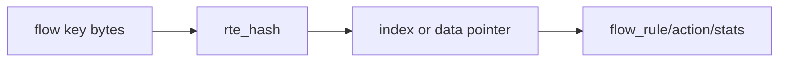

# 进阶 Mbuf、Ring 与 Hash 数据结构

## 1. 三类对象解决三类问题



mbuf 承载 packet；ring 在 stage/worker 间传 pointer；hash 将 flow key 映射到 rule/state。三者生命周期不能混在一起。

## 2. Indirect Mbuf、Clone 与 Refcnt

clone/indirect mbuf 可以创建新的 metadata 引用同一 data buffer，减少 payload copy。代价是引用计数和写时语义更复杂：



任何一方改写共享 data 前必须确认是否允许；释放 clone 只是减 refcnt，最后引用释放后 backing buffer 才回池。

## 3. Multi-segment 与 External Buffer

- multi-segment：`next/nb_segs` 将多个 data buffer 串成一个 packet。
- external buffer：mbuf metadata 引用应用提供的外部内存，并通过回调管理释放。

它们适合 jumbo、scatter/gather 或外部 DMA memory，但 parser/TX PMD 必须支持对应能力。只看首段 `data_len` 不能代表整个 `pkt_len`。

## 4. Mempool Cache Refill/Flush

per-lcore cache 批量从 global pool 取回对象，减少共享 ring 操作：



cache 太小会频繁访问 global pool；过大可能让对象滞留在各 lcore cache，使小 pool 看似耗尽。cache size 必须结合 pool size、worker 数和 burst 设计。

## 5. `rte_ring` 模式

| 模式 | 场景 | 成本 |
|---|---|---|
| SP/SC | 单 producer、单 consumer | 最低同步成本 |
| MP/SC | 多 producer、单 consumer | producer 竞争 |
| SP/MC | 单 producer、多 consumer | consumer 竞争 |
| MP/MC | 多对多 | 最高协调成本 |

成功 enqueue 才发生 ownership transfer；失败时 producer 仍拥有 mbuf。bulk/burst API 对“全有或部分成功”的语义要按具体函数确认。

## 6. Ring 的发布顺序

概念上 producer 必须先写 object pointer，再发布可见的 producer position；consumer 看到 position 后才能读取 pointer。DPDK ring 封装所需原子和 barrier，但应用自己的 stop flag、side metadata 仍需正确同步。



## 7. `rte_hash` Key 设计

exact-match key 必须字节稳定：

- 明确 network/host byte order。
- struct padding 清零或使用显式 packed-independent layout。
- reserved 字段固定值。
- IPv4/IPv6、protocol、ports 的长度固定。
- add 与 lookup 使用完全一致的 key builder。

未初始化 padding 会让“字段看起来相同”的 key 在字节比较时不同。

## 8. Hash Table 与 Rule Storage



`rte_hash` 保存 data pointer 时，指针必须在 hash entry 存活期间稳定。rule array slot reuse、delete 和并发 reader 会引入生命周期问题，需由 generation/RCU/QSBR 解决。

## 9. Bulk Lookup 与 Prefetch

批量 pipeline 可先解析多个 key，再 bulk lookup，并预取即将访问的 mbuf/rule。收益取决于工作集和 PMD burst；过度 prefetch 可能污染 cache。

```text
burst RX
-> prefetch packet N+2
-> parse packet N
-> bulk hash lookup
-> prefetch matched rules
-> actions
```

调优时应以 cycles/packet、cache misses 和 p99 证明，而不是因为代码出现 `rte_prefetch0()` 就声称变快。

## 10. 当前项目映射

- mbuf metadata：Phase 1 lab。
- mempool cache matrix：Phase 3 lab。
- SP/SC worker rings：flow pipeline Phase 3。
- 16-byte stable flow key + `rte_hash`：flow pipeline。
- rule slot generation/aging：flow pipeline Phase 2。

## 11. 自测

1. clone mbuf 为什么不能随意原地改 payload？
2. per-lcore cache 太大为什么可能造成可用对象假性不足？
3. ring enqueue 失败后谁拥有 mbuf？
4. flow key padding 为什么必须初始化？
5. hash 中 pointer 稳定为什么仍不等于并发 delete 安全？
