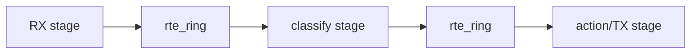
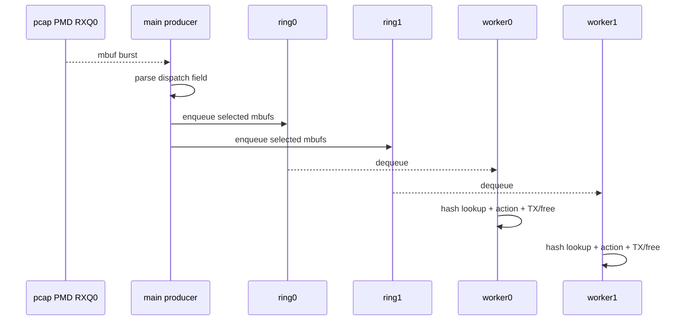
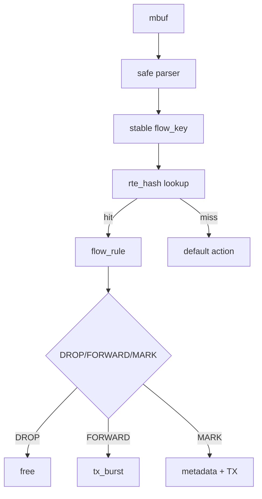
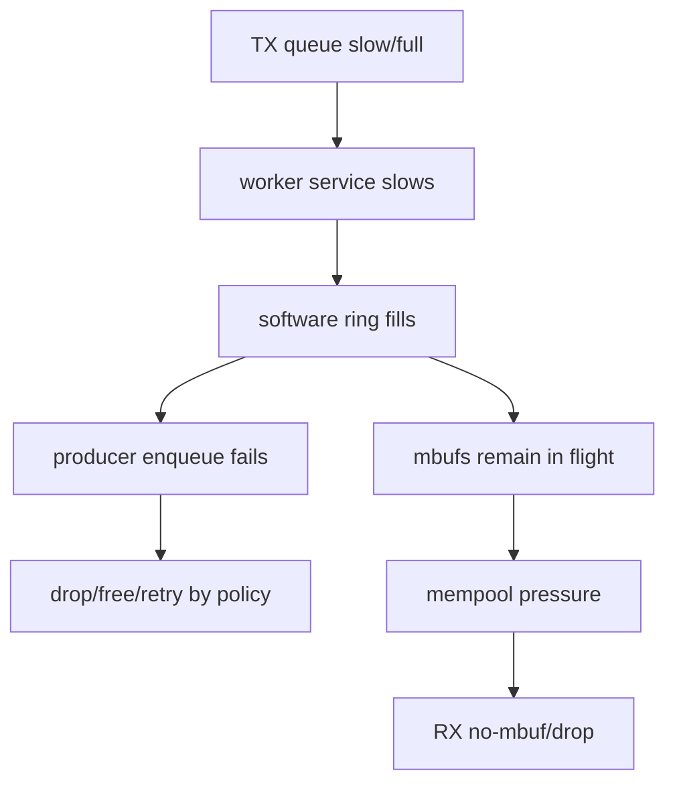
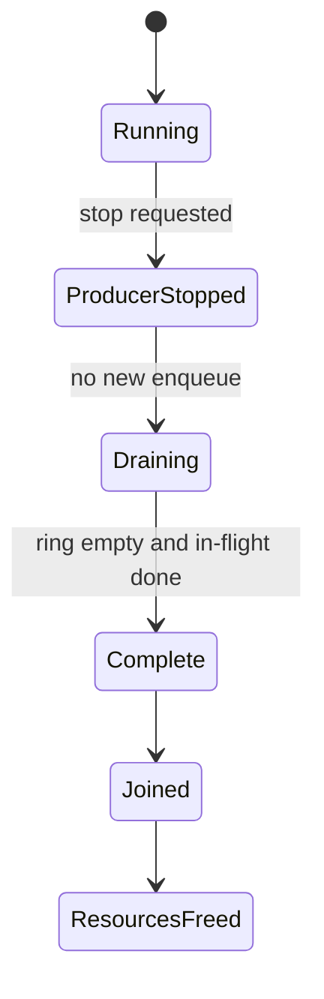

# 多核 Flow Pipeline 数据路径

## 1. 两种扩展模型

### Run-to-completion

一个 worker 从 RX 到 TX 完成全部处理：

```text
RXQ0 -> worker0 parse/lookup/action -> TXQ0
RXQ1 -> worker1 parse/lookup/action -> TXQ1
```

优点是 ownership 和 locality 清楚；缺点是某个复杂 stage 会拖慢整个 worker。

### Pipeline stages



优点是 stage 可独立扩展；代价是跨核 ring、cache transfer、排队和 backpressure。

## 2. 当前 Flow Pipeline 路径

当前 PMD 只有一个 RX queue，因此 main lcore 先收包，再按软件 key 分到两个 SP/SC ring：



它验证真实跨核 ownership 和 drain，但不是 NIC RSS。真实硬件模型应由 RXQ0/RXQ1 直接交给各 worker。

## 3. Queue-to-lcore Mapping

每个映射至少记录：

```text
port, RX queue, TX queue, lcore, CPU id, NUMA node, mempool socket
```

不要只记录 `-l 0-2`。EAL lcore id、Linux CPU id 和 NUMA node 是不同维度。

## 4. Flow Key 到 Action



分类函数最好不接管 mbuf ownership，只返回 decision；调用方统一处理 free/TX，使错误路径更易审计。

## 5. Shared Table 与 Sharded Table

| 模型 | 优点 | 代价 |
|---|---|---|
| shared hash | 规则单份、控制面简单 | 并发更新和共享 cache line |
| per-worker shard | lookup/local stats 局部化 | 规则复制、同步和跨 shard flow |

shared table 只读 lookup 相对简单；运行中 add/delete/update 需要明确并发模式。shard 根据 flow affinity 分配，控制面必须把规则更新同步到正确 shard。

## 6. Backpressure 链



必须定义 ring full 策略：drop、bounded retry、spill queue 或上游限速。无限自旋可能让 producer 无法继续 RX/reclaim，扩大拥塞。

## 7. Worker Drain



stop flag 不等于 ring empty。销毁 ring/hash/mempool 前必须 join worker；错误路径也要决定剩余 mbuf 如何释放。

## 8. Per-worker Stats

每个 worker 独立更新 cache-line-aligned stats，控制线程周期聚合：

```text
rx/dequeued
hash_hit/hash_miss
drop/forward/mark
ring_full
tx_success/tx_partial
cycles samples
```

共享 rule counter 可使用 relaxed atomic 统计，但它不解决 rule object delete/reuse 生命周期。

## 9. 延迟范围

当前项目 TSC 样本覆盖 parse + hash + decision，不包含 RX burst、ring 排队、TX completion 和 wire。因此它是 decision latency，不是 packet end-to-end latency。

## 10. 自测

1. run-to-completion 与 staged pipeline 的主要取舍是什么？
2. software dispatch 为什么仍有学习价值，但不能称为 RSS？
3. ring full 后无限 retry 可能造成什么反馈？
4. worker stop 后为什么还要 drain？
5. shared atomic counter 为什么不能保证 rule delete 安全？
