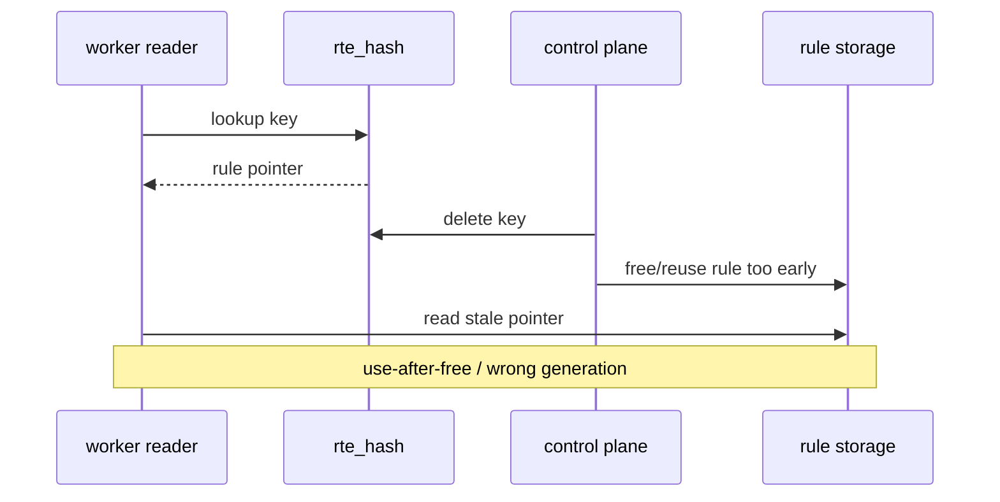
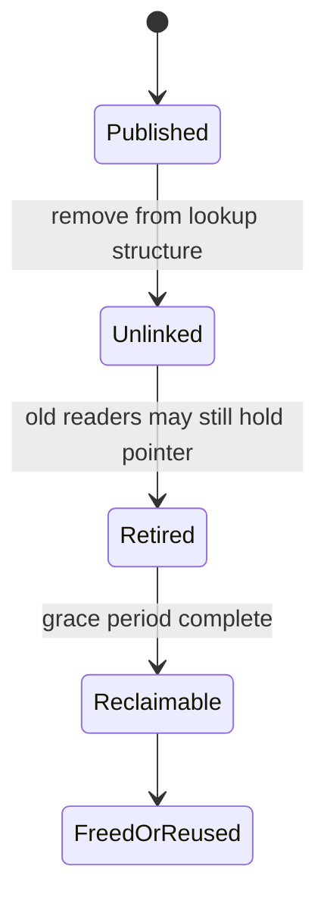
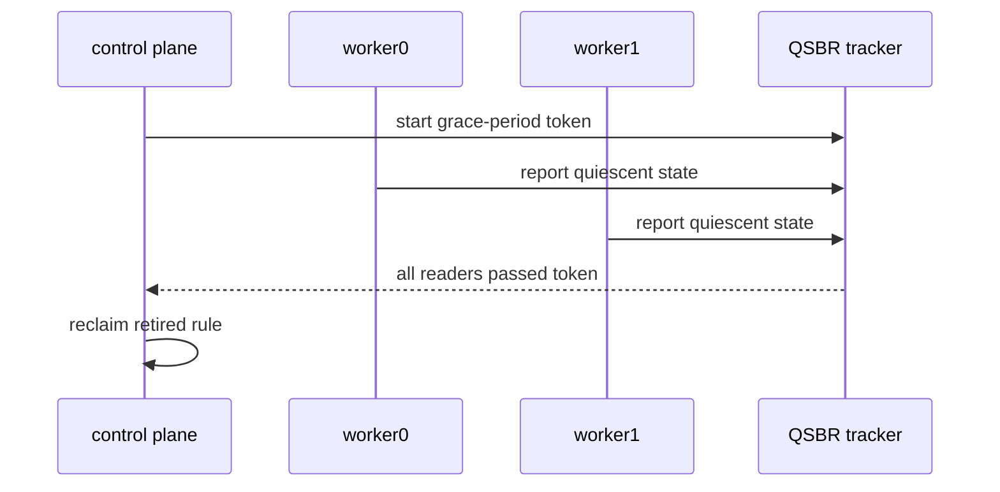
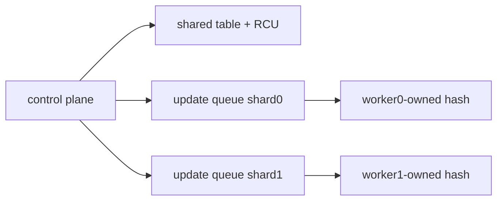

# 动态规则、RCU 与 QSBR

## 1. 问题不是 lookup，而是释放

worker 可能正在通过 hash 中的 pointer 读取 rule；控制面同时 delete key 并复用/free rule。即使 hash delete 成功，旧 reader 仍可能持有 pointer。



所以需要把“新 reader 不再获得对象”与“旧 reader 已经离开临界区”分成两个阶段。

## 2. Add、Update、Delete 的语义

- add：构造完整 rule，再发布到 hash。
- update：原位修改还是发布新版本，必须定义 reader 一致性。
- delete：先阻止新 lookup，再等待旧 reader，最后回收。
- aging：本质是由 timer/control plane 触发的 delete。
- reuse：旧 generation 安全回收后才能复用 slot。

多个字段的原位 update 可能让 reader 看见混合版本。单个 atomic action 值可原子更新；复杂 rule 更适合 copy-and-publish。

## 3. RCU 心智模型



RCU 让 read side 很轻：reader 进入/离开 read-side critical section；writer 发布新对象，并在 grace period 后回收旧对象。

## 4. QSBR 是什么

QSBR（Quiescent State Based Reclamation）通过每个 registered reader 报告 quiescent state，证明它不再引用旧对象。



worker 长时间不报告 quiescent state 会阻塞回收。报告点应放在 packet burst/loop 边界等确定不持有 rule pointer 的位置。

## 5. Copy-and-publish Update

```text
allocate new rule
-> copy old fields
-> apply update
-> publish new pointer/version
-> retire old rule
-> wait grace period
-> reclaim old rule
```

优点是 reader 看到完整旧版或新版；代价是 allocation、额外 memory 和回收队列。高频更新场景还要控制 retired backlog。

## 6. Generation 解决什么

generation 能识别 stale handle/completion 或 slot reuse：

```text
handle = slot_id + generation
```

它可以阻止旧引用误操作新对象，但不能让已经 free 的内存重新安全。generation 是逻辑版本检查，不替代 grace period。

## 7. 原子统计解决什么

`fetch_add(relaxed)` 适合 packet/byte counter，因为只要求单个计数不丢；它不自动保护 rule 的 action、key 和生命周期。

删除 rule 时还要决定 counter snapshot：

- delete 前读取并归档。
- rule 进入 retired 后等待 reader，再读取最终值。
- per-worker counters 聚合后再回收。

## 8. Shared 与 Sharded Control Plane



- shared table：规则单份，需要读写并发与回收协议。
- worker-owned shard：控制面发送 command，由 owner 在安全点修改，减少共享写；需要处理多 shard 一致性。

## 9. Aging 与 Timer

last-seen 更新频繁时不宜让所有 worker争写一个 cache line。可用 per-worker timestamp、sampling 或 owner-only 更新。aging scan 必须设预算，避免一次扫描大表阻塞控制面。

```text
ACTIVE -> EXPIRED_CANDIDATE -> UNLINKED -> RETIRED -> RECLAIMED
```

## 10. 当前项目边界

flow pipeline 当前做到：

- 运行前构建 shared/sharded table。
- worker 并发只读 lookup。
- rule counters 使用原子累加。
- 单线程测试 add/update/delete/aging/generation。

未做到：控制面与 worker 并发 add/delete 的 RCU/QSBR 回收。因此不能把规则生命周期单线程测试表述为 lock-free dynamic control plane。

## 11. 自测

1. hash delete 成功后为什么不能立即 free data pointer？
2. generation 与 grace period 分别解决什么？
3. 多字段原位 update 可能让 reader 看到什么？
4. worker 应在什么位置报告 quiescent state？
5. relaxed atomic counter 为什么不保护 rule lifecycle？
