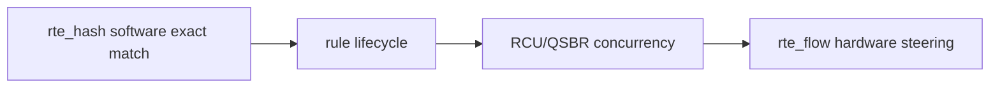

# DPDK Advanced 项目知识地图

## 1. 先读基础，再选进阶缺口


## 2. 项目映射

| Phase | 项目 | 进入前应懂 | 主要回答 | 当前证据 |
|---:|---|---|---|---|
| 1 | mbuf/mempool deep dive | base mbuf | metadata/cache/refcnt 如何观察 | pcap metadata |
| 2 | RSS multiqueue | queue/capability | PMD 是否支持 RSS/RETA | blocked boundary |
| 3 | NUMA burst tuning | cache/NUMA | 如何做控制变量矩阵 | method evidence |
| 4 | VFIO/IOMMU boundary | PCI/DMA | 部署安全边界是什么 | prerequisites evidence |
| 5 | L3 forwarder lite | parser/route/ACL | L3 lookup/action 如何闭环 | pcap functional |
| 6 | advanced summary | 全部阶段 | 如何组织证据和面试表达 | final report |
| 7 | flow pipeline | ring/hash/concurrency | exact flow、动态规则、双 worker | current-env complete |

## 3. 只想学习 RSS/多队列

```text
base 09 ethdev capability
-> advanced 01 hardware queue steering
-> lab-dpdk-rss-multiqueue
-> flow pipeline capability module
```

验收必须区分 capability probe、实际多 queue counters、RETA 读取和 flow affinity。当前 pcap PMD 只能完成第一层并记录 blocked。

## 4. 只想学习多核 Pipeline

```text
advanced 02 ring/hash
-> advanced 03 multicore data path
-> advanced 04 RCU/QSBR
-> project-dpdk-flow-pipeline
```

读代码顺序：contract/data structures -> worker/ring -> parser/hash/action -> lifecycle tests -> tuning/boundary tests。

## 5. 只想学习调优

先读基础 track 的性能方法，再读本 track `06_PROFILING_AND_DEBUGGING.md`。执行顺序：

1. Phase 3 burst/cache matrix，学习控制变量。
2. flow pipeline Phase 5，理解计时范围。
3. 真实 PMD 后再做 queue/NUMA/cycles/packet。

pcap pps 只能证明方法和软件路径，不作为硬件结论。

## 6. 只想学习 Flow Rule



先掌握 software key/action/ownership，再理解 hardware pattern/action。两者控制面形式相似，但执行位置和 capability 完全不同。

## 7. 知识到代码

| 知识 | 代码入口 |
|---|---|
| mbuf metadata | `lab-dpdk-mbuf-mempool-deep-dive/app/main.c` |
| capability/RETA | `lab-dpdk-rss-multiqueue/app/main.c` |
| matrix runner | `lab-dpdk-numa-burst-tuning/scripts/02_run_burst_cache_matrix.sh` |
| L3/ACL | `project-dpdk-l3-forwarder-lite/app/main.c` |
| flow key/hash | flow pipeline `flow_table.c` |
| parser/action | flow pipeline `flow_pipeline.c` |
| workers/rings | flow pipeline `main.c` |
| capability boundary | flow pipeline `flow_capability.c` |

## 8. 每个项目固定提问

1. 当前结果属于 software、vdev、VM 还是真实硬件？
2. mbuf 在每个 stage 的 owner 是谁？
3. table 是 shared 还是 sharded？
4. update/delete 与 reader 是否并发？
5. 计时包含哪些阶段？
6. drop/backpressure 是否守恒？

## 9. 自测

1. 为什么 Phase 2 blocked 仍然有学习价值？
2. 为什么先做 software hash 再做 `rte_flow`？
3. flow pipeline CURRENT_ENV_COMPLETE 未覆盖哪类并发更新？
4. 哪个项目适合学习测试方法而不是性能数字？
5. 从 L3 forwarder 到 flow pipeline 增加了哪些核心对象？
