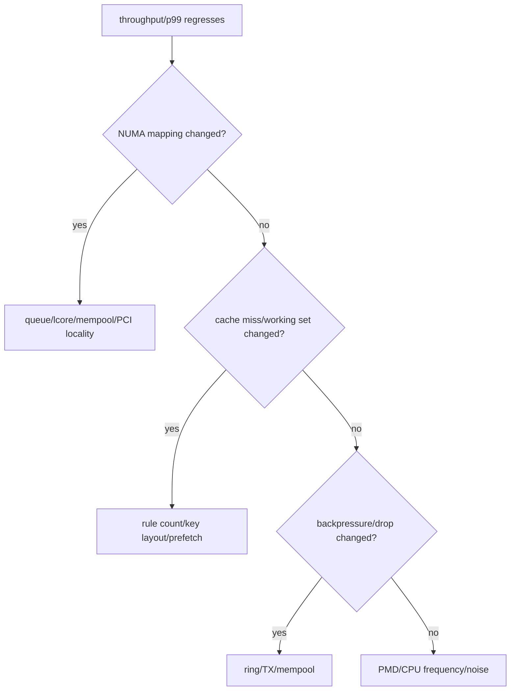

# Advanced Profiling 与分层排障

## 1. 先定义计时范围


在报告中标出 timer start/end。只测 parse+lookup 的 50 ns 不能称为端到端 packet latency。

## 2. 指标层次

| 层 | 指标 |
|---|---|
| hardware/PMD | RX/TX packets, missed, errors, no-mbuf, xstats |
| queue/ring | occupancy, enqueue fail, dequeue empty, burst distribution |
| pipeline | hit/miss, action counters, drop reason |
| CPU | cycles, instructions, IPC, cache/TLB/branch miss |
| latency | p50/p99/max，明确测量区间 |
| control plane | update rate, grace-period time, retired backlog |

## 3. `perf` 基础方法

```bash
perf stat -e cycles,instructions,branches,branch-misses,cache-misses \
  -- ./dpdk-app <args>

perf record -g -- ./dpdk-app <args>
perf report
```

VM 中 PMU capability 可能受限；缺失 event 要记录 capability boundary。profiling 本身有开销，采样频率和 call graph 模式必须记录。

## 4. CPU 环境

性能测试至少记录：

```text
lcore -> Linux CPU -> NUMA node
NIC PCI -> NUMA node
CPU governor/turbo/frequency
isolated CPUs and competing processes
IRQ placement
VM steal time or bare metal
```

`taskset` 只固定进程可运行 CPU，不自动保证 memory local、IRQ 隔离或频率稳定。

## 5. Cache/NUMA 诊断



不要看到 cache miss 增长就立即加 prefetch；先确认 miss 是否在关键路径、是否与吞吐/延迟相关。

## 6. RSS 排障

```text
dev_info capability
-> configured queue count
-> effective RSS hash fields
-> RETA
-> each queue RX counter
-> worker polling mapping
-> flow distribution
```

queue 1 counter 为零时，先确认 PMD/RSS/RETA，再查 worker；software counters 不能替代 hardware queue stats。

## 7. Ring/Pipeline 排障

- enqueue_fail 增长：consumer 服务率、ring size、worker 是否存活。
- dequeue_empty 高：输入不足或 producer/consumer 失衡，不一定是性能 bug。
- mempool available 降低：检查 ring backlog、TX in-flight 和 leak。
- shutdown hang：stop/quiescent/drain/join 顺序。
- rule hit 异常：key byte order/padding、dispatch flow affinity。

## 8. Hash/Rule 排障

```text
same displayed tuple but miss -> inspect raw key bytes and padding
wrong action after reuse       -> generation/lifetime bug
rare crash during delete       -> stale reader/reclaim bug
counter regression             -> shared updates/aggregation/reset scope
aging stalls                   -> scan budget/quiescent reader
```

## 9. TSC 与 Percentile

- 使用足够样本，说明 sampling 策略。
- 排序取 percentile 时定义 index/rank 方法。
- TSC 转 ns 使用 `rte_get_tsc_hz()`，但不要把计时粒度误作精度保证。
- 多轮 warmup/measurement，报告分布而不是挑最好一次。
- VM scheduling pause 会污染 tail，应保留并解释 outlier。

## 10. Capability Boundary

当前环境应继续输出：

```text
RSS_MULTI_QUEUE_BOUNDARY_BLOCKED
RTE_FLOW_BOUNDARY_BLOCKED
VFIO_IOMMU_BOUNDARY
```

blocked marker 要带探测值和 error detail，而不是只有“当前不支持”。

## 11. 最小性能记录

```text
environment + DPDK/PMD
packet size/flow count/input method
queue/lcore/mempool/NUMA map
burst/cache/descriptor/rule count
timer scope and sample count
Mpps/cycles-per-packet/p50/p99/drop
ethdev stats/xstats
capability boundary
```

## 12. 自测

1. parse+hash p99 与端到端 p99 有什么差别？
2. queue 1 无包时排查顺序是什么？
3. mempool available 下降可能是哪三类原因？
4. VM 中 `perf` event 缺失应怎样记录？
5. 为什么只报告最好一次结果不可信？
