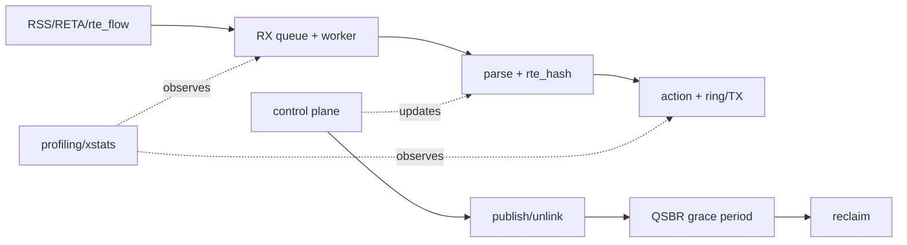

# DPDK Advanced 复习卡

## 1. 一页路径



```text
NIC steering
-> RSS hash -> RETA -> RX queue
-> queue-owned worker
-> stable flow key -> rte_hash
-> rule/action
-> ring or TX queue
-> per-worker stats/profiling

control plane:
publish -> unlink -> grace period -> reclaim
```

## 2. 十二张核心卡

### RSS

**问：** RSS 与 RETA 分别做什么？  
**答：** RSS 对配置字段计算 hash；RETA 把 hash bucket 映射到 queue。

### Flow affinity

**问：** 同一 flow 为什么希望到同一 worker？  
**答：** 让 state、cache 和 ordering 局部化，减少跨核同步。

### Queue mapping

**问：** 多 queue 为什么不等于多核有效？  
**答：** 还要正确 steering、轮询映射、NUMA locality 和足够多 flow。

### Clone/refcnt

**问：** clone 为什么不能随意改 payload？  
**答：** 多个 mbuf metadata 可能共享同一 backing buffer。

### Mempool cache

**问：** cache 越大越好吗？  
**答：** 不是；大 cache 会让对象滞留在 lcore，本地命中与全局可用量需权衡。

### Ring ownership

**问：** enqueue 失败后谁释放？  
**答：** producer 仍拥有；按 retry/drop policy 处理。

### Stable key

**问：** 为什么 flow key 要清零 padding？  
**答：** exact lookup 比较稳定字节，未初始化 padding 会制造假 miss。

### Shared hash

**问：** 并发 lookup 安全是否等于 delete 安全？  
**答：** 不等于；旧 reader 可能持有 data pointer，需要回收协议。

### RCU/QSBR

**问：** grace period 证明什么？  
**答：** 删除前已存在的 reader 已离开可能引用旧对象的临界区。

### Generation

**问：** generation 能替代 RCU 吗？  
**答：** 不能；它识别 stale handle，不保证已释放 memory 可访问。

### `rte_flow`

**问：** validate 成功等于硬件规则生效吗？  
**答：** 不等于；还需 create、traffic、counter/query 和 destroy 证据。

### p99

**问：** p99 必须附带什么？  
**答：** timer scope、sample count、负载、环境、drop 和重复方法。

## 3. 常见错误表述

1. “软件按 hash 分到两个 ring，已经验证 RSS。”错误：这是 software dispatch。
2. “rule pointer 地址没变，所以并发 update 安全。”错误：字段一致性和 delete/reuse 仍未解决。
3. “用了 relaxed atomic，所以整个 rule 线程安全。”错误：只保护对应 atomic 字段。
4. “pcap PMD 下 pps 更高，说明 NIC 调优成功。”错误：没有真实 DMA/queue/wire。
5. “`rte_flow_validate` 返回成功就完成 offload。”错误：缺少运行和计数证据。

## 4. 面试式自测

1. 描述 RSS hash、RETA、queue、worker 的完整关系。
2. shared table 与 sharded table 如何选择？
3. ring full 如何沿 pipeline 传播成 RX no-mbuf？
4. dynamic rule delete 的安全顺序是什么？
5. QSBR reader 不报告 quiescent state 会怎样？
6. bulk lookup 和 prefetch 可能改善什么、伤害什么？
7. 如何证明真实多 queue 分流？
8. 如何区分 decision latency 和 end-to-end latency？
9. 为什么 per-worker stats 常优于共享 stats？
10. 当前环境哪些能力仍是 blocked boundary？

## 5. 进入真实硬件分支的门槛

能不看文档解释以下内容：

- RSS/RETA/flow affinity。
- ring/hash/mbuf ownership。
- queue/lcore/mempool/NUMA mapping。
- rule publish/unlink/retire/reclaim。
- timer scope、drop 和 evidence boundary。
