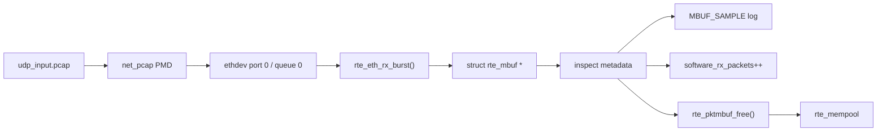
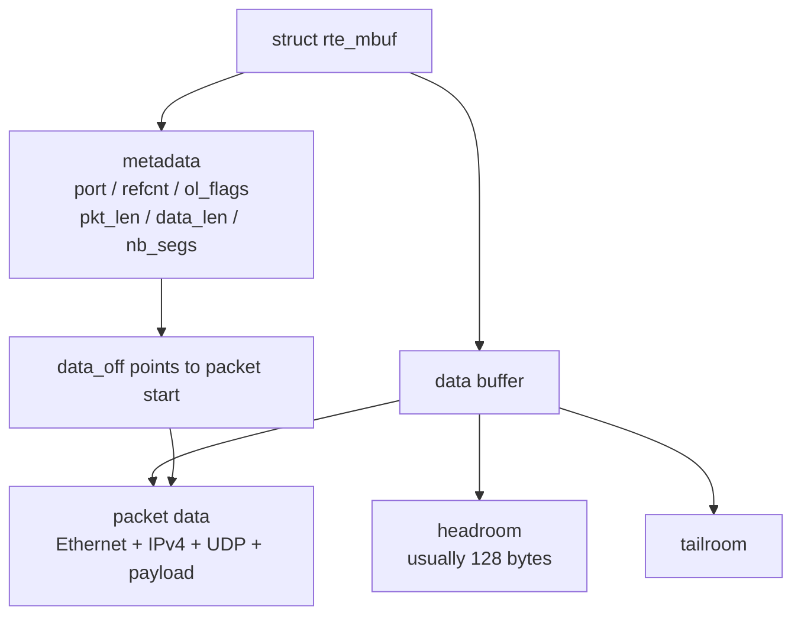
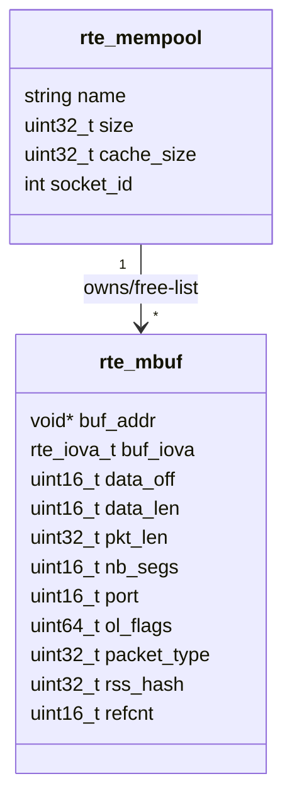
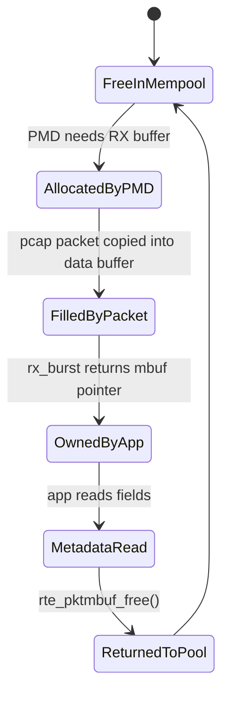
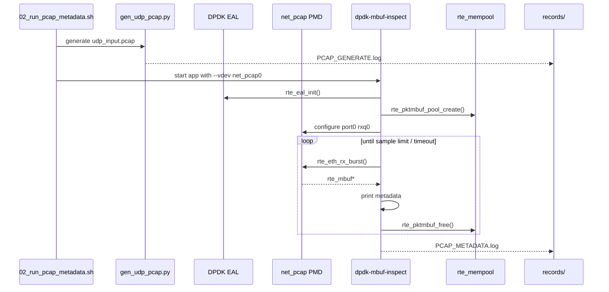

# 04_DEEP_LEARNING - mbuf / mempool 深度学习

> 这一阶段的学习重点是 DPDK packet memory model。你要能讲清楚：包进入 DPDK 后为什么不是 `malloc` 出来的普通 buffer，而是一个由 mempool 管理、由 mbuf 描述的数据对象。

## 1. 本 Lab 要回答的问题

```text
DPDK 收到一个 packet 后：
  1. packet data 放在哪里？
  2. rte_mbuf 保存了哪些 metadata？
  3. mempool 如何避免频繁 malloc/free？
  4. 应用什么时候拥有 mbuf，什么时候必须释放？
  5. 软件统计和 ethdev 统计如何对齐？
```

本阶段只观察 RX metadata，不做转发、RSS、NUMA、VFIO。

## 2. 总体数据路径



这里 `net_pcap PMD` 模拟 PMD 收包，应用看到的仍然是标准 DPDK `rte_mbuf`。

## 3. mbuf 内存布局



文本化理解：

```text
buf_addr
  + 0               -> buffer start
  + data_off=128   -> packet data start
  + data_len       -> current segment end
```

本次样例：

```text
data_off=128
data_len=67
pkt_len=67
nb_segs=1
refcnt=1
```

## 4. mbuf 字段 UML



字段含义：

| 字段 | 学习重点 |
|---|---|
| `buf_addr` | buffer 起始虚拟地址 |
| `buf_iova` | DMA/IOVA 视角地址，当前多为 VA mode |
| `data_off` | packet data 相对 buffer 起点的偏移 |
| `data_len` | 当前 segment 长度 |
| `pkt_len` | 整个 packet 长度 |
| `nb_segs` | chained mbuf 段数 |
| `ol_flags` | checksum/RSS/VLAN 等 offload 标志 |
| `rss_hash` | RSS hash，未启用时通常为 0 |

## 5. mempool 为什么重要

普通网络程序可能每包分配内存：

```text
packet in -> malloc buffer -> process -> free buffer
```

DPDK 不能这么做，因为高 pps 下 allocator 会成为瓶颈。

DPDK 的方式：

```text
startup:
  allocate many mbufs into mempool

runtime:
  PMD gets mbuf from mempool
  app processes mbuf
  app returns mbuf to mempool
```


per-lcore cache 减少多个 core 争抢同一个 mempool ring。

## 6. 生命周期状态图



关键规则：

```text
应用从 rx_burst 拿到 mbuf 后拥有它；
如果不 tx，就必须 free；
如果 tx_burst 成功，所有权交给 PMD，不能再访问该 mbuf。
```

Phase 1 只走 `rx -> inspect -> free`。

## 7. 程序执行时序图



## 8. 本次 evidence

正式记录：

```text
records/20260629-210538-mbuf-mempool/
```

关键输出：

```text
software_rx_packets=32
samples_printed=8
data_off=128
data_len=67
pkt_len=67
nb_segs=1
PASS_STATS_CONSISTENCY
```

验收含义：

```text
PASS_PCAP_RX            pcap PMD 确实收到了包
PASS_MBUF_METADATA      mbuf metadata 可观察
PASS_MEMPOOL_CONFIG     mempool 参数已记录
PASS_STATS_CONSISTENCY  app 统计和 ethdev 统计对齐
```

## 9. 边界

本阶段证明的是：

```text
pcap PMD RX path 下的 mbuf/mempool metadata 观察能力。
```

不证明：

```text
真实 NIC RX 性能
RSS hash 分流
multi-seg jumbo packet
TX path
L3 forwarding
VFIO/IOMMU
```

