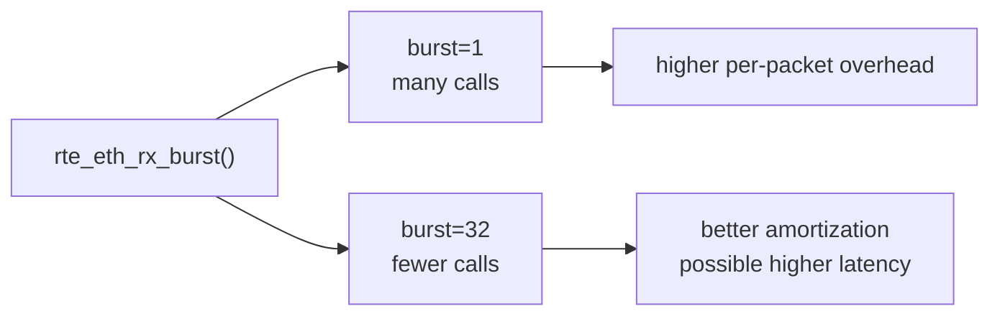
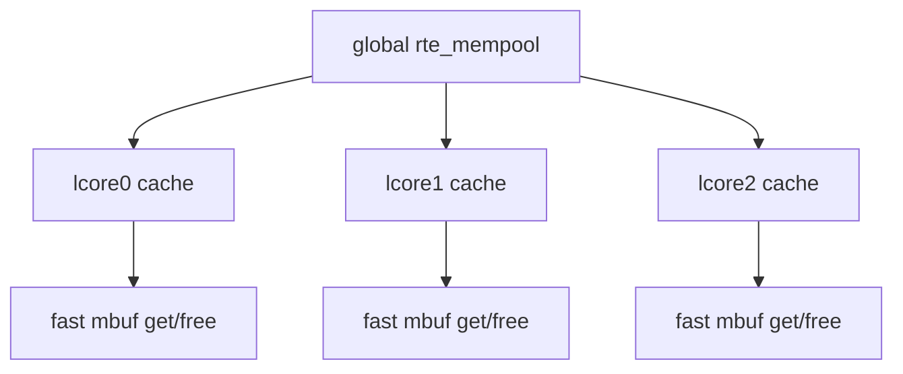
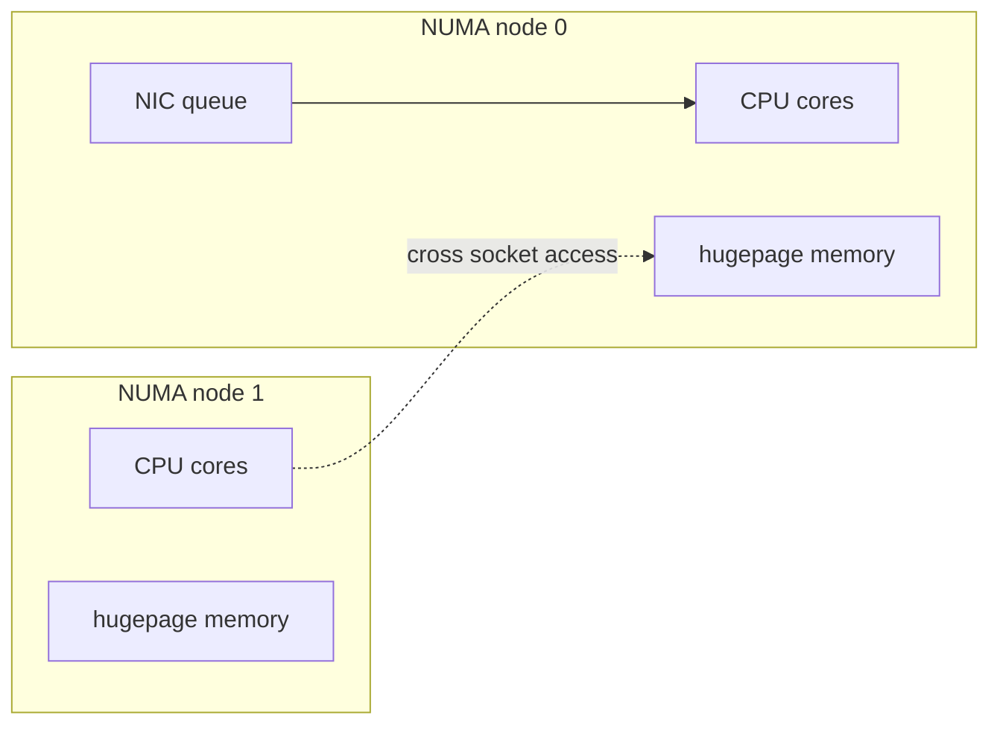
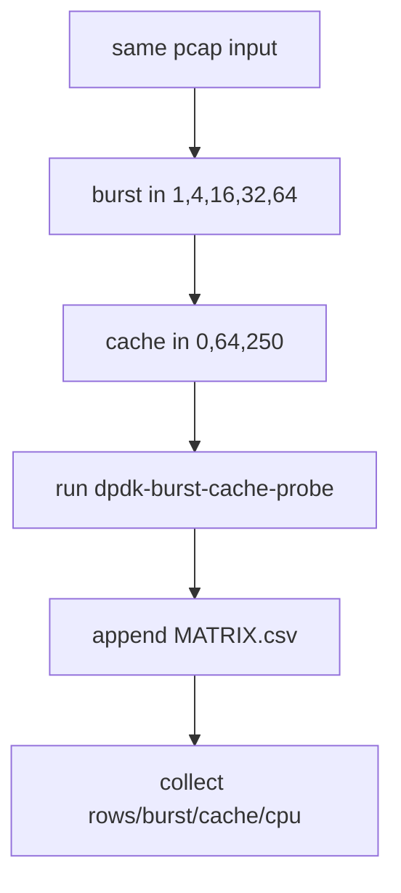
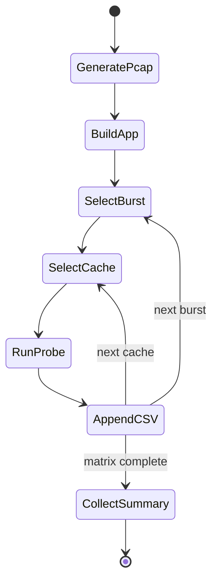
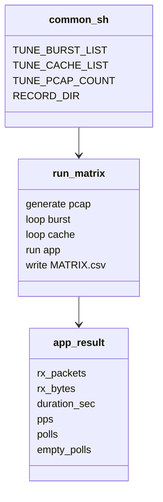

# 04_DEEP_LEARNING - NUMA / Burst / Cache 调优方法深度学习

> Phase 3 学的不是某个 pps 数字，而是性能实验方法：控制变量、形成矩阵、记录 CPU/NUMA、把 pcap PMD 的结果限定为方法论证据。

## 1. DPDK 为什么强调 burst

逐包处理：

```text
rx one packet -> function call -> process -> repeat
```

burst 处理：

```text
rx up to N packets -> process batch -> repeat
```



burst size 是吞吐和延迟之间的典型权衡。

## 2. mempool cache 的作用



如果 cache 太小：

```text
频繁访问 global mempool ring，竞争更多。
```

如果 cache 太大：

```text
对象可能被缓存到某个 lcore，影响全局可用性和内存占用。
```

本阶段测试：

```text
cache = 0, 64, 250
```

## 3. NUMA 变量

NUMA 机器上，NIC、CPU、memory 可能属于不同 socket：



跨 NUMA 访问会增加延迟和内存访问成本。

当前测试机：

```text
CPU(s)=8
NUMA node(s)=1
```

所以本阶段只记录 NUMA，不做跨 socket 性能结论。

## 4. 调优矩阵



矩阵规模：

```text
5 burst values * 3 cache values = 15 rows
```

CSV 字段：

```text
burst_size,mbuf_cache,rx_packets,rx_bytes,duration_sec,pps,polls,empty_polls
```

## 5. 实验状态机



## 6. 代码/脚本职责 UML



## 7. 当前 evidence

正式记录：

```text
records/20260629-212218-numa-burst/
```

关键结果：

```text
PASS_BURST_MATRIX
PASS_CACHE_MATRIX
PASS_CPU_RECORD
rows=15
burst_values=5
cache_values=3
```

## 8. 正确结论

可以说：

```text
我建立了 DPDK burst/cache 调优实验矩阵，
能固定 pcap 输入、固定 lcore、固定 app，只改变 burst/cache。
当前 pcap PMD 结果证明方法，不证明真实 NIC 线速。
```

不能说：

```text
当前 pps 就是真实 NIC 性能。
当前环境完成 NUMA 跨 socket 优化。
```

