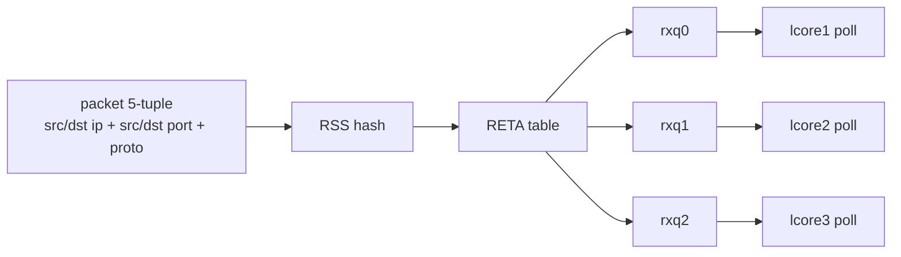
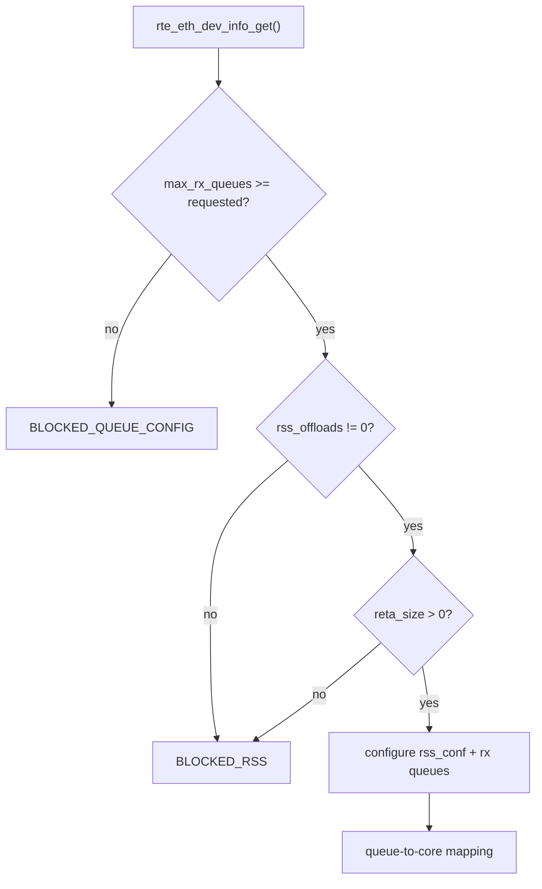
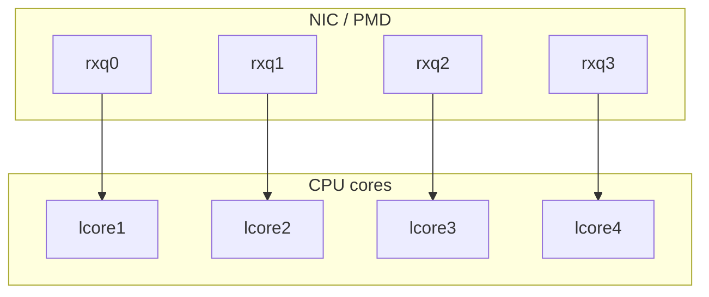
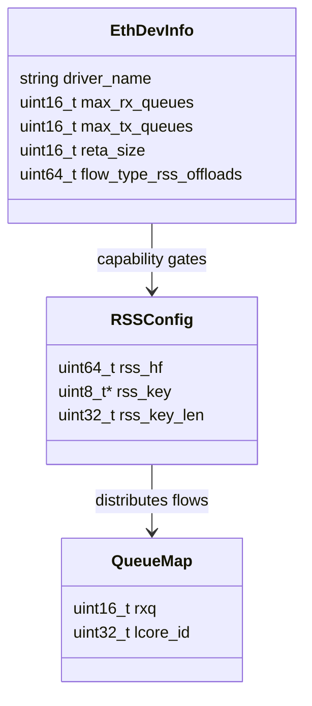
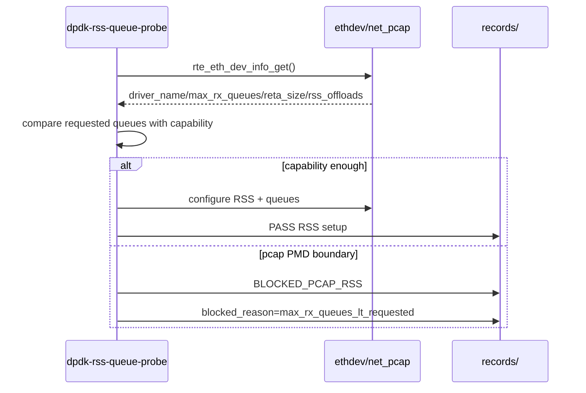

# 04_DEEP_LEARNING - RSS / Multi-Queue 深度学习

> 这一阶段的重点不是“把多队列跑起来”，而是先建立正确的 RSS 判断方法：PMD 是否支持、多队列是否存在、RETA 是否可查、RSS offload 是否可用。

## 1. RSS 解决什么问题

单队列模型：

```text
all packets -> rxq0 -> lcore0
```

问题：

```text
只有一个 core 在收包，无法扩展到多核。
```

RSS 模型：

```text
flow hash -> RETA -> rx queue -> lcore
```



RSS 的目标不是随机分包，而是让同一个 flow 稳定落到同一个 queue，同时让不同 flow 分散到多个 queue。

## 2. RSS 依赖 PMD capability

不能只看代码里有没有配置 RSS，要先查 PMD 能力：

```text
rte_eth_dev_info_get()
  -> max_rx_queues
  -> reta_size
  -> flow_type_rss_offloads
```

判断流程：



本次 pcap PMD 能力：

```text
driver_name=net_pcap
max_rx_queues=1
reta_size=0
rss_offloads=0x0
```

所以结论是：

```text
BLOCKED_PCAP_RSS
```

这是一条正确的工程结论，不是实验失败。

## 3. queue-to-core 模型

真实多队列程序通常这样设计：



每个 lcore 的主循环：

```text
while running:
  nb_rx = rte_eth_rx_burst(port, assigned_queue, ...)
  process packets
```

当前项目记录的模型：

```text
queue_map rxq=0 lcore=1
queue_map rxq=1 lcore=2
```

但是 pcap PMD 实际只有 1 个 RX queue，所以这里只能作为模型保留。

## 4. RSS / RETA / Queue UML



## 5. 执行时序



## 6. 当前 evidence

正式记录：

```text
records/20260629-211820-rss-multiqueue/
```

关键输出：

```text
QUEUE_CONFIG BLOCKED_QUEUE_CONFIG
RSS_QUERY BLOCKED_RSS
QUEUE_TO_CORE_DOC PASS_QUEUE_TO_CORE_DOC
blocked_reason=no_rss_offloads_or_reta
blocked_reason=max_rx_queues_lt_requested requested=2 max_rx_queues=1
```

## 7. 口径

可以这样讲：

```text
我没有把 pcap PMD 伪装成 RSS 硬件。先查 capability，
确认 max_rx_queues=1、reta_size=0、rss_offloads=0。
所以我把 RSS 记录为 BLOCKED，同时保留 queue-to-core 模型，
等有真实 RSS-capable NIC 后补硬件验证。
```

