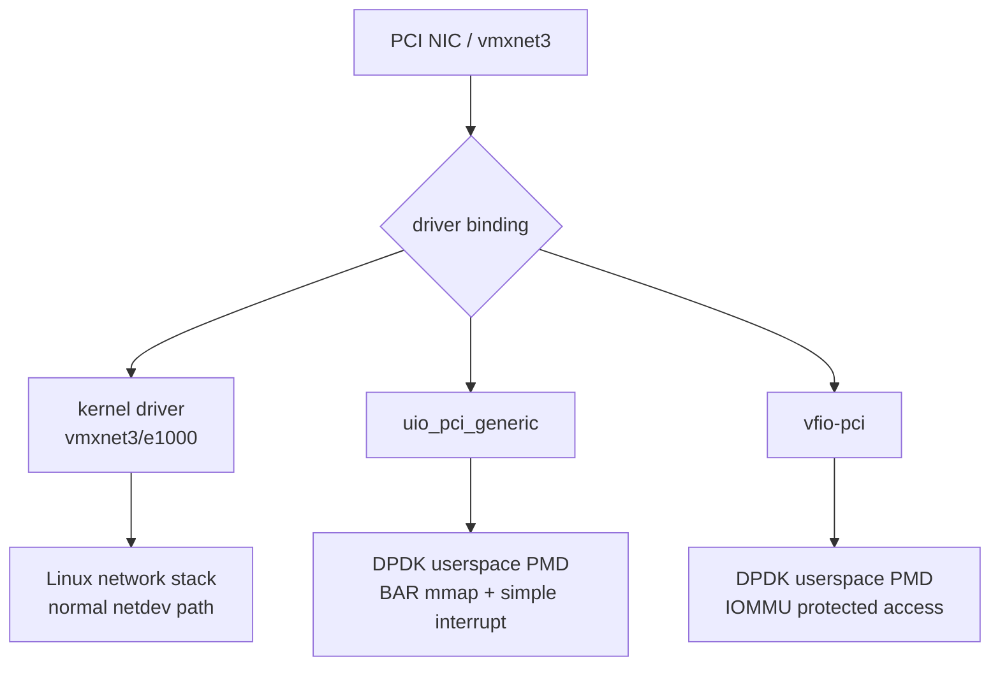
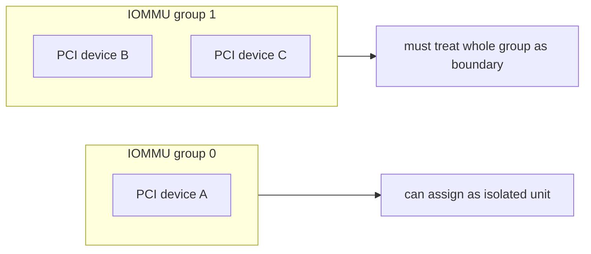
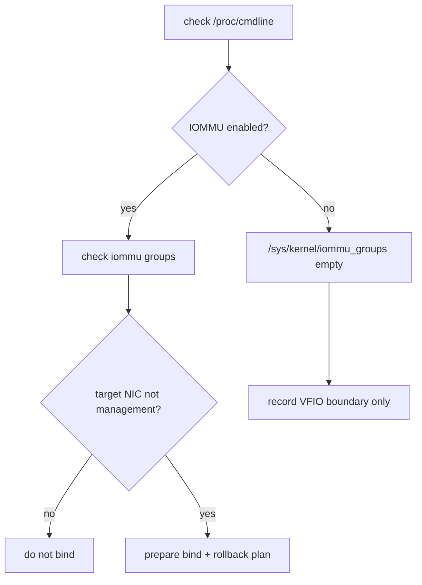
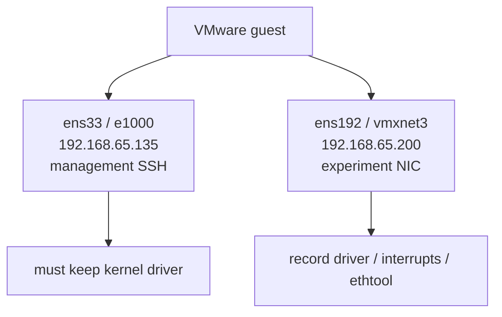
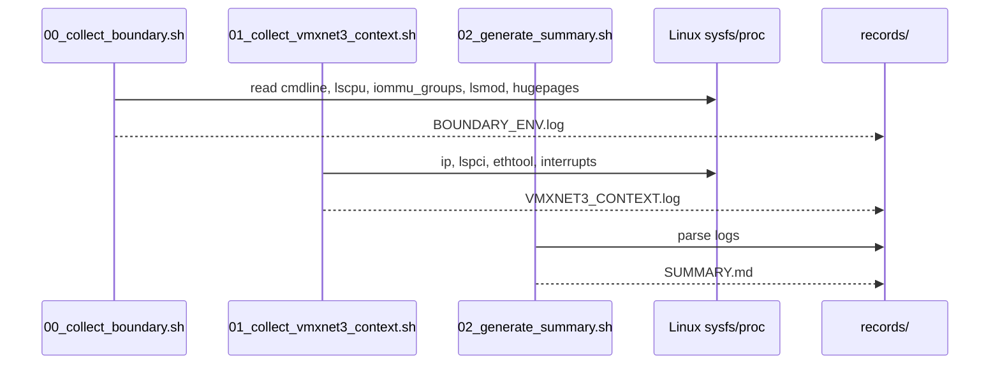

# 04_DEEP_LEARNING - VFIO / IOMMU / UIO 边界深度学习

> Phase 4 学习重点是 DPDK 部署边界：什么时候可以用 UIO，什么时候需要 VFIO，为什么 IOMMU group 是安全边界，为什么不能在 SSH 管理网卡上乱 bind。

## 1. Kernel driver、UIO、VFIO 的位置



UIO 和 VFIO 都能让用户态 PMD 访问设备，但安全边界不同。

## 2. UIO vs VFIO

| 路径 | 优点 | 边界 |
|---|---|---|
| kernel driver | 稳定，适合管理网卡 | 不是 DPDK userspace PMD |
| UIO | 简单，环境门槛低 | 没有 VFIO 那种 IOMMU 隔离 |
| VFIO | 更接近生产安全路径 | 依赖 IOMMU 和 group isolation |

## 3. IOMMU group 原理



VFIO 的隔离单位是 IOMMU group，不是你肉眼看到的单个网卡 function。

如果目标 NIC 和其他关键设备在同一个 group，就不能随便把其中一个交给 userspace。

## 4. 当前测试机决策树



本次事实：

```text
cmdline: ro quiet splash
iommu_group_entries=0
vfio_module_loaded=no
uio_module_loaded=no
ens192: Kernel driver in use: vmxnet3
ens33: management NIC, e1000
```

所以只能做 boundary evidence。

## 5. vmxnet3 / 管理网卡关系



不能为了实验把 SSH 管理网卡从 kernel driver 解绑。

## 6. 执行时序



## 7. 当前 evidence

正式记录：

```text
records/20260629-212638-vfio-iommu/
```

验收：

```text
PASS_UIO_VFIO_MATRIX
PASS_VMXNET3_BOUNDARY
PASS_IOMMU_CHECKLIST
```

## 8. 口径

```text
我没有强行宣称 VFIO 跑通。当前启动参数没有 IOMMU，
iommu_groups 为空，目标 vmxnet3 仍由 kernel driver 管理。
所以我把这个阶段定义为 VFIO/IOMMU boundary，
留下 checklist，等具备 IOMMU 和安全实验 NIC 的环境再做真实 bind。
```

