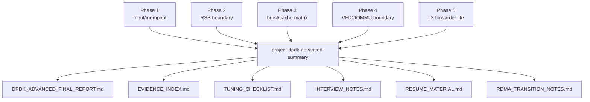
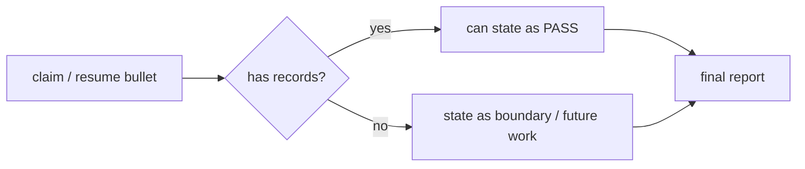
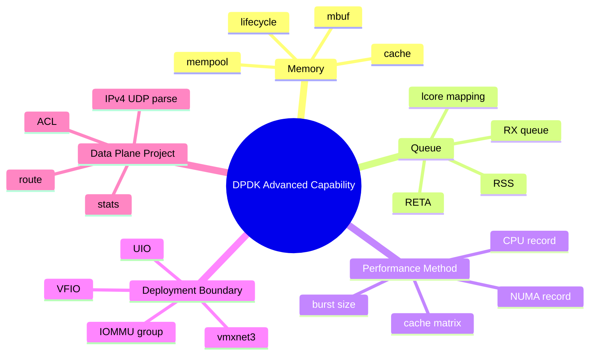
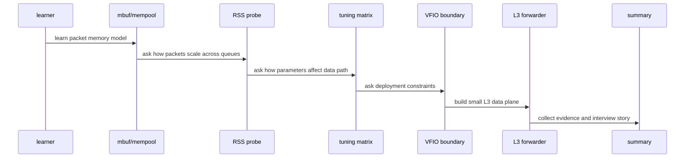
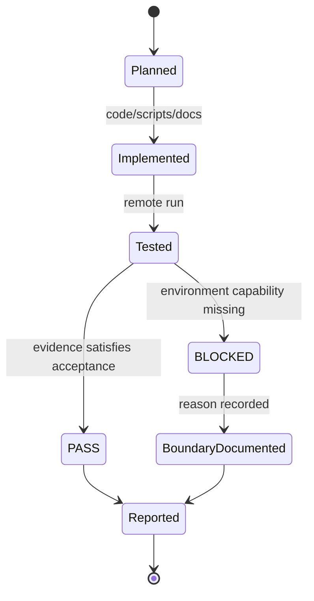
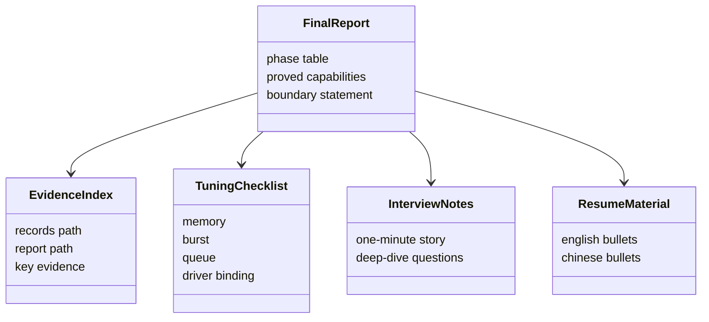
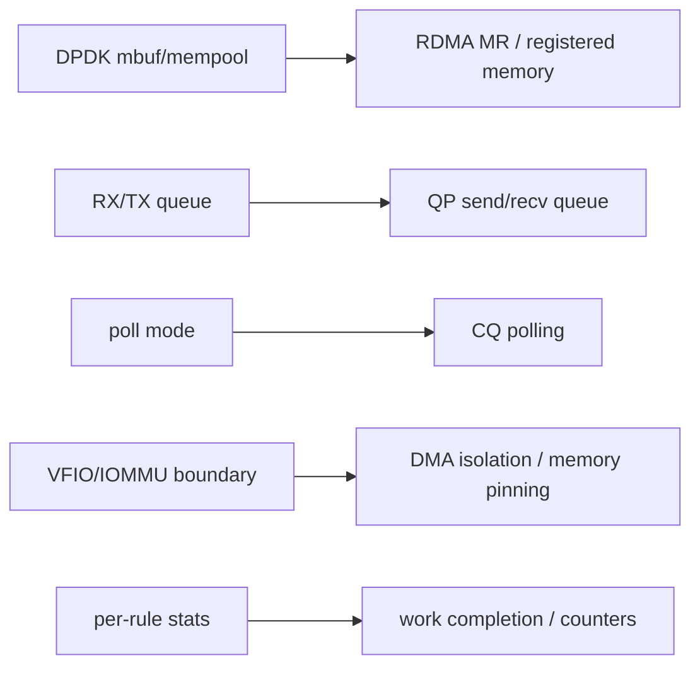

# 04_DEEP_LEARNING - DPDK Advanced Summary 深度学习

> Phase 6 不是单独的数据面程序，而是把整个 track 的能力、证据和边界收敛成可讲、可查、可复盘的工程材料。

## 1. Summary 项目的角色



它的目标不是再写一个 demo，而是把所有 demo 的含义整理成作品集。

## 2. Evidence-first 原则



本 track 的核心纪律：

```text
有记录的能力写 PASS；
环境不能证明的能力写 BLOCKED 或 boundary；
不把 pcap/VMware 结果包装成真实硬件线速。
```

## 3. 能力分层



## 4. Track-level 时序



## 5. PASS / BLOCKED 状态机



Phase 2 是典型 `BLOCKED -> BoundaryDocumented`：

```text
pcap PMD max_rx_queues=1, reta_size=0, rss_offloads=0x0
```

Phase 4 也是 boundary：

```text
iommu_group_entries=0, vfio_module_loaded=no
```

## 6. 最终报告结构 UML



## 7. RDMA 过渡关系



这就是为什么 DPDK Advanced 后面自然接 RDMA Core。

## 8. Summary 项目的边界

Summary 证明的是：

```text
整个 track 有完整证据链、解释材料和面试表达。
```

它不新增硬件能力：

```text
不会把 Phase 2 的 RSS boundary 变成 PASS RSS 硬件；
不会把 Phase 4 的 IOMMU checklist 变成 VFIO 已跑通；
不会把 Phase 5 的 pcap/net_null 变成真实 NIC 线速。
```

