# ARCHITECTURE

## 1. 总体架构

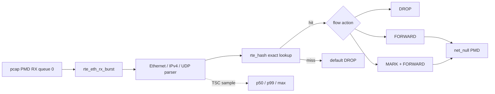

pcap PMD 只提供确定性输入，net_null PMD 作为 TX sink。它们适合验证 pipeline 语义和计数守恒，不代表真实 NIC DMA、RSS 分流或线速性能。

## 2. 模块 UML

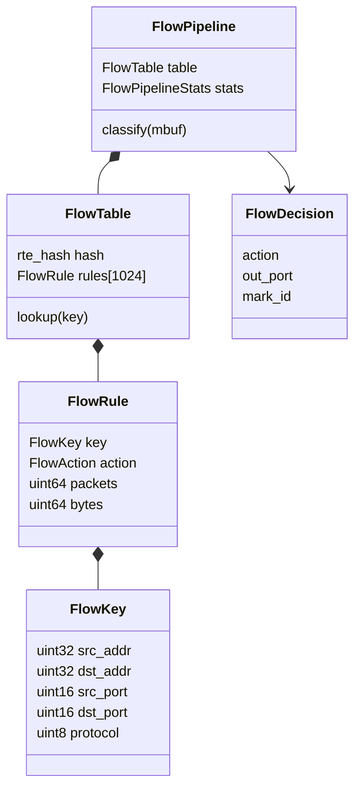

模块边界：

- `flow_key` 只负责安全解析和 key 规范化。
- `flow_table` 持有 `rte_hash`、规则对象和 per-rule 计数。
- `flow_pipeline` 负责 lookup、动作决策和 TSC 样本。
- `main` 负责 EAL、port、mempool、RX/TX 和 mbuf 生命周期。
- `flow_capability` 只查询 capability 和 validate，不改变测试流量。

## 3. 五元组与 rte_hash

`flow_key` 固定为 16 字节。地址和端口保留网络字节序，reserved 字段始终清零，因此 packet parser 与规则构造产生完全相同的字节序列。`rte_hash_add_key_data()` 将 key 映射到稳定的 `flow_rule` 地址，lookup 不需要再次遍历规则数组。

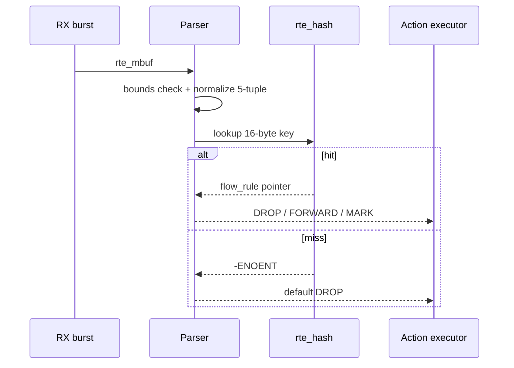

Phase 1 使用三条精确规则，分别命中 DROP、MARK 和 FORWARD。第四类流量故意 miss。64 包按四类轮转生成，因此每类预期 16 包，hash hit 为 48，miss 为 16。

## 4. 动作与 mbuf 所有权

- `DROP`：pipeline 返回决策，main 调用 `rte_pktmbuf_free()`。
- `FORWARD`：main 将原 mbuf 交给 `rte_eth_tx_burst()`；TX 成功后 PMD 接管所有权。
- `MARK`：写入 `mbuf->hash.fdir.hi` 后执行 FORWARD。
- TX 失败：main 重新获得所有权并释放 mbuf。

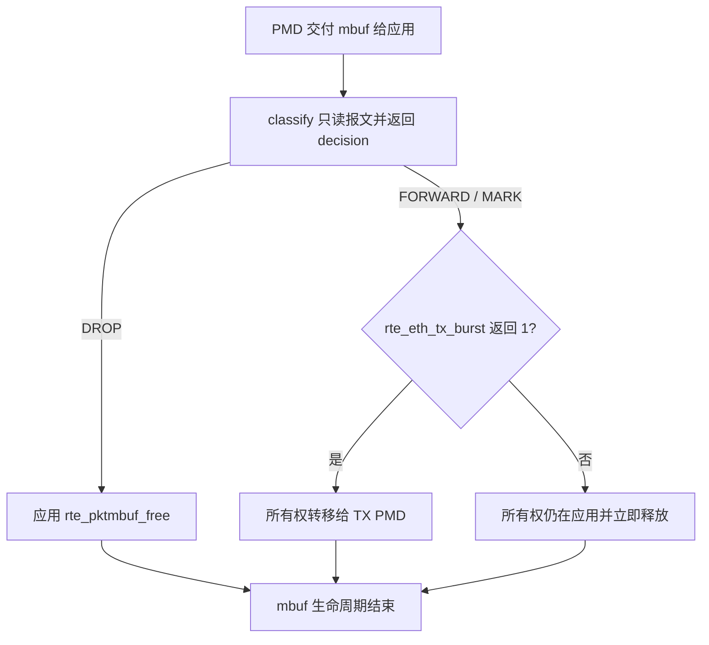

`flow_pipeline_classify()` 的 `const struct rte_mbuf *` 表达“分类不接管所有权”；真正的所有权转移只发生在 TX PMD 接受 mbuf 时。这个边界保证 DROP、TX 失败和正常 TX 三条路径不会重复释放或泄漏。

最终守恒式是：

```text
rx_packets = tx_packets + freed_packets
64 = 32 + 32
```

## 5. p99 观测边界

每个 packet 在 parser 前读取 TSC，在 hash lookup 和 decision 完成后记录 cycle delta。结束时排序样本并计算 p50/p99/max，再按 `rte_get_tsc_hz()` 换算 p99 ns。

该数据只覆盖 parse + software hash lookup + decision，不包含完整 RX/TX、PCIe、DMA 和线缆时延。64 个 pcap 样本用于验证观测链路，不能作为生产尾延迟结论。

## 6. RSS 与 rte_flow capability

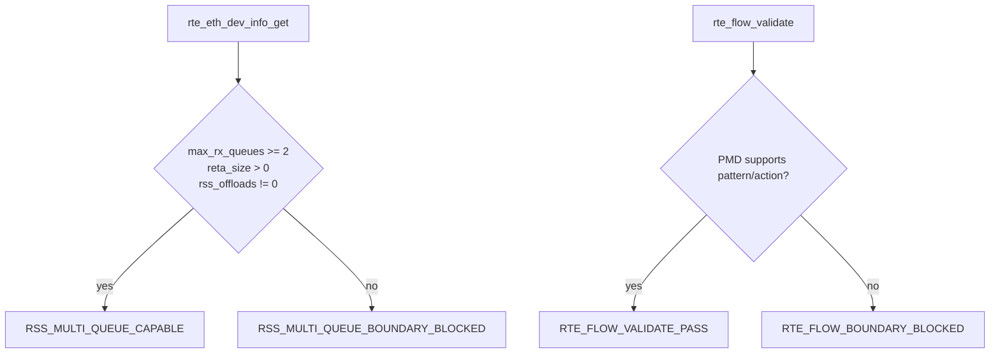

135 的 pcap PMD 返回 `max_rx_queues=1`、`reta_size=0`、`rss_offloads=0x0`，并对 `rte_flow_validate()` 返回 `Function not implemented`。这说明软件 pipeline 已验证，但硬件 steering 尚无证据。

## 7. 能力演进与现状

Phase 3 已完成 queue-to-lcore 的 shared/sharded table 软件模型，详见第 9 节。仍待真实硬件完成的是 RETA、hardware counter、`rte_flow` create/query/destroy 和多 RX queue 分流；这些项目需要支持 RSS 与 `rte_flow` 的 PMD，不能由 pcap PMD 的软件分流替代。

## 8. Phase 2：规则生命周期

静态规则和动态规则共享同一个 `rte_hash`。动态规则额外保存 `generation`、`last_seen_tsc`、`active` 和 `dynamic`：

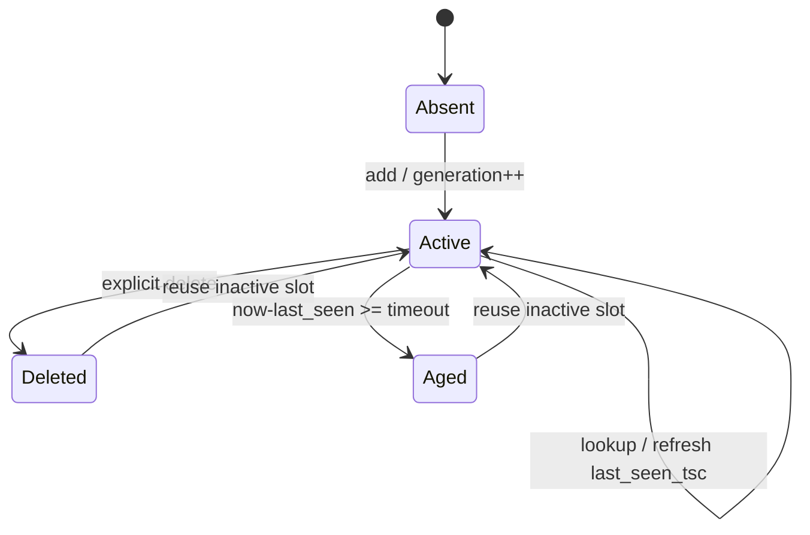

update 不替换 `flow_rule` 对象，只原位修改 action 并递增 generation，因此 `rte_hash` 保存的数据指针始终稳定。delete 和 aging 都先从 hash 删除 key，再将 rule 标记为 inactive；下一次 add 优先复用 inactive slot，避免规则数组高水位不断增长。

aging 自测使用合成 TSC 值构造确定性超时，避免 CI 调度抖动改变结果。真实运行时由 lookup 刷新 `last_seen_tsc`，后续 worker 阶段再决定 aging 扫描周期和并发同步模型。

## 9. Phase 3：queue-to-lcore worker

当前 PMD 只有一个 RX queue，因此 main lcore 从 queue 0 收包后按源 IPv4 最低位选择 logical queue，再通过两个 SP/SC `rte_ring` 将 mbuf 交给 lcore 1 和 lcore 2。这个模型真实覆盖 ring、remote launch、worker drain 和 mbuf 跨核所有权，但不等价于 NIC RSS。

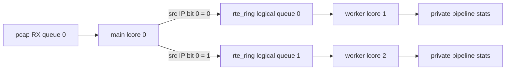

每种模式生成 64 个合成 mbuf，四类 flow 各 16 个。软件分流保证两个 logical queue 各 32 包，聚合结果仍为 48 hit、16 miss，以及 DROP/FORWARD/MARK/default DROP 各 16。

### Shared-readonly table

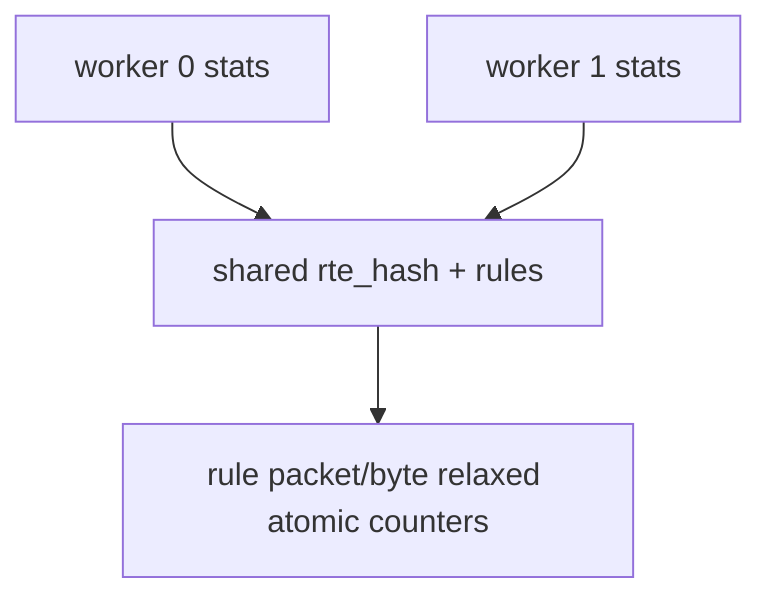

table 在 worker 启动前构建，运行期间不 add/delete。两个 worker 只并发 lookup，pipeline stats 各自私有；共享 rule 的 packet/byte 使用 relaxed atomic 累加。控制面更新与 worker 并发时仍需要 RW concurrency 或 RCU/QSBR，当前阶段不声称完成。

### Sharded table

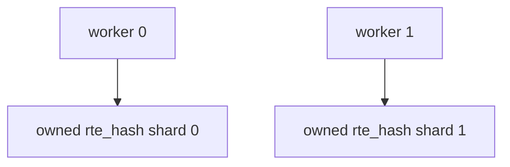

每个 worker 拥有完整 table 副本，无 lookup 数据竞争，代价是规则内存复制和控制面多副本更新。后续应根据 flow affinity、规则规模和更新频率选择 shared 或 sharded，而不是默认一种模式适合所有负载。

## 10. Phase 5：调优矩阵

调优矩阵采用单变量对照：baseline 固定为 burst 16、cache 250、3 条规则；其余 case 每次只改变 burst、cache 或 table rule count。每个 case 使用同一份 4096 包 pcap，并再次执行完整动作计数断言。

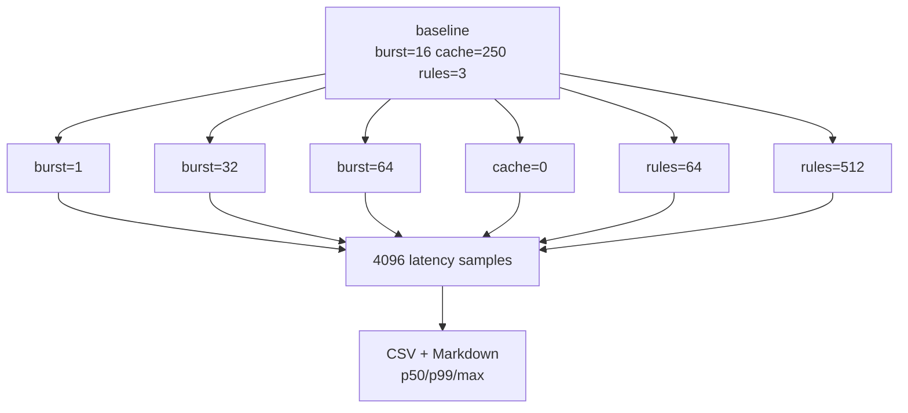

### 变量含义

- `burst-size` 改变一次 `rte_eth_rx_burst()` 最多取出的 mbuf 数，主要影响循环、预取和摊销；当前 latency 计时不包含 RX burst 本身，因此只可间接观察 packet 排布影响。
- `mbuf-cache` 是 mempool 的 per-lcore cache。当前 pcap 路径中的 mbuf 分配主要由 PMD 完成，而 decision latency 又不含 alloc/free，所以 cache 变化理论上不应直接改变该指标。
- `rule-count` 通过不命中的 filler key 扩大 `rte_hash` table，有助于观察工作集和 bucket 冲突，但 512 条仍远小于生产流表。

### 本次结果

```text
p50: 所有 case 均为 75 cycles
p99: 100-125 cycles
baseline: 125 cycles / 50 ns
observed delta: 25 cycles
```

该矩阵证明参数化、重复执行和结构化证据链已打通，但不能说明 burst 1 或 512 rules 更快。原因包括单次运行、样本较少、TSC 粒度、pcap PMD、无真实 DMA，以及计时范围仅包含 parse + hash + decision。真实调优至少需要多轮 warmup、置信区间、CPU pinning、真实 PMD 和完整端到端吞吐/尾延迟指标。

## 11. Phase 6：错误边界与资源清理

正常路径证明“输入正确时功能成立”，负向路径则证明“输入或资源不满足约束时不会带病运行”。应用把失败分为三层：应用参数与流量模型、EAL 枚举到的端口资源、worker lcore 资源。每层输出稳定 marker，并统一进入 `out` 清理路径。

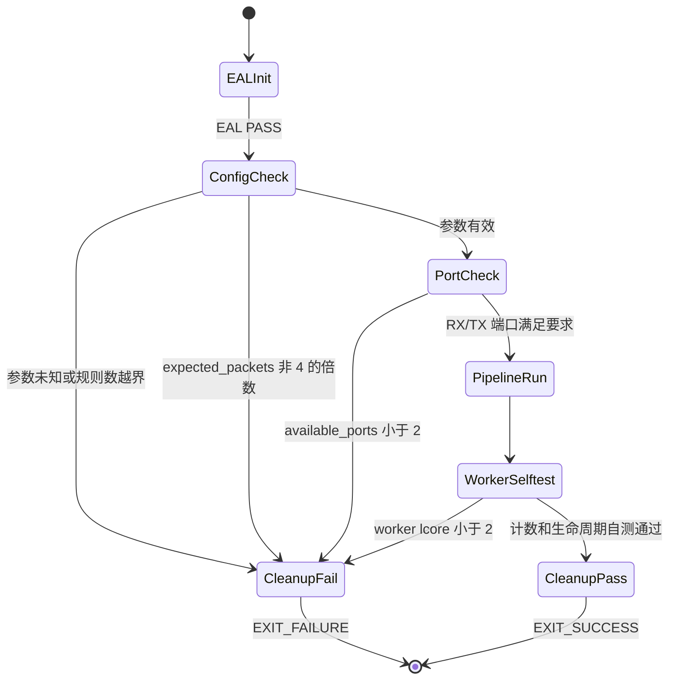

### 11.1 为什么 expected packets 必须是 4 的倍数

pcap 生成器按 DROP、MARK、FORWARD、MISS 四类等量生成流量，主程序据此计算 `3N/4` 次 hash hit、`N/4` 次 miss 和 `N/2` 次 TX。若 N 不能被 4 整除，整数除法会让测试预期失真，因此在进入数据面前拒绝该配置，而不是运行后用模糊计数判错。

### 11.2 清理时序

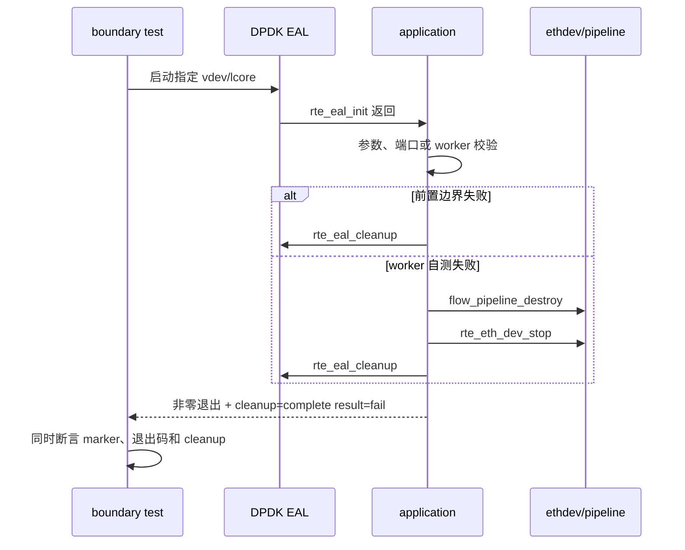

测试不能只 grep 错误文本：若进程意外返回 0，或没有走到 cleanup，即使打印过 marker 也必须失败。`tests/error_boundary_test.sh` 因此对三项进行联合验收。

## 12. 当前环境完成边界

| 能力 | 结论 | 证据范围 |
|---|---|---|
| software exact-match pipeline | PASS | pcap PMD + `rte_hash` + net_null |
| 规则生命周期与 aging | PASS | 确定性 synthetic TSC 自测 |
| 双 worker/shared/sharded 模型 | PASS | 两个 worker lcore + 两个 SP/SC ring |
| burst/cache/rule-count 矩阵 | PASS | 7 cases，每组 4096 包 |
| 参数/端口/worker 错误边界 | PASS | 4 个预期失败用例 |
| NIC RSS/RETA 多队列 | BOUNDARY | pcap PMD 仅 1 RX queue |
| hardware `rte_flow` | BOUNDARY | PMD 返回 `-ENOSYS` |
| 线速、DMA、PCIe、真实尾延迟 | NOT CLAIMED | 需要真实 NIC 与流量发生器 |

因此 `DPDK_FLOW_PIPELINE_CURRENT_ENV_COMPLETE` 表示当前软件与 pcap 环境内的闭环完成，不等价于真实 NIC 硬件 offload 完成。
