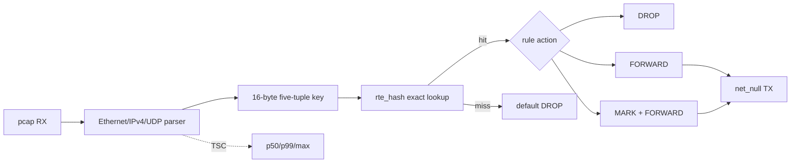
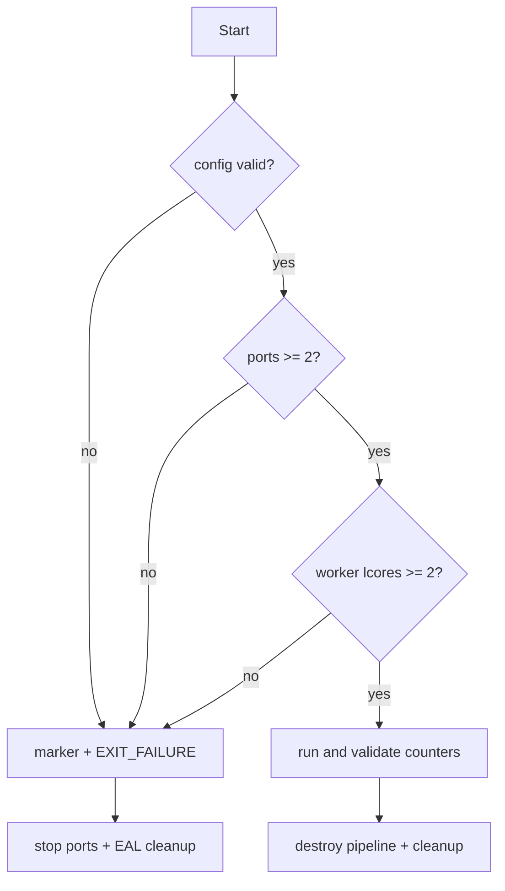

# DPDK FLOW PIPELINE FINAL REPORT

## 1. 项目定位

本项目把静态 L3 forwarding 练习推进为一个可更新、可观测、可调参、可验证失败边界的 DPDK 精确流流水线。目标不是用 pcap PMD 模拟线速成绩，而是建立从 packet parser、软件流表、动作执行到多核模型和证据归档的完整工程闭环。

## 2. 数据面

流表支持 add、update、delete、generation、aging 和 per-rule packet/byte counters。主 lcore 还通过两个 SP/SC `rte_ring` 验证双 worker 分发，覆盖 shared-readonly 与 per-worker sharded 两种所有权模型。

## 3. 完成矩阵

| Phase | 内容 | 状态 | 核心证据 |
|---|---|---|---|
| 1 | parser、`rte_hash`、DROP/FORWARD/MARK、latency | PASS | 64 包四类计数守恒 |
| 2 | add/update/delete、generation、aging | PASS | 生命周期与 synthetic TSC 自测 |
| 3 | 双 worker、shared/sharded table | PASS | 两个队列各 32 包 |
| 4 | RSS/RETA、hardware `rte_flow` | BOUNDARY | pcap PMD 单队列且 `-ENOSYS` |
| 5 | burst/cache/rule-count 调优 | PASS | 7 cases x 4096 包 |
| 6 | 参数/资源错误边界、最终回归 | PASS | 4 个预期失败用例 |

## 4. 性能实验结论

Phase 5 中所有 case 的 p50 均为 75 cycles，p99 为 100-125 cycles，baseline 为 125 cycles / 50 ns。25-cycle 差异不足以建立稳定排序，更不能解释为 512 条规则比 3 条规则更快。

本数据只测量 parse + software hash lookup + decision，不包含真实 NIC RX/TX、DMA、PCIe、RSS、队列竞争和端到端吞吐。其价值是证明参数矩阵、动态计数公式和 CSV/Markdown 证据链可复现。

## 5. 错误边界

自动化测试不仅检查错误 marker，还联合检查非零退出和 `cleanup=complete result=fail`，避免“打印了错误但仍成功退出”或“失败后资源清理不完整”。

## 6. 当前边界与下一次复验

`DPDK_FLOW_PIPELINE_CURRENT_ENV_COMPLETE` 仅表示 135 的 pcap/net_null 软件环境完成。真实硬件复验应至少包含：

1. 支持多 RX queue 的 PMD，配置 RSS hash fields 与 RETA，并核对 queue 分布。
2. `rte_flow` validate/create/query/destroy，确认规则命中计数和 fallback 行为。
3. 固定 CPU、NUMA、频率与 warmup，多轮报告置信区间。
4. 使用流量发生器测量 Mpps、Gbps、drop、端到端 p99/p999。
5. 对照 software hash 与 hardware offload 的 CPU cycles、吞吐和尾延迟。

## 7. 证据入口

- 原理与 UML：`docs/ARCHITECTURE.md`
- 完整测试流程：`tests/TEST_FLOW.md`
- Phase 4 边界：`tests/TEST_RECORD_20260713_PHASE4_CAPABILITY_BOUNDARY.md`
- Phase 5 数据：`tests/results/PHASE5_TUNING_MATRIX_20260713.*`
- Phase 6 记录：`tests/TEST_RECORD_20260713_PHASE6_CLOSEOUT.md`
