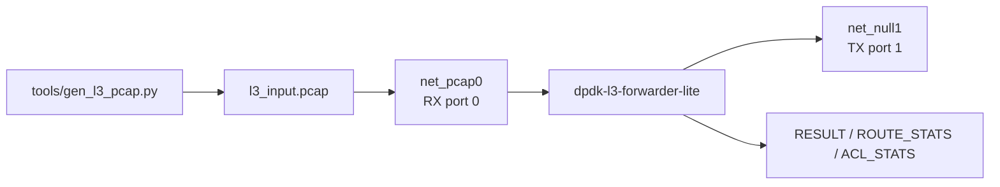
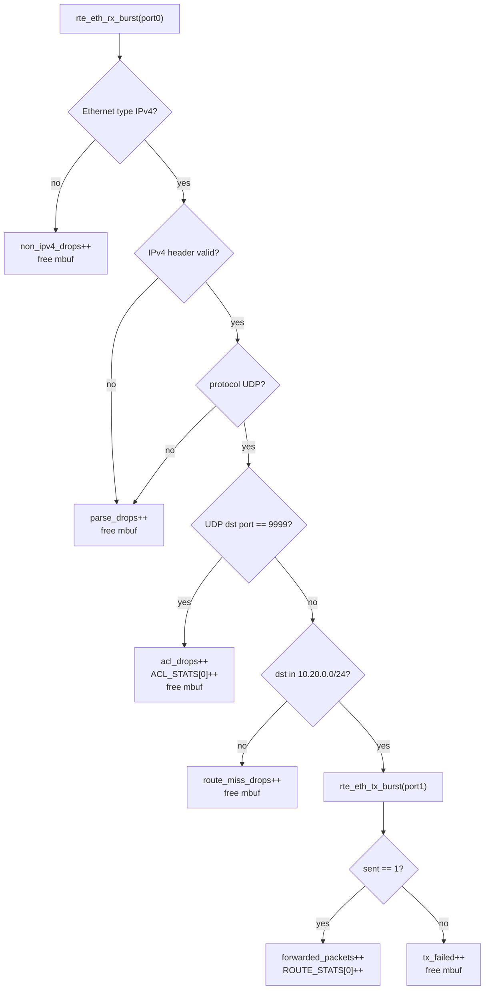
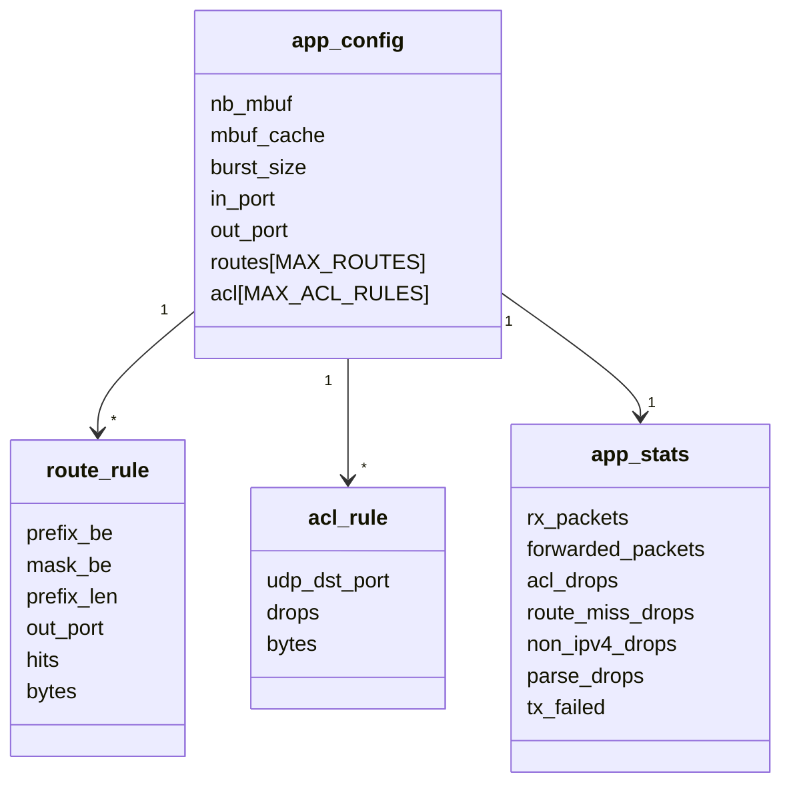
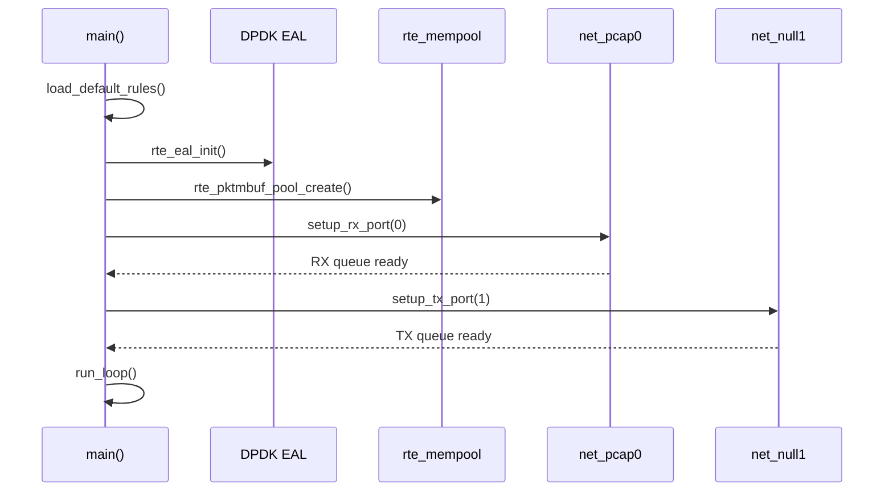
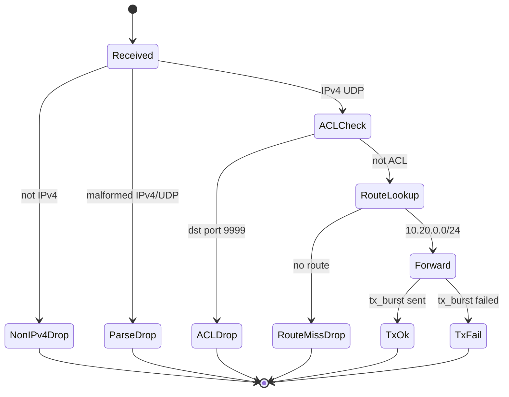
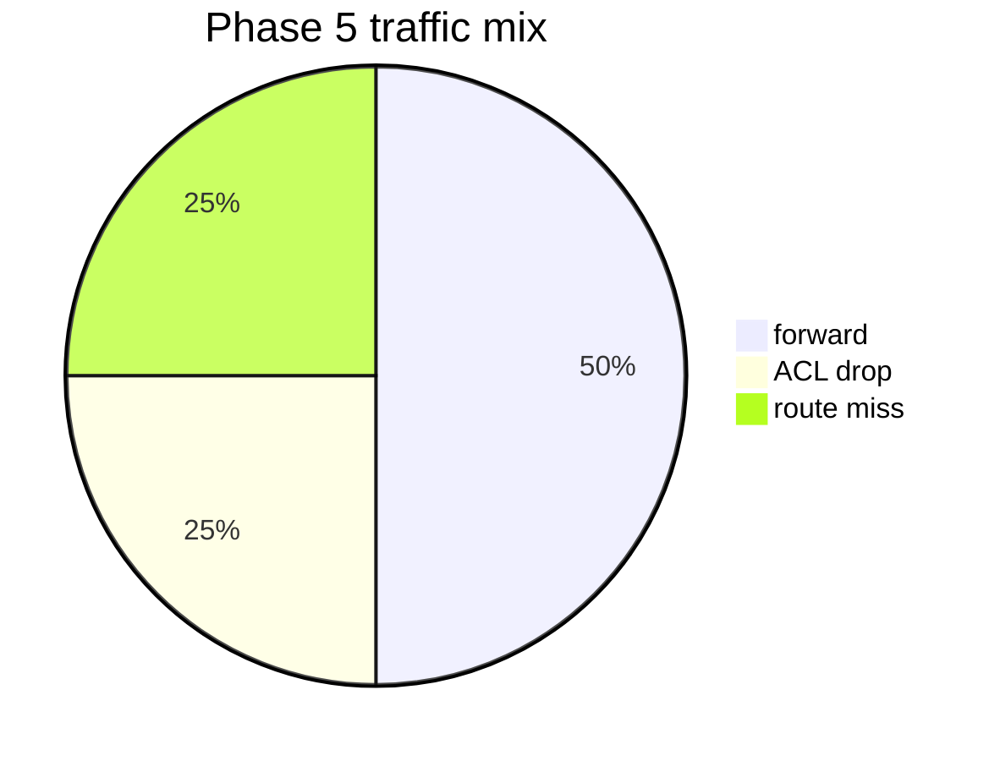
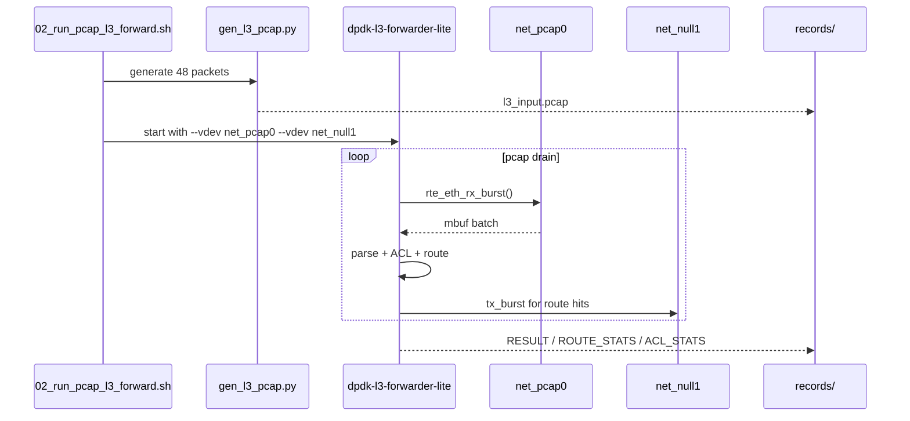

# 04_DEEP_LEARNING - DPDK L3 Forwarder Lite 深度学习

> Phase 5 是当前 track 里最像“项目”的部分：它把 RX、parse、ACL、route、TX、stats 串成一个小型 L3 数据面。

## 1. 项目要解决的问题

前面阶段分别学了：

```text
mbuf/mempool
RSS boundary
burst/cache tuning
VFIO/IOMMU boundary
```

Phase 5 把这些能力组合成一个数据面骨架：

```text
pcap PMD input -> IPv4/UDP parse -> ACL -> route lookup -> net_null TX
```

## 2. 总体拓扑



为什么用 pcap PMD：

```text
可复现，不依赖真实网卡，不影响测试机网络。
```

为什么用 net_null：

```text
能验证 TX burst 成功，同时不需要真实链路对端。
```

## 3. 数据面 pipeline



关键顺序：

```text
先 ACL，再 route。
```

原因：安全策略优先于转发策略。

## 4. 程序结构 UML



## 5. 初始化时序



对应配置：

```text
ROUTE[0] prefix=10.20.0.0/24 out_port=1
ACL[0] action=drop udp_dst_port=9999
```

## 6. Packet 分类状态图



## 7. 测试流量设计

`tools/gen_l3_pcap.py` 生成三类包：

| 流量 | 数量 | 预期 |
|---|---:|---|
| `10.20.0.77:9000` | 24 | route hit + forward |
| `10.20.0.77:9999` | 12 | ACL drop |
| `10.99.0.77:9000` | 12 | route miss drop |



## 8. 运行时序



## 9. 当前 evidence

正式记录：

```text
records/20260629-213104-l3-forwarder/
```

关键结果：

```text
rx_packets=48
forwarded_packets=24
acl_drops=12
route_miss_drops=12
tx_failed=0
ROUTE_STATS[0] hits=24
ACL_STATS[0] drops=12
```

这证明：

```text
pcap RX -> parse -> ACL -> route -> TX -> per-rule stats
```

已经形成可复现闭环。

## 10. 边界

本项目不证明：

```text
真实 NIC 线速
真实 RSS 多队列
完整 rte_acl / rte_lpm library
生产级控制面热更新
```

可以继续扩展：

```text
hand-coded route_lookup()
  -> rte_lpm

hand-coded acl_drop()
  -> rte_acl

single queue
  -> RSS multi queue

net_null TX
  -> real NIC / vhost / tap
```

