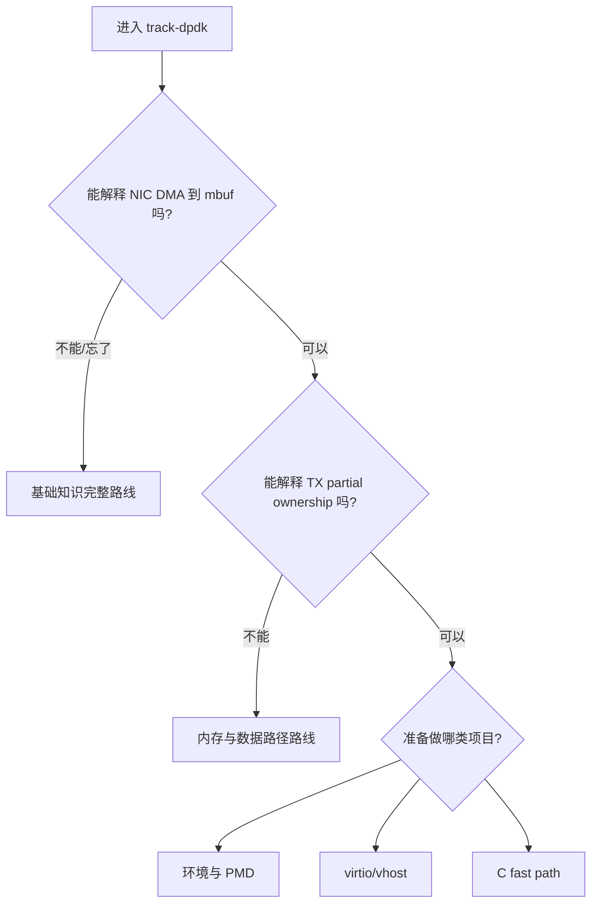

# START_HERE - DPDK 学习入口

本入口面向两类读者：第一次学习 DPDK，或者隔一段时间后需要快速恢复上下文。不要先运行项目命令，先完成与自己知识缺口匹配的阅读路径。

## 1. 选择入口



## 2. 零基础或系统复习：约 2-3 小时

按顺序阅读：

1. [`docs/fundamentals/00_10_MINUTE_MENTAL_MODEL.md`](docs/fundamentals/00_10_MINUTE_MENTAL_MODEL.md)
2. [`docs/fundamentals/01_KERNEL_AND_HARDWARE_POSITION.md`](docs/fundamentals/01_KERNEL_AND_HARDWARE_POSITION.md)
3. [`docs/fundamentals/02_CORE_OBJECTS_AND_MEMORY.md`](docs/fundamentals/02_CORE_OBJECTS_AND_MEMORY.md)
4. [`docs/fundamentals/03_END_TO_END_DATA_PATH.md`](docs/fundamentals/03_END_TO_END_DATA_PATH.md)
5. [`docs/fundamentals/04_CONCURRENCY_AND_LIFECYCLE.md`](docs/fundamentals/04_CONCURRENCY_AND_LIFECYCLE.md)
6. [`docs/fundamentals/05_PROJECT_KNOWLEDGE_MAP.md`](docs/fundamentals/05_PROJECT_KNOWLEDGE_MAP.md)

最后使用 [`07_RECALL_CARDS.md`](docs/fundamentals/07_RECALL_CARDS.md) 自测。能解释 mbuf ownership 和证据边界后再进项目。

开始修改 parser/port 配置或讨论性能前，再阅读：

7. [`08_PACKET_FORMAT_AND_OFFLOADS.md`](docs/fundamentals/08_PACKET_FORMAT_AND_OFFLOADS.md)
8. [`09_ETHDEV_CAPABILITY_AND_PORT_CONFIG.md`](docs/fundamentals/09_ETHDEV_CAPABILITY_AND_PORT_CONFIG.md)
9. [`10_PERFORMANCE_AND_OBSERVABILITY.md`](docs/fundamentals/10_PERFORMANCE_AND_OBSERVABILITY.md)

虚拟化路径使用 [`11_VIRTIO_VHOST_DATA_PATH.md`](docs/fundamentals/11_VIRTIO_VHOST_DATA_PATH.md)，操作真实 PCI 设备前必须阅读 [`12_SAFE_ENVIRONMENT_PREPARATION.md`](docs/fundamentals/12_SAFE_ENVIRONMENT_PREPARATION.md)。

## 3. 快速恢复记忆：约 20-30 分钟

```text
00 十分钟心智模型
-> 03 一个包的端到端路径
-> 07 复习卡
-> 05 项目知识地图
```

这条路线适合做过 DPDK、但忘记对象关系或项目位置的人。

## 4. 第一次动手

### 4.1 环境与 PMD

```bash
cd lab-vmxnet3-testpmd
cat START_HERE.md
```

进入前必须知道：PCI function、driver binding、hugepage、EAL 和 PMD 分别负责什么。

### 4.2 最小 C 数据面

```bash
cd lab-dpdk-l2-forwarding
cat START_HERE.md
```

重点不是“程序能启动”，而是跟踪以下生命周期：

```text
EAL -> mempool -> port -> RX/TX queue -> start
-> rx_burst -> process -> tx_burst/free
-> stop -> close
```

### 4.3 虚拟化数据面

```text
lab-vhost-user-basic
-> lab-virtio-user-vhost
```

先理解 vhost-user socket 是控制通道，再验证 virtqueue 和 packet counters；不要把 socket 文件存在当作转发成功。

## 5. 写业务 fast path

```text
lab-dpdk-l2-forwarding
-> project-user-space-fastpath
-> project-fastpath-traffic-test
-> project-dpdk-media-gateway-lite
```

阅读代码时固定回答四个问题：

1. 这个函数取得了哪个对象的所有权？
2. 每个 return/continue 分支由谁释放 mbuf？
3. RX、forward、drop、TX 是否守恒？
4. 当前证据是 compile、smoke、traffic 还是 performance？

## 6. 遇到问题

优先使用 [`docs/fundamentals/06_DEBUGGING_PLAYBOOK.md`](docs/fundamentals/06_DEBUGGING_PLAYBOOK.md)，按环境、PCI、EAL、port/queue、RX、parser/action、TX 的层次定位。

不要一看到 RX=0 就修改 parser，也不要一看到 EAL failed 就扩大 mempool。先判断失败发生在哪一层。

track 级检查入口见 [`tests/TEST_FLOW.md`](tests/TEST_FLOW.md)。文档审计不操作设备；pcap regression 使用 `--no-pci --no-huge`，不会绑定物理网卡。

## 7. 进入 Advanced 的门槛

完成基础 track 后，再进入 `../track-dpdk-advanced/`。应能独立解释：

- descriptor、DMA buffer 和 mbuf 的区别。
- hugepage、mempool 和 per-lcore cache 的作用。
- queue/lcore/NUMA 映射。
- partial TX、ring full、RX no-mbuf 的 backpressure 链。
- vdev/VM 证据与真实 NIC 性能证据的边界。

## 8. 当前环境

仓库当前实测环境为 DPDK 21.11.9、Ubuntu 22.04.5、VMware vmxnet3/uio。阅读 API 时以项目 `pkg-config libdpdk` 和现有代码为准，不默认套用其他版本命令。
