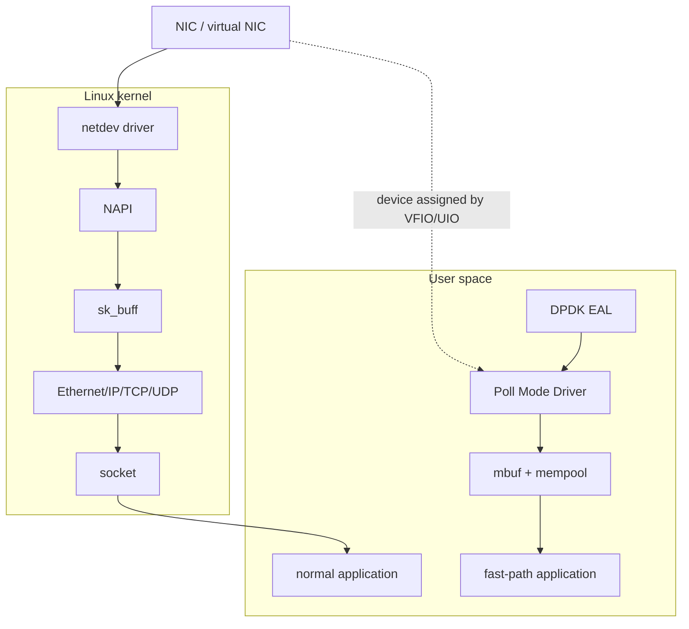
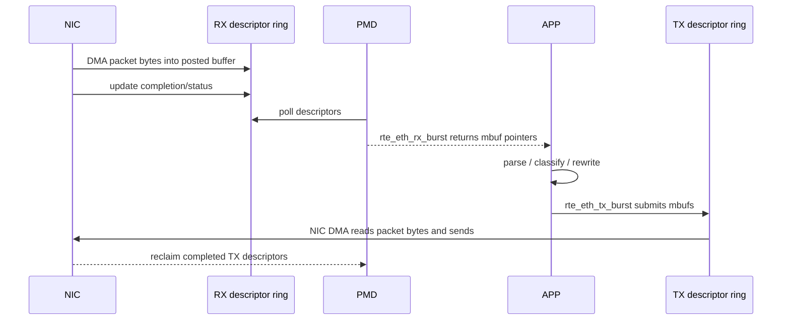

# DPDK 十分钟心智模型

## 1. 先回答一个问题

DPDK 不是新的网络协议栈，也不是“把 Linux 内核删掉”。它是一组用户态数据面库和驱动框架，让应用能够直接轮询 NIC 队列、批量处理 packet buffer，并自行决定转发、丢弃或改写数据包。

普通 socket 程序把包交给内核协议栈；典型 DPDK 程序把被接管端口的数据路径交给用户态 PMD。控制面、进程调度、内存管理、PCI/VFIO 和设备安全隔离仍依赖内核。



图中的两条路径通常不是同一个端口同时工作。一个 PCI function 绑定到 DPDK 使用的 VFIO/UIO 驱动后，原内核 netdev 一般不再负责它，因此管理口和 DPDK 数据口必须分开规划。

## 2. 一句话记住八个核心对象

| 对象 | 精确作用 | 暂时可以怎样记 |
|---|---|---|
| EAL | 初始化 CPU、内存、PCI、日志等运行环境 | 开场搭台 |
| PMD | 用户态轮询并驱动具体设备或 vdev | 用户态网卡司机 |
| port | DPDK 识别的 ethdev 端口 | 一块可用网口 |
| RX/TX queue | 与 NIC descriptor ring 对应的收发队列 | 收货/发货通道 |
| mempool | 批量管理固定大小对象，提供快速申请归还 | 可循环使用的托盘池 |
| mbuf | packet metadata，并指向实际 packet data | 带标签的托盘 |
| lcore | 被 DPDK 管理和使用的逻辑 CPU | 固定工位 |
| burst | 一次收发多个 mbuf | 成批搬运 |

类比只帮助建立第一印象：mbuf 不等于报文本身，queue 也不只是软件数组。后续文档会拆开 descriptor、DMA buffer、metadata 和所有权。

## 3. 一个包在 DPDK 中的一生



关键点不是函数名字，而是所有权转移：

1. RX 前，buffer 由 NIC/PMD 管理。
2. `rte_eth_rx_burst()` 返回后，应用拥有这些 mbuf。
3. 成功提交给 `rte_eth_tx_burst()` 的 mbuf 转交给 TX 路径。
4. 没有发送成功、主动丢弃或发生错误的 mbuf 必须由应用释放。

## 4. DPDK 为什么快

DPDK 的性能来自多个机制叠加，不是某一个“零拷贝”口号：

- PMD polling 避免每包中断、唤醒和调度切换。
- burst API 摊薄函数调用、doorbell 和队列操作成本。
- mempool 预分配对象，减少 fast path 上的通用堆分配。
- hugepage 降低大内存工作集的 TLB 压力，并便于稳定的 DMA 映射。
- 固定 lcore/queue 减少锁竞争、迁核和 cache line 抖动。
- 应用按场景裁剪协议处理，不必让每个包都经过完整内核协议栈。

代价也同样真实：polling 会持续占用 CPU；应用必须自己处理 NUMA、队列映射、mbuf 生命周期、统计、异常和设备恢复。

## 5. Kernel bypass 到底 bypass 什么

```text
通常绕过：netdev RX/TX、NAPI、skb、内核 L2/L3/L4、socket 数据路径
仍然依赖：进程/线程、CPU 调度、hugetlbfs、PCI、VFIO/IOMMU、页表、信号、文件系统
应用自选：是否实现 ARP、IP、UDP/TCP、路由、ACL、NAT、重组、邻居表
```

所以“DPDK 接管网卡”更准确的表述是：**数据面 queue 与 buffer 的消费逻辑由用户态 PMD 和应用托管**，不是硬件脱离了内核治理。

## 6. 当前 track 在学什么


这条线先证明环境和设备，再理解虚拟 I/O，最后自己写 `rte_eth_rx_burst()` 到 `rte_eth_tx_burst()` 的循环。不要一进来就背 API；先能在脑中指出“这个项目处于数据路径的哪一段”。

## 7. 十分钟阅读路线

1. 本文：形成全局地图。
2. `01_KERNEL_AND_HARDWARE_POSITION.md`：理解 NIC、DMA、内核和用户态的边界。
3. `02_CORE_OBJECTS_AND_MEMORY.md`：理解 hugepage、mempool、mbuf。
4. `03_END_TO_END_DATA_PATH.md`：跟踪启动、RX、处理、TX。
5. `05_PROJECT_KNOWLEDGE_MAP.md`：选择项目。

## 8. 快速自测

读完后应能回答：

1. DPDK 是否完全不需要内核？
2. PMD 为什么通常与固定 lcore 配合？
3. mbuf 和 packet bytes 是同一个概念吗？
4. `rte_eth_tx_burst()` 返回值小于输入数量时，谁释放剩余 mbuf？
5. 为什么不能随便把 SSH 管理口绑定给 DPDK？

答案都能从本文直接推出；如果有两个以上含糊，先不要进入项目命令。
