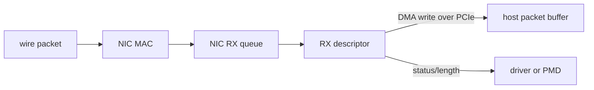
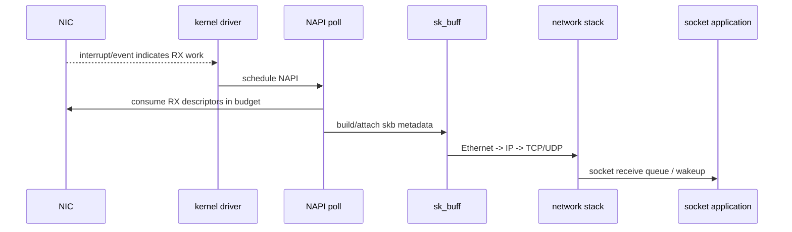
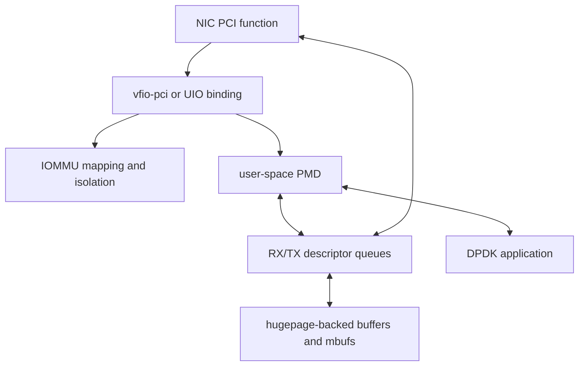
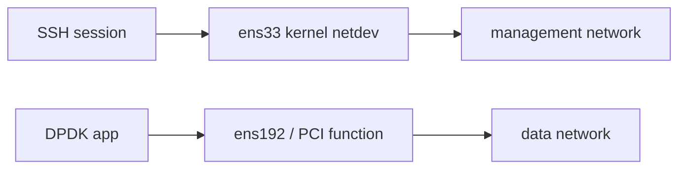

# DPDK 在内核与 NIC 路径中的位置

## 1. 本篇解决什么

目标是把 `NIC -> PCIe -> DMA -> driver -> queue -> application` 串成一张图，并解释 DPDK 究竟接管了哪一段。理解这条边界后，UIO、VFIO、PMD、hugepage 就不再是孤立术语。

## 2. NIC 收包时硬件做了什么

驱动先为 RX ring 准备 descriptor。descriptor 描述“DMA 到哪里、buffer 多大、当前是否可用”。数据包到达后，NIC 把 packet bytes DMA 到主机内存，并更新 descriptor 状态；CPU 不需要逐字节搬运报文。



descriptor 不是 packet bytes，它更像一张货运单：记录 buffer 地址、长度和状态。packet buffer 才是货物所在的内存区域。

## 3. 内核网络路径

典型 Linux RX 路径可以抽象为：



NAPI 已经不是“每包一个硬中断”的简单模式：中断通知有工作，随后内核在预算内轮询一批 descriptor。DPDK polling 的区别是用户态 worker 通常持续主动轮询，并直接拿到 mbuf，不进入 skb 和 socket 路径。

## 4. DPDK 数据路径



用户态 PMD 通过映射后的设备 BAR、queue 和 DMA 内存操作网卡。设备安全隔离和 DMA 地址映射仍由 VFIO/IOMMU 及内核提供；PMD 实现具体 NIC 的 queue 配置、descriptor 格式、doorbell 和统计逻辑。

## 5. UIO 与 VFIO

| 维度 | UIO 类驱动 | VFIO |
|---|---|---|
| 目标 | 简化设备资源映射到用户态 | 安全地把设备交给用户态/VMM |
| DMA 隔离 | 能力较弱，依赖平台与配置 | 与 IOMMU 配合提供隔离和映射 |
| 生产倾向 | 实验、受控环境 | 通常优先考虑 |
| 当前 track | VMware 环境使用 `uio_pci_generic` | 真实 IOMMU 环境再补验 |

类比：UIO 像把机房钥匙直接交给实验员；VFIO 像通过门禁划定只能访问的房间。类比边界是：真实机制是 PCI resource mapping、DMA mapping 和 interrupt/event 管理，不只是权限检查。

## 6. 什么叫“用户态托管”

应用需要承担原本由内核网络路径完成的一部分工作：

- 选择端口、queue、descriptor 数量和 offload。
- 创建可供 RX 使用的 mempool。
- 轮询 RX，解析协议并决定动作。
- 将可发送 mbuf 放到 TX，释放未发送或被丢弃的 mbuf。
- 维护统计、backpressure、控制面和退出回收。

但应用不一定要实现完整 TCP/IP。L2 forwarder 只看 MAC；媒体网关可以只识别 IPv4/UDP；具体处理范围由业务定义。

## 7. 为什么管理口不能随便绑定



PCI function 绑定到 DPDK 驱动后，原 kernel netdev 通常消失或不再处理流量。若它承载 SSH，远程连接会立即失去数据路径。当前实验明确保留 `ens33` 管理口，只操作 `ens192` 数据口。

## 8. RX 与 TX 的硬件视角

```text
RX: application/PMD posts empty buffers -> NIC DMA writes bytes -> PMD reaps completed descriptors
TX: application gives filled buffers -> PMD posts descriptors -> NIC DMA reads bytes -> PMD reclaims descriptors
```

“零拷贝”应谨慎表达：CPU 可以直接处理 DMA buffer 中的数据，避免内核 socket 路径中的额外复制；但 NIC 与内存之间仍发生 DMA，应用改写、linearize、clone 或跨域传递也可能产生复制。

## 9. 当前代码映射

| 机制 | 当前代码或实验 |
|---|---|
| PCI 设备检查/绑定 | `lab-vmxnet3-testpmd/scripts/00_check_env.sh`、`02_bind_vmxnet3.sh` |
| hugepage 环境 | `lab-vmxnet3-testpmd/scripts/01_setup_hugepages.sh` |
| PMD/queue 快速验证 | `lab-vmxnet3-testpmd` |
| 用户态端口初始化 | `lab-dpdk-l2-forwarding/app/main.c` 的 port setup |
| RX/TX descriptor 消费 | 同文件的 forwarding loop |
| vdev/虚拟队列 | `lab-vhost-user-basic`、`lab-virtio-user-vhost` |

## 10. 常见误区

- **误区：DPDK 驱动完全绕过内核。** 数据面绕过内核协议栈，但设备分配、内存、进程和隔离仍依赖内核。
- **误区：DMA 意味着没有 CPU 成本。** CPU 仍要创建 descriptor、poll、解析、维护 cache 和回收对象。
- **误区：polling 永远更快。** 低负载时它可能浪费核心；是否值得取决于延迟、吞吐和 CPU 预算。
- **误区：一个 port 就是一张物理网卡。** ethdev port 也可能来自 pcap、null、virtio-user 等 vdev。

## 11. 自测

1. descriptor 和 packet buffer 分别保存什么？
2. NAPI 与 PMD polling 的主要执行上下文差别是什么？
3. VFIO/IOMMU 没有参与 L3/L4 协议处理，为什么仍然重要？
4. 当前机器为什么分管理口和 DPDK 数据口？
