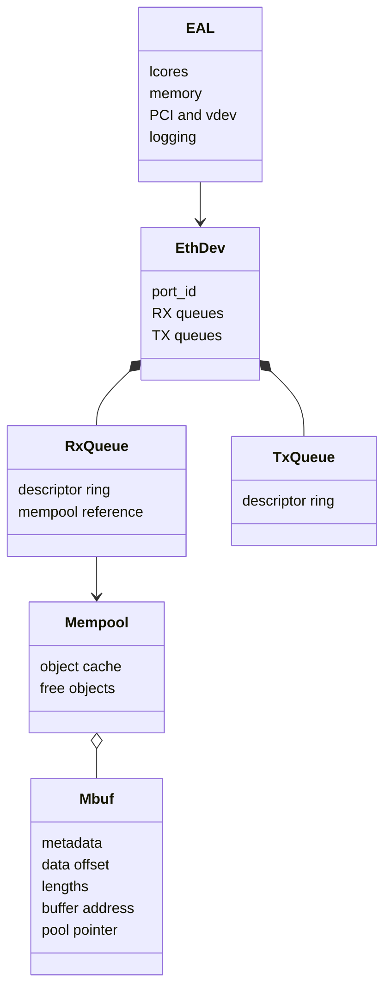
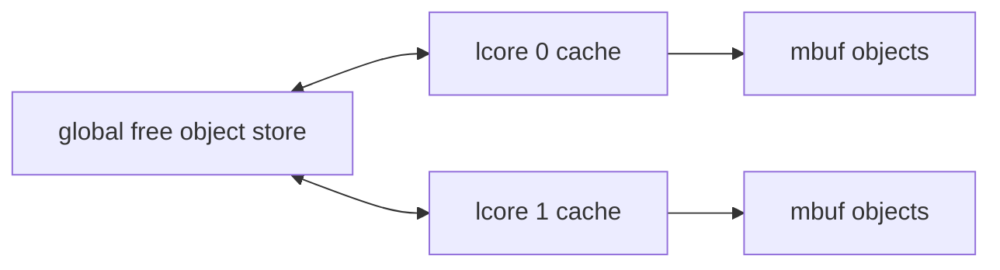
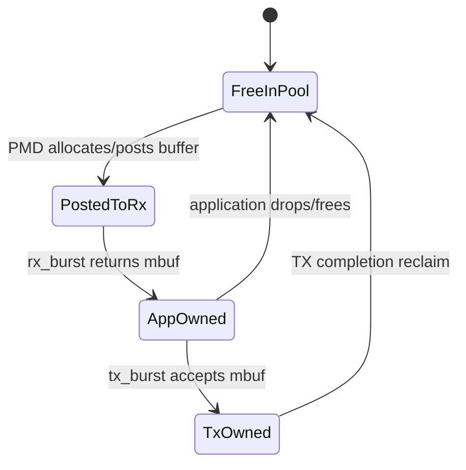
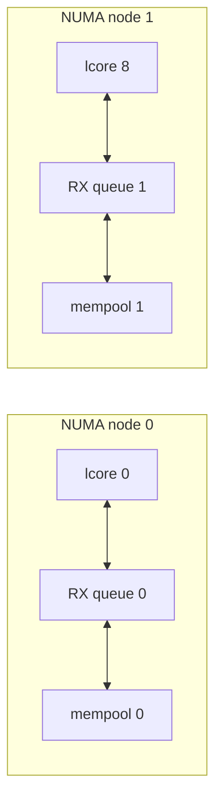

# DPDK 核心对象与内存模型

## 1. 对象关系总图



## 2. EAL：先把运行地基铺好

`rte_eal_init()` 通常是 DPDK 程序第一个 DPDK 调用。它解析 EAL 参数，并初始化或发现：

- lcore 与 CPU affinity。
- hugepage-backed memory、memzone 和内部 allocator。
- PCI 设备、bus、driver 和 vdev。
- multi-process file prefix、日志、timer 等基础设施。

EAL 参数和应用参数用 `--` 分隔。EAL 会消费自己认识的参数，应用再解析剩余参数。这就是项目中 `-l 0 -n 4 --no-pci -- --burst 32` 分成两层的原因。

## 3. 为什么需要 hugepage

### 3.1 TLB 视角

CPU 用虚拟地址访问内存，需要页表转换；TLB 缓存近期转换。假设映射 1 GiB 工作集：

```text
4 KiB page: 1 GiB / 4 KiB = 262144 pages
2 MiB page: 1 GiB / 2 MiB = 512 pages
```

更少的页表项意味着同样 TLB 容量能覆盖更大工作集，降低 fast path 随机触碰大量 packet buffer 时的 TLB miss 压力。

### 3.2 DMA/IOVA 视角

PMD 要让 NIC 通过 DMA 访问 packet buffer，需要稳定的 IOVA 映射。hugepage 提供大粒度、预留且可锁定的内存区域，便于 EAL 和 VFIO/UIO 管理映射。

准确边界：每个 hugepage 是大粒度页，但不能简单宣称“整个 mempool 一定是一整块物理连续内存”。设备最终使用的是 PMD/EAL 提供的 IOVA 与分段信息；IOMMU 模式下 IOVA 也不等于 CPU 物理地址。

### 3.3 它不解决什么

- hugepage 不自动保证 NUMA locality。
- hugepage 不自动消除 cache miss。
- hugepage 不会替应用释放 mbuf。
- `--no-huge` 可以服务某些 vdev/smoke 场景，但不能据此证明真实 NIC DMA 配置。

## 4. Mempool：为什么不在 fast path malloc

通用 `malloc/free` 要处理任意大小、并发和碎片。DPDK mempool 管理大量同构对象，并可使用 per-lcore cache 降低共享结构竞争。



类比：mempool 是预先洗好、按规格摆放的托盘池；worker 取用和归还，不在每个包到来时临时制造托盘。边界是 per-lcore cache、ring/stack backend、NUMA socket 等实现细节仍会影响性能。

## 5. Mbuf：metadata 与 data buffer

mbuf 是描述 packet 的对象，不应把它等同于连续报文数组。

```text
+---------------- rte_mbuf metadata ----------------+
| buf_addr | data_off | data_len | pkt_len | port   |
| ol_flags | next | nb_segs | refcnt | pool ...     |
+----------------------------------------------------+
          |
          v
+---------------- backing data buffer ---------------+
| headroom | Ethernet | IPv4 | UDP | payload | tail |
+----------------------------------------------------+
           ^
           data_off
```

- `buf_addr` 指向 backing buffer 起点。
- `data_off` 给出当前 packet data 相对起点的偏移，前面是 headroom。
- `data_len` 是当前 segment 数据长度。
- `pkt_len` 是整个 packet 的总长度。
- `next/nb_segs` 表示 multi-segment packet。
- `ol_flags` 描述 checksum、VLAN、RSS hash 等 offload metadata。

`rte_pktmbuf_mtod()` 适合已确认首段含有目标 header 的场景。生产 parser 还要检查长度、IHL、分段和非连续数据；不能对所有报文盲目强转结构体指针。

## 6. Headroom 为什么有用

headroom 允许应用在 packet 前插入 encapsulation header，而不一定移动整个 payload。类似快递箱前留出一段空位，用来补贴新的外包装标签。若空间不足，仍可能需要新 mbuf、chain 或 copy。

## 7. 所有权与引用计数



如果 clone/reference 增加了 refcnt，单次 free 只是减少引用；只有最后一个引用释放后对象才回池。当前 track 主要使用单 segment、单 owner 路径，但理解 refcnt 能防止把“调用过 free”误当成“buffer 已经立刻可重用”。

## 8. Queue、socket 与 NUMA

创建 RX queue 时传入 mempool，PMD 从池中取得可供 NIC DMA 的 buffer。queue、worker 和 mempool 最好位于同一 NUMA socket：



跨 NUMA 访问会经过互连，增加延迟和带宽压力。当前单 NUMA/VM 环境只能验证代码路径，不能证明多 socket 调优效果。

## 9. 容量如何估算

mempool 不能只按 burst 大小创建。对象可能同时存在于：

- 所有 RX descriptor。
- 应用当前 burst。
- TX descriptor 和待完成队列。
- per-lcore cache。
- 临时 clone、重组或业务队列。

简化思路：先统计所有 queue descriptor 需求，再加 worker 在途对象和余量；运行时观察 `rx_nombuf`、mempool available count 与 TX failure，而不是迷信一个固定公式。

## 10. 当前代码映射

| API/字段 | 项目位置 | 学习重点 |
|---|---|---|
| `rte_eal_init()` | `lab-dpdk-l2-forwarding/app/main.c` | 两层参数与初始化顺序 |
| `rte_pktmbuf_pool_create()` | 同文件 | pool size、cache、data room |
| `rte_eth_rx_queue_setup()` | 同文件 | RX queue 与 mempool 绑定 |
| `rte_pktmbuf_mtod*()` | fastpath/media gateway | header 定位与边界检查 |
| `rte_pktmbuf_free()` | forwarding/drop/error 分支 | 所有权闭环 |

## 11. 自测

1. hugepage 提升的主要是容量还是地址转换覆盖能力？
2. 为什么说 mbuf 不是 packet bytes？
3. `pkt_len` 和 `data_len` 什么时候可能不同？
4. RX queue 为什么需要 mempool，而 TX queue setup 通常不传 RX mempool？
5. mempool 很大是否就必然更快？
