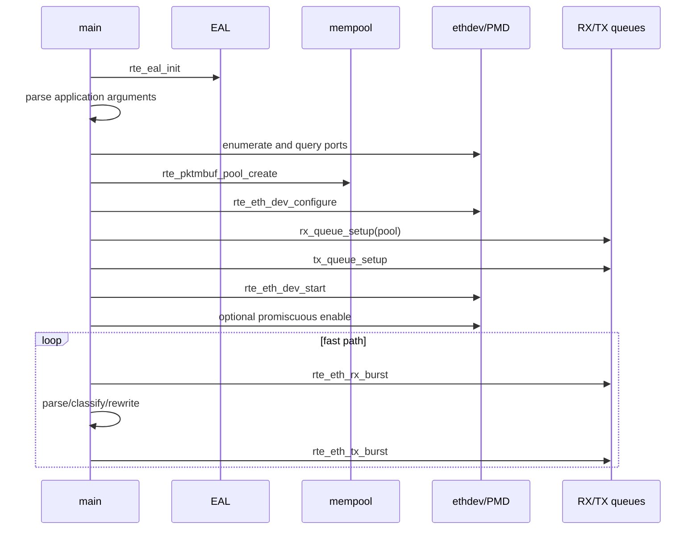
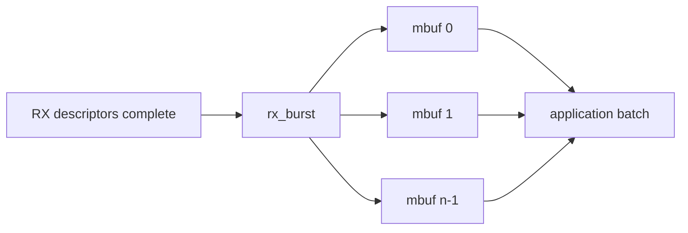
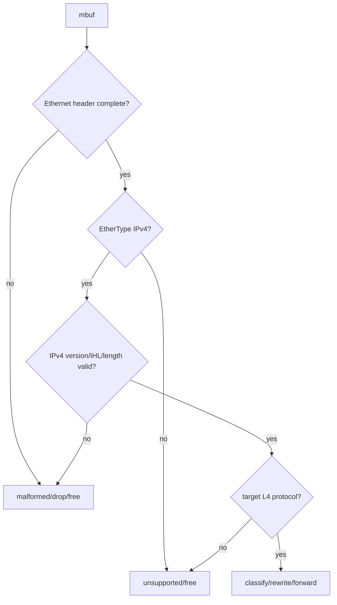
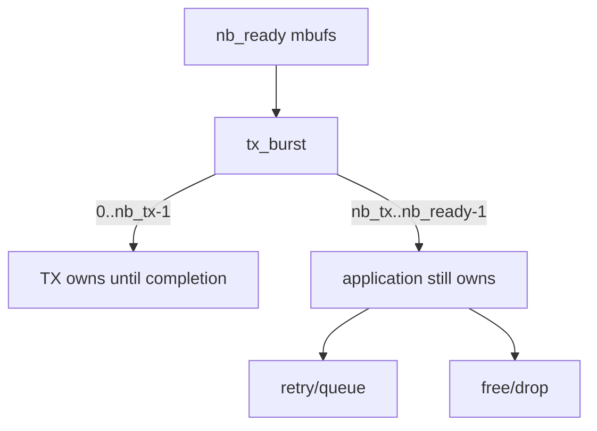
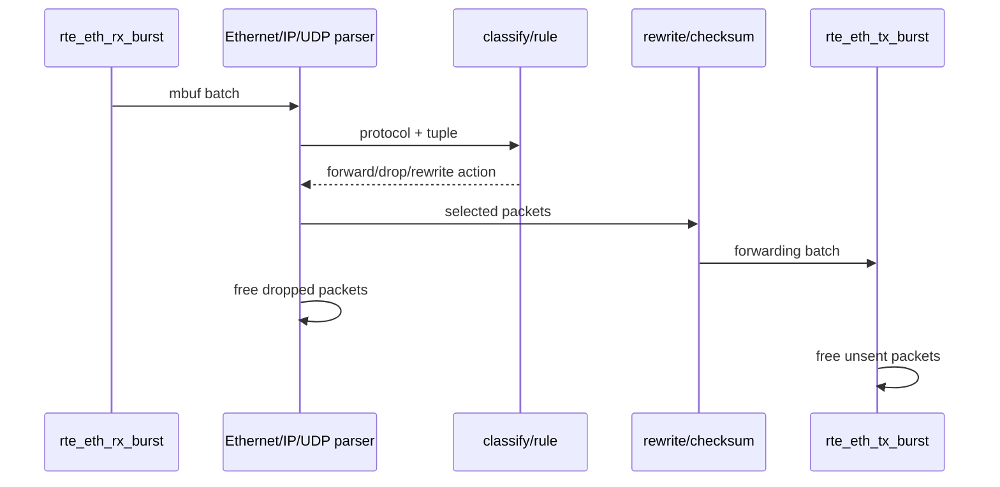

# DPDK 端到端数据路径

## 1. 从 main 到第一个 packet



初始化顺序是资源依赖关系，不只是 API 背诵：RX queue 要引用已经存在的 mempool；queue 要在配置后的 port 上建立；port start 发生在 queue setup 完成之后。

## 2. RX burst 到底返回什么

```c
struct rte_mbuf *pkts[BURST_SIZE];
uint16_t nb_rx = rte_eth_rx_burst(port_id, queue_id, pkts, BURST_SIZE);
```

返回值是本次取得的 mbuf 指针数量，可能为 0，也可能小于请求值。它不是错误码；空轮询是 PMD loop 的正常情况。返回后 `pkts[0..nb_rx-1]` 由应用负责处理。



## 3. Parser 的最小正确性顺序

不要先强转指针再检查长度。推荐思路：

1. 确认至少包含 Ethernet header。
2. 读取 EtherType，处理或拒绝 VLAN 等额外封装。
3. 确认至少包含 IPv4 fixed header。
4. 校验 version、IHL 和 `total_length` 合法。
5. 根据 IHL 定位 L4，检查 UDP/TCP header 长度。
6. 再访问 payload 或执行 rewrite。



当前实验流量较简单，但知识文档明确给出生产 parser 边界，避免把“pcap 能跑”误解为“任意报文都安全”。

## 4. TX burst 与最容易发生的泄漏

```c
uint16_t nb_tx = rte_eth_tx_burst(out_port, queue_id, pkts, nb_ready);
for (uint16_t i = nb_tx; i < nb_ready; i++)
    rte_pktmbuf_free(pkts[i]);
```

`nb_tx` 只表示本次被 TX 路径接受的数量。成功接受的 mbuf 所有权交给 PMD；未接受的仍归应用。应用可以重试、排队或释放，但不能假装全部发送成功。



## 5. Doorbell、descriptor 与 burst

PMD 将多个 packet 的 descriptor 写入 TX ring，再按设备规则更新 producer index/doorbell。批量操作可以摊薄固定开销，也让 CPU 更容易预取 mbuf metadata。

burst 不是越大越好：大 burst 可能增加单包排队等待和 cache 工作集；太小又会增加调用和 doorbell 开销。吞吐与尾延迟需要实际测量。

## 6. L2 forwarding 路径

```text
port 0 / RX queue 0
  -> rx_burst
  -> optional MAC rewrite
  -> port 1 / TX queue 0
  -> free unsent mbufs
```

对应 `lab-dpdk-l2-forwarding/app/main.c`。这是理解 ethdev lifecycle、mbuf ownership 和 burst 的最短 C 数据面。

## 7. Fastpath classify/rewrite 路径



对应 `project-user-space-fastpath/app/main.c`。比 l2fwd 多出的价值不是函数更多，而是每个分支都必须维持 mbuf 所有权、统计守恒和 checksum 语义。

## 8. vhost-user / virtio-user 路径


Unix socket 主要用于建立连接、协商 features 和传递共享内存/queue 元数据，packet data 通常走共享 virtqueue，而不是把每个 packet 当作普通 socket payload 发送。

`virtio-user` 可在用户态充当前端，便于不启动完整 VM 时验证 vhost-user 路径。它仍然是虚拟设备路径，不能代替真实 NIC 性能证据。

## 9. 正常退出顺序

```text
stop producing/receiving
-> drain or account in-flight mbufs
-> stop ethdev
-> close ethdev
-> cleanup EAL/process resources
```

资源释放通常按创建逆序。信号处理只设置退出标志，fast loop 在可控位置结束；不要在异步 signal handler 中执行复杂 DPDK 清理。

## 10. 统计守恒

一个简单转发器至少应满足近似关系：

```text
rx = forwarded + dropped_parse + dropped_rule + dropped_other
forwarded = tx_success + tx_unsent_or_queued
所有 app-owned mbuf 最终必须进入 TX ownership 或 free
```

硬件统计、软件统计和时间窗口可能不同步，因此先定义计数点，再解释差异。只看到 RX 非零不等于转发正确。

## 11. API 到项目映射

| 生命周期 | API | 首选阅读位置 |
|---|---|---|
| 环境 | `rte_eal_init` | l2fwd `main()` |
| 内存池 | `rte_pktmbuf_pool_create` | l2fwd `main()` |
| port | `rte_eth_dev_configure` | l2fwd port setup |
| queue | `rte_eth_rx_queue_setup` / `tx_queue_setup` | l2fwd port setup |
| 启动 | `rte_eth_dev_start` | l2fwd port setup |
| RX | `rte_eth_rx_burst` | l2fwd forwarding loop |
| 解析 | `rte_pktmbuf_mtod*` | fastpath parser |
| TX | `rte_eth_tx_burst` | l2fwd/fastpath loop |
| 回收 | `rte_pktmbuf_free` | drop 和 unsent 分支 |

## 12. 自测

1. 为什么空的 `rx_burst` 不算错误？
2. TX 只接受一部分 mbuf 时所有权如何划分？
3. 为什么 vhost-user socket 建立成功不等于 packet forwarding 已验证？
4. 初始化时为什么先创建 mempool 再 setup RX queue？
5. 如何用统计守恒发现一个 drop 分支漏记或漏 free？
