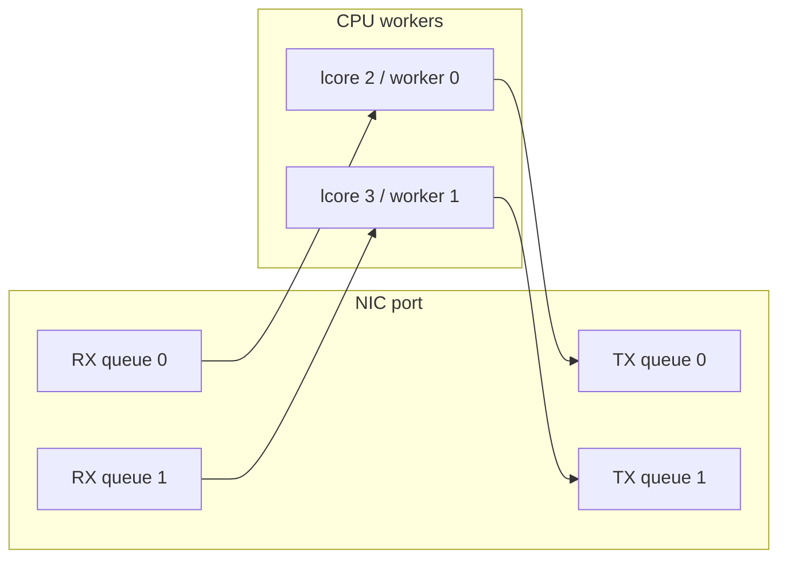
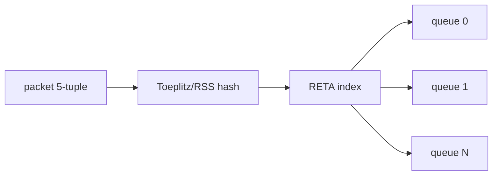
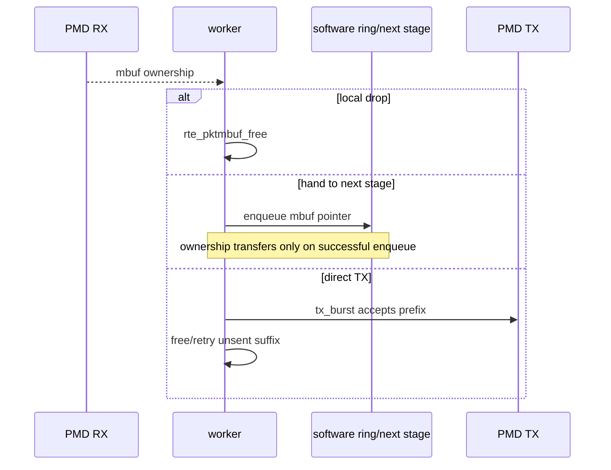
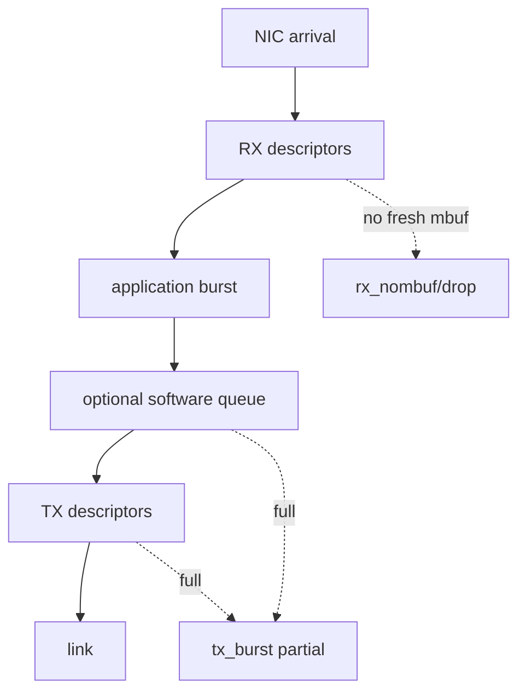
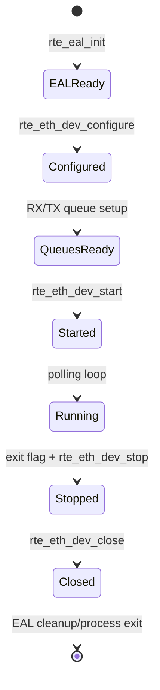

# DPDK 并发、队列与生命周期

## 1. 为什么数据面喜欢“一核一队列”

高性能数据面希望减少共享写、锁和迁核。常见映射是一个 worker 固定在一个 lcore，并独占一个 RX queue；对应 TX queue 也尽量独占。



这不是 DPDK 强制规则，而是容易推理的 ownership 模型。多个线程共享同一 queue 时，要确认 PMD/API 的线程安全约束并承担同步成本。

## 2. RSS 如何把包分到多个 RX queue

NIC 根据配置的 hash key 和报文字段计算 hash，再通过 RETA 把结果映射到 queue。常见目标是让同一 flow 稳定落在同一 queue，便于单 worker 维护 flow state。



RSS 不保证绝对均匀，也不等于应用已经并行。还需要足够的 queue、worker、正确的 RETA、流量多样性和 NUMA 映射。当前基础 track 主要是单 queue，深入实验位于 `track-dpdk-advanced`。

## 3. Burst 的吞吐与延迟权衡

| burst 特征 | 好处 | 代价 |
|---|---|---|
| 较小 | 单包等待可能较短，工作集小 | 调用、queue 操作和 doorbell 摊薄不足 |
| 较大 | 更易批处理、预取和摊薄固定成本 | 可能增加排队、cache 压力和尾延迟 |

`burst_size=32` 是起点，不是答案。调优要同时记录 packets/s、cycles/packet、p50/p99、drop、RX no-mbuf 和 CPU 利用率。

## 4. Mbuf ownership 是并发正确性的中心



若 `rte_ring_enqueue()` 失败，所有权通常仍在 producer；若成功，consumer 接管。必须由项目协议明确约定，不能只凭函数名猜测。

## 5. Software ring 的内存模型

DPDK ring 适合在线程或 pipeline stage 间传递指针。SPSC 模式减少竞争；MP/MC 模式支持多生产者/消费者，但原子操作更多。


ring 只传 pointer，不自动复制 packet，也不自动释放失败 enqueue 的对象。ring 满就是 backpressure 信号，应用需要 drop、retry 或上游限速策略。

## 6. Cache line 与 false sharing

两个 worker 高频更新位于同一 cache line 的统计字段，会让该 cache line 在核心之间来回转移，即使它们修改不同变量。这叫 false sharing。

```text
bad:  [worker0_rx | worker1_rx] in one cache line
good: [worker0 stats ........] [worker1 stats ........]
```

常见方法是 per-lcore stats、cache-line alignment，最后由控制线程聚合。对齐会增加内存占用，是否必要仍要通过 profiling 判断。

## 7. Backpressure 从哪里来



下游慢会逐层表现为 TX partial、software ring full、mbuf 长时间在途，最终可能让 RX 无可用 buffer。只增加 mempool 会延后故障，不会修复持续的服务率不匹配。

## 8. Port 生命周期



配置变化是否允许在 started 状态执行，要看具体 ethdev API 和 PMD capability。稳妥做法是明确生命周期，并检查每个返回值。

## 9. 多线程退出协议

1. 控制线程发布 stop flag。
2. producer 停止产生新对象。
3. consumer 排空已发布对象，或按策略明确丢弃并释放。
4. worker join。
5. 停止并关闭 port。
6. 释放应用资源并 cleanup EAL。

stop 不等于立即销毁共享 mempool/ring。必须先证明没有 worker 仍可能访问它们。

## 10. 当前项目中的层次

- `lab-dpdk-l2-forwarding`：单 worker、单 queue，先建立确定所有权。
- `project-user-space-fastpath`：parser/rule/rewrite 分支增加，所有权分支更复杂。
- `project-dpdk-media-gateway-lite`：拆模块后仍由主 loop 维持 mbuf lifecycle。
- `track-dpdk-advanced/lab-dpdk-rss-multiqueue`：多 queue/RSS 增量知识。
- `track-dpdk-advanced/project-dpdk-flow-pipeline`：software ring、双 worker 和规则生命周期。

## 11. 自测

1. 为什么同一 flow 通常希望稳定落在同一 queue？
2. ring enqueue 失败后 mbuf 通常归谁？
3. TX 长期慢于 RX 时，为什么只扩 mempool 治标不治本？
4. stop flag 设置后为什么不能立刻 free ring？
5. per-lcore stats 主要避免哪类共享成本？
