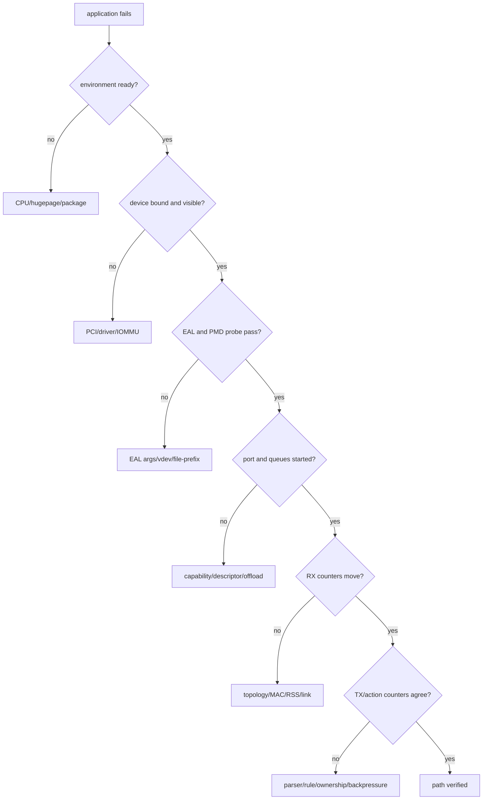
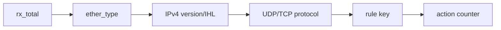

# DPDK 分层排障手册

## 1. 原则：先找失败层，不先改代码



## 2. 第 0 层：保护远程连接

```bash
ip -br link
ip -br addr
ethtool -i ens33
ethtool -i ens192
```

先确认 SSH 走哪个接口，再操作 PCI binding。管理口与目标 DPDK port 不明确时停止，不要靠“网卡名字看起来像数据口”猜测。

## 3. 第 1 层：软件和 CPU 环境

```bash
pkg-config --modversion libdpdk
pkg-config --cflags --libs libdpdk
lscpu | grep -E 'CPU\(s\)|NUMA|Huge'
```

典型症状：编译找不到 header/library、EAL 参数不识别、CPU mask/lcore 不存在。先确认仓库目标环境是 DPDK 21.11.9，不把其他版本示例原样套用。

## 4. 第 2 层：hugepage

```bash
grep -E 'HugePages|Hugepagesize' /proc/meminfo
mount | grep hugetlbfs
ls -ld /dev/hugepages /mnt/huge 2>/dev/null
```

典型症状：EAL 无法分配内存、mempool create 失败。还要检查文件权限、NUMA node 上的 hugepage 分布和旧进程残留；“总数非零”不代表当前 socket 可用。

## 5. 第 3 层：PCI 与 driver binding

```bash
lspci -nnk | grep -A3 -i ethernet
dpdk-devbind.py --status
readlink /sys/bus/pci/devices/0000:0b:00.0/driver
```

典型症状：`rte_eth_dev_count_avail()` 为 0、PMD probe 失败。检查：

- PCI BDF 是否正确。
- 当前 driver 是 kernel netdev、`vfio-pci` 还是 `uio_pci_generic`。
- VFIO 时 IOMMU group 和权限是否可用。
- 对应 PMD 是否被构建/安装。

## 6. 第 4 层：EAL 与进程资源

```bash
ps -ef | grep -E 'testpmd|dpdk'
ls /var/run/dpdk 2>/dev/null
```

常见问题：

- lcore 重叠或不存在。
- `--file-prefix` 与残留进程冲突。
- primary/secondary process 角色不匹配。
- `--no-pci` 下却期待真实 PCI port。
- vdev 参数拼写或路径错误。

调试时保留完整 EAL 开头日志，但日常回归只 grep `EAL`、`probe`、`port` 和项目 marker，避免反复读取长日志。

## 7. 第 5 层：port/queue 配置

检查每个 API 返回值，并记录设备 capability：

```text
rte_eth_dev_info_get
rte_eth_dev_configure
rte_eth_rx_queue_setup
rte_eth_tx_queue_setup
rte_eth_dev_start
```

典型失败原因包括 descriptor 数量不满足设备限制、请求了不支持的 offload、queue 数超过 capability、mempool data room 不足或 NUMA socket 选择不合适。

## 8. 第 6 层：RX 一直为零

按顺序检查：

1. link 是否 up。
2. 发包是否进入正确物理/虚拟端口。
3. 目的 MAC 与 promiscuous 配置。
4. VLAN/封装是否与 parser 假设一致。
5. RSS 是否把流量送到另一个 queue。
6. hardware stats 与 software stats 是否都为零。
7. vhost/virtio 是否只建了 socket，queue 尚未 ready。

不要先改 parser：如果 hardware RX counter 都不动，问题通常在 parser 之前。

## 9. 第 7 层：RX 有包但业务命中为零



为每层增加互斥计数，例如 `unsupported_l2`、`malformed_ipv4`、`non_udp`、`rule_miss`。这样能定位包在哪一步离开，不需要逐包打印拖垮 fast path。

## 10. 第 8 层：TX partial、drop 或 mempool 耗尽

- `tx_burst < nb_ready`：检查 link、TX descriptor、下游服务率和 retry/drop 策略。
- `rx_nombuf` 增长：检查 mbuf 是否泄漏、TX 长时间在途、software ring 堆积和 pool 容量。
- 软件 RX 与 TX/drop 不守恒：检查每个 continue/error 分支。
- 退出时崩溃：检查 worker 是否已 join、port 是否仍持有对象、清理顺序。

## 11. vhost-user 专项

```bash
ss -xl | grep vhost
ls -l /path/to/vhost.sock
lsof -U | grep vhost
```

检查 server/client 角色、socket 路径权限、启动顺序、feature negotiation、queue ready 和 shared memory。socket 文件存在只证明控制通道至少创建过，不证明 virtqueue 已交换 packet。

## 12. 最小证据包

每次测试建议记录：

```text
environment: kernel, DPDK version, CPU/NUMA, hugepages
device: BDF, driver, PMD, link
command: exact EAL args + app args
markers: init, port start, RX/TX/drop summary, cleanup
boundary: vdev/VM/real NIC, smoke/traffic/performance
```

## 13. 快速故障对照

| 现象 | 优先检查 |
|---|---|
| 编译失败 | pkg-config、DPDK version/API |
| EAL init failed | lcore、hugepage、file-prefix、权限 |
| 0 ports | binding、PMD、`--no-pci`、vdev |
| queue setup failed | capability、descriptor、offload、mempool |
| RX=0 | topology、link、MAC、RSS queue |
| RX>0 rule_hit=0 | parser 分层计数、rule key |
| TX partial | TX ring、link、backpressure |
| rx_nombuf | leak、pool、in-flight、downstream |
| shutdown crash | ownership、worker join、逆序清理 |

## 14. 自测

1. hardware RX counter 为零时，为什么不应先修改 UDP parser？
2. EAL 能启动但 port 数为零，应优先检查哪一层？
3. RX 持续增长、TX 不动且 `rx_nombuf` 随后增长，可能形成了怎样的 backpressure 链？
4. vhost socket 文件存在，仍需哪两类证据才能说明数据路径成立？
5. 一份可复核测试记录至少应保存哪五类信息？
