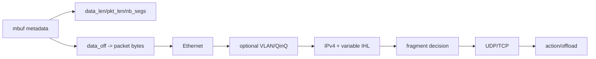
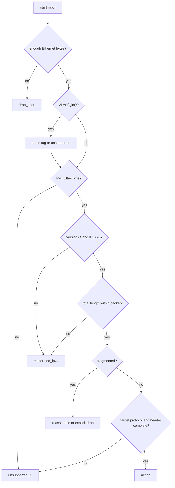
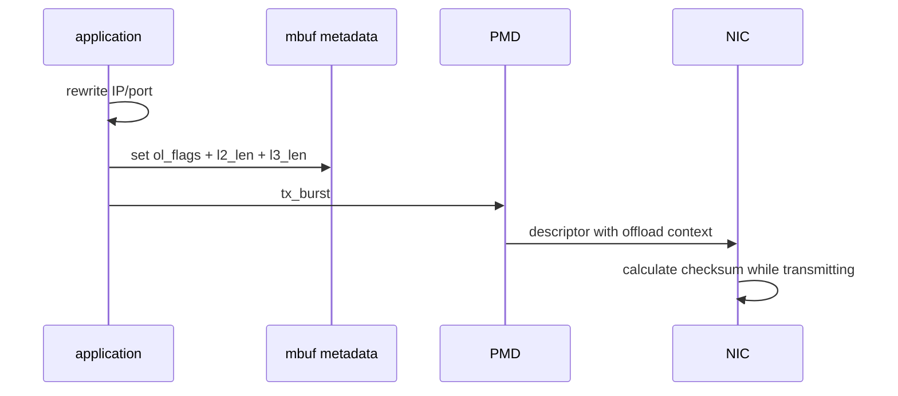

# 报文格式、Parser 与 Offload

## 1. 为什么这一层决定正确性

DPDK 把 packet buffer 直接交给应用，也把边界检查、字节序、分片和 checksum 责任交给应用。能从 mbuf 取到指针不代表这个指针后面一定有完整、连续、可信的 header。



## 2. 常见报文字节布局

无 VLAN 的 Ethernet/IPv4/UDP：

```text
offset  size  field
0       6     destination MAC
6       6     source MAC
12      2     EtherType = 0x0800
14      IHL   IPv4 header, minimum 20 bytes
14+IHL  8     UDP header
22+IHL  N     UDP payload
```

带 802.1Q VLAN 时，原 EtherType 位置变成 TPID，后面多 4 字节 tag：

```text
dst MAC | src MAC | 0x8100 | TCI | inner EtherType | L3 ...
```

因此固定假设 `IPv4 = Ethernet + 14` 会把 VLAN TCI 当成 IPv4 开头。基础 parser 至少要明确“支持 VLAN”或“识别后归类 unsupported”，不能默默误解析。

## 3. 网络字节序

Ethernet/IP/UDP 多字节字段使用网络字节序（big-endian）。x86 常见为 little-endian，比较和改写前要显式转换：

```c
uint16_t ether_type = rte_be_to_cpu_16(eth->ether_type);
uint16_t dst_port = rte_be_to_cpu_16(udp->dst_port);

udp->dst_port = rte_cpu_to_be_16(new_port);
```

直接拿 wire field 与 host integer 比较，可能只在某些常量写法下“碰巧工作”。代码审查时应能一眼看出 wire-order 和 host-order 的边界。

## 4. Parser 的防御式顺序



关键检查：

1. `rte_pktmbuf_pkt_len(m)` 是否覆盖所需总长度。
2. IPv4 version 必须为 4，IHL 至少 5，实际 header 长度为 `IHL * 4`。
3. `total_length` 不能小于 IHL，也不能越过可用 packet bytes。
4. UDP length 至少 8，且不越过 IPv4 payload。
5. 不支持的封装和 malformed 应分开计数。

## 5. Multi-segment mbuf

`pkt_len > data_len` 或 `nb_segs > 1` 表示 packet 跨多个 segment。以下写法只保证首段起点可取，不保证后续完整 header 连续：

```c
struct rte_ipv4_hdr *ip = rte_pktmbuf_mtod_offset(m,
    struct rte_ipv4_hdr *, sizeof(struct rte_ether_hdr));
```

可选策略：

- 在能力和 MTU 可控时明确只接受 single-segment，并对 `nb_segs != 1` 计数丢弃。
- 使用 `rte_pktmbuf_read()` 将跨段 header 读入临时 buffer。
- 必要时 linearize，但要衡量 copy 和失败路径成本。

类比：mbuf chain 像一本书被拆成多册；拿到第一册封面不等于后续章节都在第一册。

## 6. IPv4 Fragment

非首分片可能没有完整 L4 header。parser 若只看 protocol=UDP 就读取 UDP header，会越界或把 payload 当 header。

```text
fragment offset = 0, MF = 0  -> normal unfragmented packet
fragment offset = 0, MF = 1  -> first fragment, more follow
fragment offset > 0           -> later fragment, no L4 header guarantee
```

基础 fastpath 可以明确丢弃所有 fragment；需要业务支持时再引入重组表、超时、内存上限和乱序处理。禁止在没有资源上限的情况下“顺便加重组”。

## 7. RX Checksum Offload

设备支持并启用 RX checksum offload 后，PMD 通过 `mbuf->ol_flags` 报告校验结果。应用应区分：

- hardware 明确判定 good。
- hardware 明确判定 bad。
- unknown/not checked。

unknown 不能当作 good。具体 flag 和 capability 以当前 DPDK 版本/PMD 为准，并先通过 `rte_eth_dev_info_get()` 检查支持范围。

## 8. TX Checksum Offload

应用改写 IP、UDP/TCP 字段后，要么在软件中重算 checksum，要么正确配置 TX offload metadata。典型硬件 offload 需要同时满足：

```text
device capability supports requested offload
port/queue enables requested offload
mbuf ol_flags marks packet type/checksum request
mbuf l2_len/l3_len describe header layout
checksum fields use PMD/API expected seed value
```

只设置 `ol_flags` 而没有启用 port capability，或只启用 capability 而没有填写 `l2_len/l3_len`，都可能得到错误 wire packet。



## 9. MTU、Jumbo 与 Data Room

MTU 是 L3 payload 相关配置，不等于 mempool data room。要容纳 packet，还需考虑 Ethernet/VLAN headers、headroom、CRC 是否由硬件剥离以及 multi-segment capability。

启用 jumbo frame 前应同时确认：

- NIC/PMD max RX packet length。
- port MTU 配置。
- mempool data room 或 scattered RX。
- parser 的长度类型和边界。
- 测试端链路 MTU 一致。

## 10. 当前代码映射

| 主题 | 当前入口 | 需要关注 |
|---|---|---|
| Ethernet/IP/UDP parser | `project-user-space-fastpath/app/main.c` | 长度、IHL、字节序 |
| 模块化 parser | `project-dpdk-media-gateway-lite/app/gateway_packet.c` | unsupported/malformed 计数 |
| rewrite | fastpath/media gateway rule path | checksum 与 TX ownership |
| offload capability | l2fwd/media gateway port setup | 当前配置是否显式协商 |

## 11. 建议测试矩阵

| pcap case | 预期 |
|---|---|
| 正常 Ethernet/IPv4/UDP | UDP/action 命中 |
| 非 IPv4 | unsupported，不越界 |
| 单 VLAN IPv4/UDP | 按声明支持或 unsupported |
| Ethernet 短包 | drop_short |
| IPv4 IHL < 5 | malformed_ipv4 |
| IPv4 total_length 越界 | malformed_ipv4 |
| later fragment | fragment_drop |
| UDP length < 8 | malformed_udp |
| multi-segment header | read/linearize 或明确 drop |
| checksum bad/unknown | 按 offload 策略分类 |

## 12. 自测

1. 为什么 `mtod_offset(Ethernet size)` 不能保证拿到完整 IPv4 header？
2. VLAN 如何改变 L3 offset？
3. later IPv4 fragment 为什么不能直接读 UDP header？
4. TX checksum offload 为什么既要 port capability，也要 mbuf metadata？
5. `pkt_len` 与 `data_len` 不同意味着什么？
